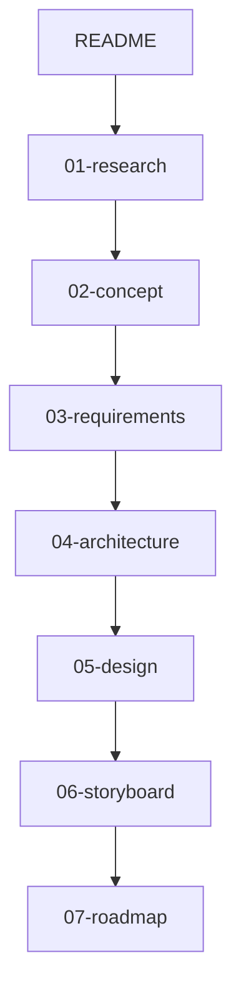
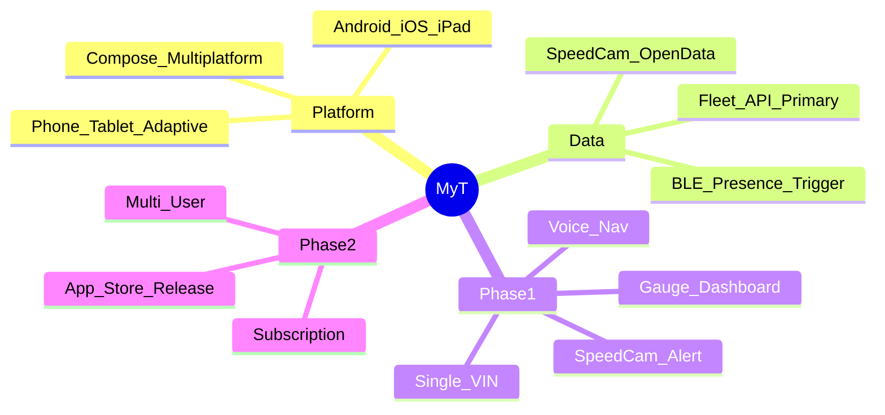

# MyT — Tesla Model 3 크로스플랫폼 계기판 컴패니언

> Tesla Model 3와 블루투스·Fleet API로 연결하여, 휴대폰·태블릿에서 실시간 계기판·내비·과속단속 알림을 제공하는 크로스플랫폼 앱

## 프로젝트 개요

| 항목 | 내용 |
|---|---|
| **대상 차량** | Tesla Model 3 (Phase 1: 본인 차량 1대) |
| **플랫폼** | Android · iOS · iPadOS (폰·태블릿 적응형) |
| **기술 스택** | Kotlin Multiplatform + Compose Multiplatform |
| **데이터 소스** | Tesla Fleet API (공식) + 공공데이터 과속단속 카메라 |
| **Phase** | 1: 개인 사용 안정화 → 2: 유상 배포 |

## 문서 읽는 순서



1. [조사 문서](docs/01-research/) — Tesla API, BLE, 과속카메라, 경쟁앱, 크로스플랫폼 기술
2. [제품 개념](docs/02-concept/product-concept.md) — 비전, 사용자, Phase 구분
3. [요구사항](docs/03-requirements/) — 기능·비기능·표시 스펙·기능 카탈로그·수락기준
4. [아키텍처](docs/04-architecture/) — 시스템 구조, 데이터 흐름, 기술 스택
5. [상세 설계](docs/05-design/) — 모듈, 적응형 레이아웃, 보안
6. [콘티](docs/06-storyboard/app-conti.md) — 장면별 화면 흐름
7. [로드맵](docs/07-roadmap/phase-plan.md) — Phase 1 → 2 일정

## 문서 인덱스

### 01-research (조사)

| 문서 | 설명 |
|---|---|
| [tesla-api-bluetooth-findings.md](docs/01-research/tesla-api-bluetooth-findings.md) | Tesla Fleet API · BLE · Vehicle Command 조사 |
| [korea-speed-camera-data.md](docs/01-research/korea-speed-camera-data.md) | 한국 과속단속 카메라 데이터 소스 |
| [commercial-constraints.md](docs/01-research/commercial-constraints.md) | 유상 배포·약관·스토어 정책 제약 |
| [competitor-apps-analysis.md](docs/01-research/competitor-apps-analysis.md) | Tessie·TezLab·Stats 등 경쟁앱 기능 분석 |
| [cross-platform-tech-stack.md](docs/01-research/cross-platform-tech-stack.md) | KMP·Compose Multiplatform 기술 조사 |

### 02-concept (개념)

| 문서 | 설명 |
|---|---|
| [product-concept.md](docs/02-concept/product-concept.md) | 제품 비전, 차별점, 사용자 시나리오 |

### 03-requirements (요구사항)

| 문서 | 설명 |
|---|---|
| [functional-requirements.md](docs/03-requirements/functional-requirements.md) | 기능 요구사항 (FR-xxx) |
| [non-functional-requirements.md](docs/03-requirements/non-functional-requirements.md) | 비기능 요구사항 (NFR-xxx) |
| [feature-catalog.md](docs/03-requirements/feature-catalog.md) | 전체 기능 카탈로그 (경쟁앱 포함) |
| [display-specifications.md](docs/03-requirements/display-specifications.md) | 화면 표시 정보·레이아웃·표시 방식 |
| [acceptance-criteria-phase1.md](docs/03-requirements/acceptance-criteria-phase1.md) | Phase 1 수락 기준 |

### 04-architecture (아키텍처)

| 문서 | 설명 |
|---|---|
| [system-architecture.md](docs/04-architecture/system-architecture.md) | C4 시스템 아키텍처 |
| [data-flow.md](docs/04-architecture/data-flow.md) | 데이터 흐름·상태머신 |
| [tech-stack.md](docs/04-architecture/tech-stack.md) | 기술 스택·모듈 구조 |

### 05-design (설계)

| 문서 | 설명 |
|---|---|
| [detailed-design.md](docs/05-design/detailed-design.md) | 모듈·API 매핑·상태 설계 |
| [adaptive-layout-design.md](docs/05-design/adaptive-layout-design.md) | 폰·태블릿 적응형 레이아웃 |
| [security-privacy.md](docs/05-design/security-privacy.md) | 보안·개인정보 |

### 06-storyboard (콘티)

| 문서 | 설명 |
|---|---|
| [app-conti.md](docs/06-storyboard/app-conti.md) | 장면별 상세 콘티 |

### 07-roadmap (로드맵)

| 문서 | 설명 |
|---|---|
| [phase-plan.md](docs/07-roadmap/phase-plan.md) | Phase 1 → 2 로드맵 |

### 08-implementation (구현·진행)

| 문서 | 설명 |
|---|---|
| [full-implementation-plan.md](docs/08-implementation/full-implementation-plan.md) | Phase 0~3 전체 구현 계획 |
| [progress-tracker.md](docs/08-implementation/progress-tracker.md) | **항목별 진행 (Started/Finished/Duration)** |
| [gates.md](docs/08-implementation/gates.md) | Integration Gate G0~G20 |
| [changelog.md](docs/08-implementation/changelog.md) | 버전 변경 이력 |
| [install-guide.md](docs/08-implementation/install-guide.md) | APK/IPA 설치 가이드 |
| [phase-specs/](docs/08-implementation/phase-specs/) | Phase 1.5/2/3 명세 |

## 코드 구조

```
MyT/
├── composeApp/          # KMP 공유 (UI, domain, data) — Phase 1 M0~M17
├── androidApp/          # Android APK
├── backend/             # Ktor server — Phase 2 M25~M28 (skeleton)
├── iosApp/              # iOS wrapper — Phase 1 M15
├── scripts/build-all.sh
└── docs/
```

## 빌드 (JDK 17+ 필요)

```bash
cd MyT
./gradlew :androidApp:assembleDebug
./gradlew :composeApp:allTests
./gradlew :backend:run   # Phase 2 API skeleton → :8080/health
```

## 핵심 설계 결정



## 관련 링크

- [Tesla Fleet API](https://developer.tesla.com/docs/fleet-api/getting-started/what-is-fleet-api)
- [Tesla Vehicle Command Protocol](https://github.com/teslamotors/vehicle-command)
- [전국무인교통단속카메라표준데이터](https://www.data.go.kr/data/15028200/standard.do)
- [Compose Multiplatform](https://www.jetbrains.com/compose-multiplatform/)
