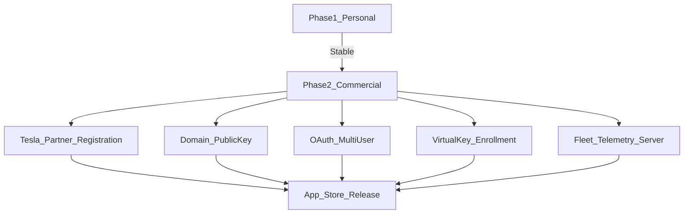
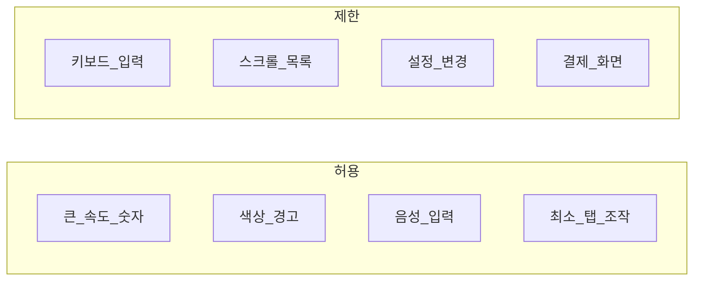

# 유상 배포 · 상용 제약 조사

## 1. Tesla Fleet API 상용 요건

### 1.1 Tesla 개발자 등록

| 항목 | Phase 1 (개인) | Phase 2 (상용) |
|---|---|---|
| Tesla Developer 계정 | 본인 계정 | 법인/사업자 등록 |
| 앱 이름 | MyT-Personal | MyT |
| OAuth Client | Single user | Multi-user |
| Public Key Domain | 개인 도메인 또는 localhost proxy | 공식 도메인 필수 |
| Fleet Telemetry | 불필요 (폴링) | 자체 서버 필수 (비용 절감) |
| Virtual Key | 본인 차량 1대 | 사용자별 페어링 UX |

### 1.2 API 비용 (2025~ 공식 pay-per-use)

Tesla는 계정당 **월 $10 할인(크레딧)** 을 제공한다. 개인 1대 사용은 이 금액을 **유료 전환 없이** 쓰도록 MyT가 호출을 제한한다.

| 카테고리 | 공식 단가 | 월 상한(앱 강제) | 일 상한 |
|---|---|---|---|
| Data (`vehicle_data` 등 폴링) | 500 req / $1 | 3,000 ($6.00) | 80 |
| Commands (내비 등) | 1,000 req / $1 | 200 ($0.20) | 8 |
| Wakes | 50 req / $1 | 50 ($1.00) | 2 |

합계 목표 **≤ $7.20 / 월** (크레딧 $10의 72%). **$9.50(95%)** 에서 모든 Fleet 호출을 차단한다.

| 차량 상태 | 폴링 | 웨이크 |
|---|---|---|
| 주행 · 앱 포그라운드 | 60초 | 금지 |
| 주차 · 앱 포그라운드 | 5분 | 금지 |
| 충전 | 3분 | 금지 |
| Sleep | 폴링 안 함 | 사용자 새로고침 또는 하루 2회까지 |
| 백그라운드 | 폴링 안 함 | 금지 |
| 한도 70%↑ | 간격 2배 | 웨이크 금지 |
| 한도 95%↑ | 호출 차단 | 차단 |

출처: [Tesla Billing and Limits](https://developer.tesla.com/docs/fleet-api/billing-and-limits), [developer.tesla.com](https://developer.tesla.com/)

### 1.3 Tesla 약관 핵심

- Fleet API 사용 시 Tesla Developer Agreement 준수
- 차량 데이터는 사용자 동의 하에만 수집
- `vehicle_location` scope 사용 시 차량 UI에 위치 공유 아이콘 표시됨 → 사용자 안내 필수
- 비공식 Owner API 사용 금지 (상용)
- 차량당 Fleet Telemetry 설정 최대 3~5개 앱

## 2. 앱 스토어 정책

### 2.1 Google Play

| 정책 | MyT 대응 |
|---|---|
| 운전 중 UI 제한 | 큰 글씨, 최소 탭, 음성 우선 |
| Foreground Service | `connectedDevice` 타입 선언 |
| Background Location | Phase 1 불필요 (Fleet API GPS) |
| 인앱 결제 | Phase 2: Google Play Billing |
| 데이터 안전 | 데이터 수집·공유 명시 |

### 2.2 Apple App Store

| 정책 | MyT 대응 |
|---|---|
| Background Bluetooth | `bluetooth-central` capability |
| 운전 중 UI | CarPlay 미사용, 독립 앱 |
| 인앱 결제 | Phase 2: StoreKit 2 |
| App Tracking Transparency | 추적 없음 (ATT 불필요) |
| Privacy Nutrition Label | 위치·차량 데이터 명시 |

### 2.3 운전 중 UI 가이드라인

- Gauge 모드: 정보 표시만, 조작 최소
- 설정·결제: 주차 중에만 접근
- 과속 경고: 시각+청각, 3초 이내 자동 해제

## 3. Phase 2 유상 배포 기능 (문서화만)

| 기능 | 설명 | 우선순위 |
|---|---|---|
| 구독/일회성 결제 | Play Billing + StoreKit | P0 |
| 멀티 차량 | 계정당 N대 | P1 |
| 멀티 사용자 OAuth | 사용자별 토큰·키 | P0 |
| Fleet Telemetry 서버 | 실시간 스트림 | P0 |
| 데이터 내보내기 | CSV/JSON | P2 |
| Home Assistant 연동 | MQTT/Webhook | P3 |
| Apple Watch / Wear OS | 차량 상태 위젯 | P2 |
| Siri Shortcuts / Google Assistant | 음성 명령 | P2 |

## 4. 개인정보 · 보안 (Phase 2)

| 항목 | 요구 |
|---|---|
| 개인정보처리방침 | 위치·차량·운행 데이터 |
| GDPR (EU) | 데이터 삭제·이동권 |
| OAuth 토큰 | 서버 미저장 (Phase 1), 암호화 저장 (Phase 2) |
| TLS | Fleet API 통신 전 구간 |
| 키 관리 | Android Keystore / iOS Keychain |

## 5. 참고

- [Tesla Fleet API - What is Fleet API](https://developer.tesla.com/docs/fleet-api/getting-started/what-is-fleet-api)
- [Google Play 운전 중 distraction 정책](https://developer.android.com/training/cars/driving)
- [Apple Human Interface Guidelines - CarPlay](https://developer.apple.com/design/human-interface-guidelines/carplay)
