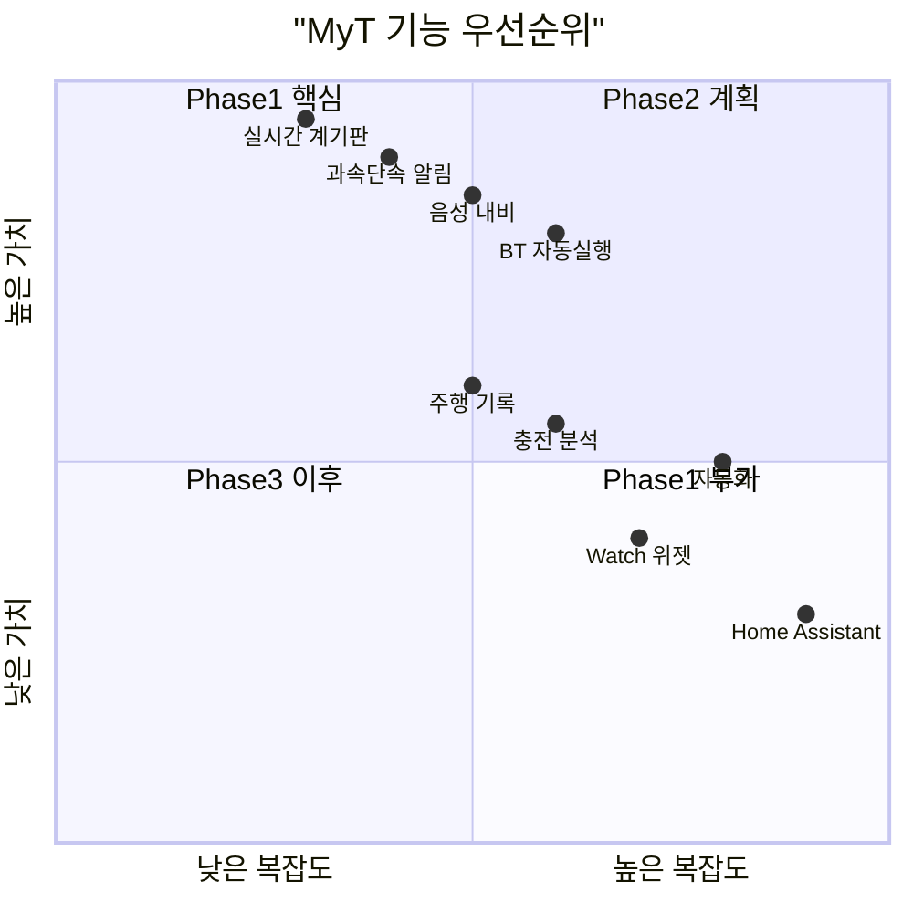
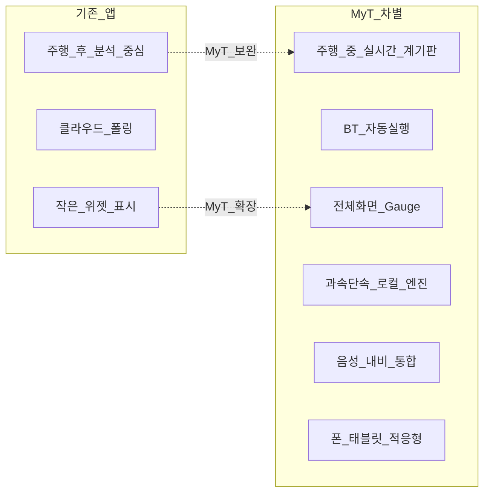

# 경쟁 앱 기능 분석

## 1. 분석 대상

| 앱 | 플랫폼 | 가격 | 사용자 규모 | 특징 |
|---|---|---|---|---|
| [Tessie](https://tessie.com) | iOS, Android, Watch, Web | $5.99/월 | 500K+ | 올인원, 자동화, 네이티브 UX |
| [TezLab](https://tezlabapp.com) | iOS, Android | 구독 | 대규모 | #1 EV 앱, FSD 분석 |
| [Stats for Tesla](https://stats.app) | iOS | 일회성/구독 | 장기 | 배터리·효율·Siri |
| [Nikola](https://nikolaapp.com) | iOS, Watch | $9.99/월 | 중규모 | 차량 보호·알림 |
| [Teslascope](https://teslascope.com) | Web, iOS(베타) | 구독 | 50K+ | 자동화·분석·FSD |
| [TeslaFi](https://teslafi.com) | Web | $10/월 | 중규모 | 충전·비용 추적 |
| [TeslaMate](https://github.com/adriankumpf/teslamate) | Self-hosted | 무료 | 오픈소스 | Grafana 대시보드 |
| [Watch app for Tesla](https://apps.apple.com/app/watch-app-for-tesla/id1512108917) | watchOS | 일회성 | 중규모 | Apple Watch 제어 |
| Tesla 공식 앱 | iOS, Android | 무료 | 전체 | 기본 제어·Live Camera |

## 2. 기능 매트릭스 (경쟁앱 전체 기능)

아래 표의 **모든 기능**을 MyT 기능 카탈로그에 포함한다. Phase는 구현 시기를 나타낸다.

### 2.1 실시간 계기판 · 주행 (MyT 핵심 차별)

| # | 기능 | Tessie | TezLab | Stats | Nikola | Teslascope | MyT Phase |
|---|---|---|---|---|---|---|---|
| D01 | 실시간 속도계 (대형) | - | - | - | - | - | **1** |
| D02 | 기어 표시 (P/R/N/D) | - | - | - | - | - | **1** |
| D03 | SOC / 항속거리 | ○ | ○ | ○ | ○ | ○ | **1** |
| D04 | 실내/외기 온도 | ○ | ○ | - | - | - | **1** |
| D05 | 전력 / 가속 (G-미터) | - | - | - | - | - | **1** |
| D06 | 타이어 공기압 | ○ | - | - | - | - | **1** |
| D07 | 안전벨트 / 좌석 점유 | - | - | - | - | - | **1** |
| D08 | GPS 위치 + 진행방향 | ○ | ○ | - | - | ○ | **1** |
| D09 | 목적지 / ETA / 경로 | ○ | - | - | - | - | **1** |
| D10 | 전체화면 Gauge UI | - | - | - | - | - | **1** |
| D11 | 가로/세로 적응 레이아웃 | - | - | - | - | - | **1** |
| D12 | 폰/태블릿 적응 레이아웃 | ○ | - | - | - | - | **1** |
| D13 | BT 연결 시 자동 실행 | - | - | - | - | - | **1** |
| D14 | 과속단속 카메라 알림 | - | - | - | - | - | **1** |
| D15 | 구간단속 평균속도 추적 | - | - | - | - | - | **1** |
| D16 | 음성 목적지 설정 | - | - | - | - | - | **1** |
| D17 | 주야간 자동 테마 | ○ | ○ | ○ | - | - | **1** |
| D18 | OBD급 실시간 진단 (Profiler) | ○ | - | - | - | - | 2 |

### 2.2 주행 기록 · 분석

| # | 기능 | Tessie | TezLab | Stats | Nikola | Teslascope | MyT Phase |
|---|---|---|---|---|---|---|---|
| T01 | 주행 기록 (거리, 시간, 효율) | ○ | ○ | ○ | ○ | ○ | 1.5 |
| T02 | 주행 지도 표시 | ○ | ○ | - | - | ○ | 1.5 |
| T03 | 주행 효율 (Wh/km, Wh/mi) | ○ | ○ | ○ | ○ | ○ | 1.5 |
| T04 | 주행 태그/분류 | ○ | ○ | - | - | - | 2 |
| T05 | FSD/Autopilot 분석 | ○ | ○ | - | - | ○ | 2 |
| T06 | Self-Driving 통계 | - | - | - | - | ○ | 2 |
| T07 | 최고/평균 속도 | ○ | ○ | ○ | ○ | - | 1.5 |
| T08 | 고도/온도 프로필 | ○ | ○ | - | - | - | 2 |
| T09 | CO₂ 절감 / 연료비 절약 | ○ | ○ | ○ | - | - | 2 |
| T10 | 다른 운전자와 비교 | ○ | ○ | ○ | ○ | - | 2 |
| T11 | 주행 배지/업적 | - | ○ | - | - | - | 3 |
| T12 | 주행 데이터 내보내기 (CSV) | ○ | - | ○ | - | ○ | 2 |
| T13 | 일/주/월 주행 통계 | ○ | ○ | ○ | ○ | ○ | 1.5 |
| T14 | 주행 히스토리 캘린더 | - | - | - | - | ○ | 2 |

### 2.3 충전 · 배터리

| # | 기능 | Tessie | TezLab | Stats | Nikola | Teslascope | MyT Phase |
|---|---|---|---|---|---|---|---|
| C01 | 실시간 충전 진행률 | ○ | ○ | ○ | ○ | ○ | **1** |
| C02 | 충전 속도 (kW) | ○ | ○ | - | ○ | ○ | **1** |
| C03 | 완충까지 남은 시간 | ○ | ○ | ○ | ○ | ○ | **1** |
| C04 | 충전 한도 설정 | ○ | ○ | ○ | - | - | 2 |
| C05 | 충전 기록 (세션별) | ○ | ○ | ○ | ○ | ○ | 1.5 |
| C06 | 충전 비용 계산 | ○ | ○ | - | - | ○ | 2 |
| C07 | Time-of-Use 요금 | ○ | - | ○ | - | ○ | 2 |
| C08 | Geo-fencing (장소별 요금) | - | - | - | - | ○ | 2 |
| C09 | Supercharger 비용/영수증 | - | - | - | - | ○ | 2 |
| C10 | 팬텀 드레인 추적 | ○ | ○ | ○ | ○ | - | 2 |
| C11 | 배터리 건강 (degradation) | ○ | ○ | ○ | ○ | ○ | 2 |
| C12 | 배터리 비교 (다른 사용자) | ○ | ○ | ○ | - | - | 2 |
| C13 | Smart Charging (시간 지정) | - | - | ○ | - | - | 2 |
| C14 | Smart Battery Prep (예열) | - | - | ○ | - | - | 2 |
| C15 | 충전 알림 (완료/중단) | ○ | ○ | ○ | ○ | - | 1.5 |
| C16 | 충전소 지도 | - | ○ | - | - | - | 2 |
| C17 | 충전 히스토리 그래프 | ○ | ○ | ○ | ○ | ○ | 2 |

### 2.4 차량 제어

| # | 기능 | Tessie | TezLab | Stats | Nikola | Teslascope | MyT Phase |
|---|---|---|---|---|---|---|---|
| V01 | 잠금/해제 | ○ | ○ | ○ | ○ | ○ | 2 |
| V02 | 원격 시동 (Remote Start) | ○ | ○ | - | - | - | 2 |
| V03 | 트렁크/프렁크 | ○ | ○ | ○ | ○ | - | 2 |
| V04 | 창문 열기/닫기 | ○ | - | - | - | - | 2 |
| V05 | 경적/라이트 | ○ | - | - | - | - | 2 |
| V06 | 클라이-mate ON/OFF | ○ | ○ | ○ | ○ | - | 2 |
| V07 | 클라이-mate 온도 설정 | ○ | ○ | ○ | - | - | 2 |
| V08 | Dog Mode | ○ | ○ | - | - | - | 2 |
| V09 | Camp Mode | ○ | ○ | - | - | - | 2 |
| V10 | Sentry Mode ON/OFF | ○ | - | - | - | - | 2 |
| V11 | 충전 포트 열기/닫기 | ○ | ○ | ○ | - | - | 2 |
| V12 | Quick Controls (커스텀) | - | ○ | - | - | - | 2 |
| V13 | Flash Lights / Honk | ○ | - | - | - | - | 2 |
| V14 | 차량 이름 변경 | ○ | - | - | - | - | 3 |
| V15 | Valet Mode | - | - | - | ○ | - | 3 |

### 2.5 자동화 · 알림

| # | 기능 | Tessie | TezLab | Stats | Nikola | Teslascope | MyT Phase |
|---|---|---|---|---|---|---|---|
| A01 | 스케줄 (시간 기반) | ○ | ○ | ○ | - | ○ | 2 |
| A02 | 트리거 (조건 기반) | ○ | ○ | - | - | ○ | 2 |
| A03 | 출발 시간 기반 클라이-mate | ○ | ○ | - | - | - | 2 |
| A04 | 위치 진입/이탈 알림 | ○ | - | - | - | ○ | 2 |
| A05 | 문/트렁크 열림 알림 | ○ | - | ○ | ○ | - | 2 |
| A06 | 잠금 해제 알림 | - | - | ○ | ○ | - | 2 |
| A07 | 자동 잠금 (문 열림 시) | - | - | ○ | - | - | 2 |
| A08 | 충전 완료 알림 | ○ | ○ | ○ | - | - | 1.5 |
| A09 | Sentry 이벤트 알림 | ○ | - | - | - | - | 2 |
| A10 | Sentry 침입 알림 | - | - | - | - | ○ | 2 |
| A11 | SOC 낮음 알림 | ○ | - | ○ | ○ | - | 2 |
| A12 | 과속 알림 | - | - | - | - | ○ | **1** |
| A13 | 펌웨어 업데이트 알림 | ○ | - | - | - | ○ | 2 |
| A14 | 서비스/하드웨어 이슈 알림 | - | - | - | - | ○ | 2 |
| A15 | 원격 클라이-mate 방치 알림 | - | - | ○ | - | - | 2 |

### 2.6 내비게이션 · 위치

| # | 기능 | Tessie | TezLab | Stats | Nikola | Teslascope | MyT Phase |
|---|---|---|---|---|---|---|---|
| N01 | 음성 목적지 설정 | - | - | - | - | - | **1** |
| N02 | 텍스트 목적지 설정 | - | - | - | - | - | **1** |
| N03 | 현재 내비 목적지 표시 | ○ | - | - | - | - | **1** |
| N04 | ETA / 남은 거리 | ○ | - | - | - | - | **1** |
| N05 | 경로 polyline 지도 | - | - | - | - | - | **1** |
| N06 | 과속단속 카메라 (로컬 DB) | - | - | - | - | - | **1** |
| N07 | 차량 현재 위치 지도 | ○ | ○ | - | - | ○ | 1.5 |
| N08 | Supercharger 검색 | - | ○ | - | - | - | 2 |
| N09 | 즐겨찾기 (Home/Work) | - | - | - | - | - | 2 |

### 2.7 플랫폼 · 확장

| # | 기능 | Tessie | TezLab | Stats | Nikola | Teslascope | MyT Phase |
|---|---|---|---|---|---|---|---|
| P01 | iOS + Android | ○ | ○ | iOS | iOS | iOS(베타) | **1** |
| P02 | iPad / 태블릿 최적화 | ○ | - | - | - | - | **1** |
| P03 | Apple Watch 앱 | ○ | - | - | ○ | ○ | 2 |
| P04 | Wear OS 앱 | ○ | - | - | - | - | 2 |
| P05 | 홈 화면 위젯 | ○ | - | ○ | - | - | 2 |
| P06 | Lock Screen 위젯 | ○ | - | - | - | - | 2 |
| P07 | Live Activity (충전) | - | - | - | - | ○ | 2 |
| P08 | Siri Shortcuts | ○ | - | ○ | ○ | - | 2 |
| P09 | Google Assistant | ○ | - | - | - | - | 2 |
| P10 | Home Assistant 연동 | ○ | - | - | - | - | 3 |
| P11 | HomeKit 연동 | ○ | - | - | - | - | 3 |
| P12 | Alexa 연동 | ○ | - | - | - | - | 3 |
| P13 | Web 대시보드 | ○ | - | - | - | ○ | 2 |
| P14 | Mac/PC 브라우저 제어 | ○ | - | - | - | - | 3 |
| P15 | 다중 차량 지원 | ○ | ○ | ○ | ○ | ○ | 2 |
| P16 | 데이터 가져오기 (Tessie 등) | ○ | - | - | - | ○ | 3 |
| P17 | 데이터 내보내기 | ○ | - | ○ | - | ○ | 2 |

## 3. MyT 차별점

| 차별점 | 설명 |
|---|---|
| **실시간 Gauge UI** | 경쟁앱은 주행 후 분석 중심. MyT는 주행 **중** 전체화면 계기판 |
| **BT 자동 실행** | Phone Key 연결 → 앱 자동 시작 (경쟁앱 없음) |
| **과속단속 로컬 엔진** | 공공데이터 기반, 커스터마이즈 가능한 다단계 경고 |
| **음성 내비 통합** | Gauge UI에서 바로 차량 내비 목적지 설정 |
| **크로스플랫폼 Gauge** | iPhone + iPad + Android 폰/태블릿 동일 Gauge 경험 |

## 4. 참고

- [Tessie App Store](https://apps.apple.com/us/app/tessie/id1496718223)
- [TezLab App Store](https://apps.apple.com/us/app/tezlab-for-tesla-rivian/id1239581716)
- [Stats for Tesla App Store](https://apps.apple.com/us/app/stats-for-model-s-x-3-y/id1191100729)
- [Teslascope](https://teslascope.com/about)
- [Tessie vs TeslaMate 비교](https://www.myteslamate.com/blog/teslamate-vs-tessie/)
