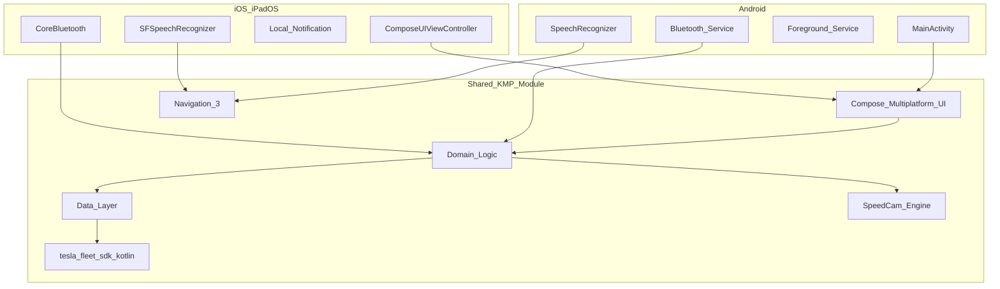
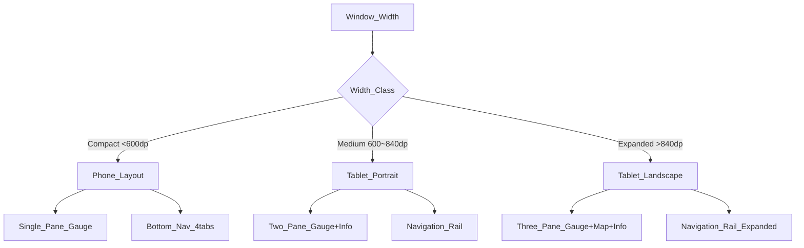
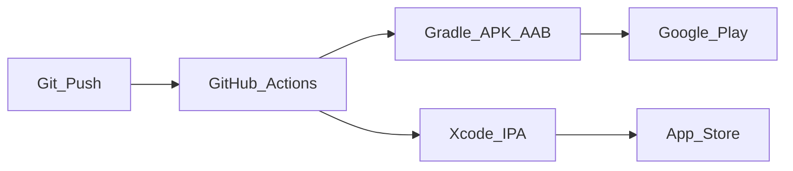

# 크로스플랫폼 기술 조사

## 1. 프레임워크 비교

| 기준 | Compose Multiplatform | Flutter | React Native |
|---|---|---|---|
| 언어 | Kotlin | Dart | JavaScript/TS |
| UI 공유율 | ~90% | ~95% | ~80% |
| iOS 성능 | 네이티브급 | 양호 | 양호 |
| Tesla Fleet SDK | Kotlin SDK 직접 사용 | REST 직접 구현 | REST 직접 구현 |
| BLE | Kable (KMP) | flutter_blue_plus | react-native-ble-plx |
| 적응형 레이아웃 | Material3 Adaptive | LayoutBuilder | Dimensions API |
| iPad 최적화 | ListDetailPaneScaffold | ResponsiveBuilder | react-native-responsive-screen |
| 생태계 성숙도 | 2025~ 급성장 | 성숙 | 성숙 |
| 학습 곡선 (Android 개발자) | 낮음 | 중간 | 중간 |

## 2. MyT 기술 선택: Compose Multiplatform (KMP)



**선택 이유:**

1. **Tesla Fleet SDK Kotlin** — 공식 Fleet API Kotlin SDK 존재 ([tesla-fleet-sdk-kotlin](https://github.com/boltfortesla/tesla-fleet-sdk-kotlin))
2. **UI 90%+ 공유** — Gauge UI, 설정, 분석 화면 모두 공유
3. **Material 3 Adaptive** — 폰/태블릿/가로/세로 자동 적응
4. **Android 개발자 친화** — Kotlin 단일 언어
5. **iOS 16+ 지원** — Compose Multiplatform iOS 안정화 (2025~)

## 3. 프로젝트 모듈 구조

```
MyT/
├── composeApp/                    # KMP 메인 모듈
│   ├── src/
│   │   ├── commonMain/kotlin/     # 공유 UI + 로직
│   │   │   ├── ui/                # Compose 화면
│   │   │   ├── domain/            # UseCase, Model
│   │   │   ├── data/              # Repository, API
│   │   │   └── di/                # Koin DI
│   │   ├── androidMain/kotlin/    # Android 전용
│   │   │   ├── service/           # BT Service, FG Service
│   │   │   └── platform/          # Speech, Notification
│   │   └── iosMain/kotlin/        # iOS 전용
│   │       └── platform/          # CoreBluetooth, Speech
│   └── build.gradle.kts
├── iosApp/                        # Xcode 프로젝트
│   └── iosApp/
│       └── ContentView.swift      # ComposeUIViewController 래퍼
├── androidApp/                    # Android 앱 모듈
│   └── src/main/
│       └── AndroidManifest.xml
├── shared/                        # (선택) pure KMP logic module
└── docs/                          # 설계 문서
```

## 4. 핵심 라이브러리

| 영역 | 라이브러리 | 플랫폼 | 용도 |
|---|---|---|---|
| UI | Compose Multiplatform 1.9+ | All | 화면 |
| Adaptive | Material3 Adaptive 1.3+ | All | 폰/태블릿 레이아웃 |
| Navigation | Navigation 3 + Adaptive | All | 화면 전환 |
| DI | Koin 4.x + KSP | All | 의존성 주입 |
| Network | Ktor Client 3.x | All | HTTP (Fleet API) |
| Serialization | kotlinx.serialization | All | JSON |
| Tesla API | tesla-fleet-sdk-kotlin 3.x | All | Fleet API |
| BLE | Kable 0.36+ | Android/iOS | Bluetooth LE |
| DB | SQLDelight 2.x | All | 과속카메라 POI |
| Settings | Multiplatform Settings | All | 사용자 설정 |
| DateTime | kotlinx-datetime | All | 시간 처리 |
| Coroutines | kotlinx.coroutines | All | 비동기 |
| Image | Coil 3.x (Compose) | All | 아이콘·이미지 |
| Map | (Phase 1.5) MapLibre / Google Maps | Platform-specific | 경로·위치 |
| Speech | expect/actual | Platform | STT |
| Audio | expect/actual | Platform | 경고음 |
| Crypto | expect/actual | Platform | Keystore/Keychain |

## 5. 적응형 레이아웃 전략

### 5.1 Window Size Class



| Window Class | 너비 | 네비게이션 | Gauge 레이아웃 |
|---|---|---|---|
| Compact | < 600dp | Bottom Navigation Bar | 단일 패널 (세로/가로) |
| Medium | 600~840dp | Navigation Rail (접힘) | 2-패널 (Gauge + Info) |
| Expanded | > 840dp | Navigation Rail (펼침) | 3-패널 (Gauge + Map + Info) |

### 5.2 디바이스별 레이아웃

| 디바이스 | 화면 | Gauge 배치 | 부가 정보 |
|---|---|---|---|
| iPhone (세로) | Compact | 전체화면 속도계 중앙 | 하단: SOC, ETA, 온도 |
| iPhone (가로) | Compact | 좌: 속도계 / 우: SOC+기어+ETA | 상단: 경고 배너 |
| iPad (세로) | Medium | 상단 60%: 속도계 | 하단 40%: 지도+정보 |
| iPad (가로) | Expanded | 좌 40%: 속도계 | 중 30%: 지도 / 우 30%: 상세 |
| Android Phone | Compact | iPhone과 동일 | iPhone과 동일 |
| Android Tablet | Medium~Expanded | iPad와 동일 | iPad와 동일 |

## 6. 플랫폼별 네이티브 코드 (expect/actual)

| 기능 | Android | iOS/iPadOS |
|---|---|---|
| BT 연결 감지 | `BluetoothBroadcastReceiver` + `CompanionDeviceManager` | `CBCentralManager` delegate |
| 앱 자동 실행 | `Intent` + Foreground Service | Local Notification → 탭 |
| STT | `SpeechRecognizer` | `SFSpeechRecognizer` |
| TTS | `TextToSpeech` | `AVSpeechSynthesizer` |
| 경고음 | `MediaPlayer` / `ToneGenerator` | `AVAudioPlayer` |
| 햅틱 | `Vibrator` | `UIImpactFeedbackGenerator` |
| 토큰 저장 | `EncryptedSharedPreferences` | `Keychain` |
| 백그라운드 | Foreground Service (`connectedDevice`) | `bluetooth-central` BG mode |
| 화면 항상 켜짐 | `FLAG_KEEP_SCREEN_ON` | `UIApplication.shared.isIdleTimerDisabled` |
| 위젯 | Glance AppWidget (Phase 2) | WidgetKit (Phase 2) |

## 7. 개발·빌드 환경

| 항목 | 요구 |
|---|---|
| IDE | Android Studio Ladybug+ / IntelliJ IDEA |
| Xcode | 16+ (iOS 빌드) |
| Kotlin | 2.1+ |
| Compose Multiplatform | 1.9+ |
| JDK | 17+ |
| iOS Deployment Target | 16.0+ |
| Android minSdk | 26 (Android 8.0) |
| Android targetSdk | 35 |

## 8. CI/CD (Phase 2)



## 9. 참고

- [Compose Multiplatform 공식](https://www.jetbrains.com/compose-multiplatform/)
- [Material 3 Adaptive](https://developer.android.com/develop/ui/compose/layouts/adaptive)
- [Navigation 3 in KMP](https://kotlinlang.org/docs/multiplatform/compose-navigation-3.html)
- [Kable BLE library](https://github.com/JuulLabs/kable)
- [tesla-fleet-sdk-kotlin](https://github.com/boltfortesla/tesla-fleet-sdk-kotlin)
