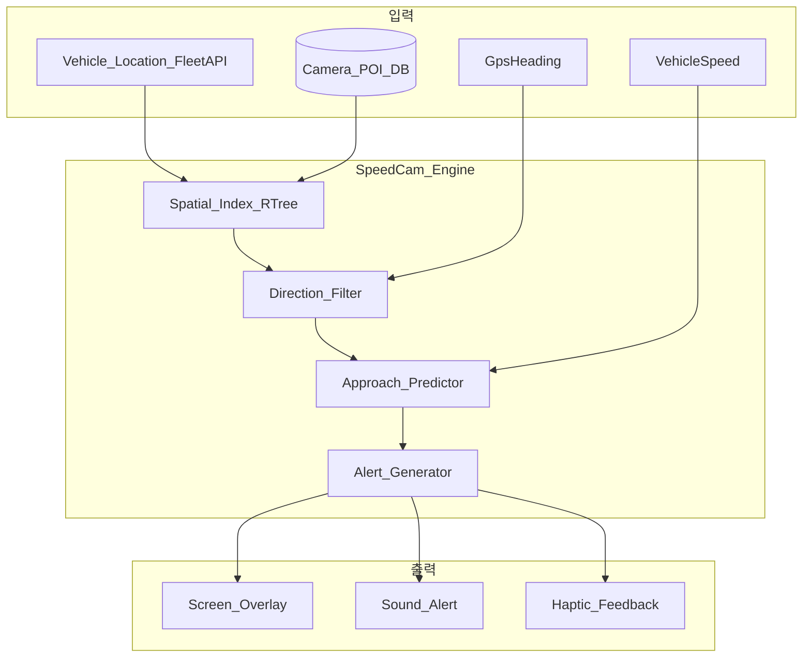
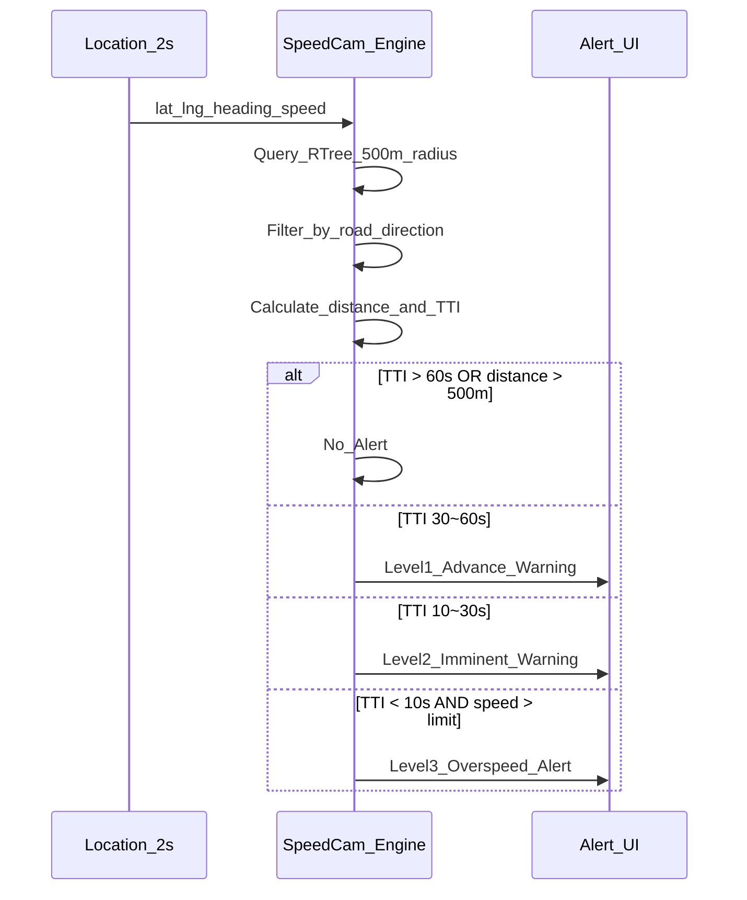
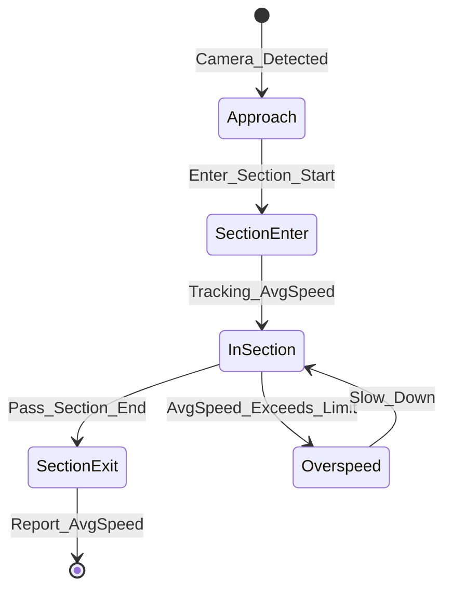

# 한국 과속단속 카메라 데이터 조사

## 1. 데이터 소스

### 1.1 주 데이터: 공공데이터포털

**[전국무인교통단속카메라표준데이터](https://www.data.go.kr/data/15028200/standard.do)**

| 항목 | 내용 |
|---|---|
| 제공기관 | 경찰청 |
| 형식 | CSV, JSON, XLS, RDF, API |
| 갱신 | 매월 초 전국 병합 |
| 비용 | 무료 |
| 범위 | 전국 고정식 (이동식 제외) |

**데이터 필드:**

| 필드명 | 타입 | MyT 활용 |
|---|---|---|
| 무인교통단속카메라관리번호 | string | 고유 ID |
| 시도명 | string | 지역 필터 |
| 시군구명 | string | 지역 필터 |
| 도로종류 | string | 도로 유형 표시 |
| 도로노선명 | string | UI 표시 |
| 도road노선방향 | string | **진행 방향 필터 (핵심)** |
| 위도 | double | 거리 계산 |
| 경도 | double | 거리 계산 |
| 설치장소 | string | UI 표시 |
| 단속구분 | string | 과속/신호/버스전용 등 |
| 제한속도 | int | **경고 기준 (핵심)** |
| 단속구간위치구분 | string | 고정/구간단속 시작·종료 |
| 과속단속구간길이 | int | 구간단속 거리 |
| 보호구역구분 | string | 어린이/노인 보호 |
| 설치연도 | int | 참고 |
| 데이터기준일자 | date | 캐시 갱신 기준 |

### 1.2 보조 데이터

| 소스 | URL | 용도 |
|---|---|---|
| 교통정보공개서비스 (ITS) | [openapi.its.go.kr](http://openapi.its.go.kr) | 가변속도표지, CCTV |
| 지자체별 API (예: 대전) | data.go.kr | 지역별 실시간 갱신 |

## 2. MyT 과속단속 엔진 설계



### 2.1 POI 데이터 관리

| 항목 | 설계 |
|---|---|
| 저장 | 앱 내 SQLite (Room/SQLDelight) |
| 초기 로드 | 앱 설치 시 JSON 번들 + API 갱신 |
| 갱신 주기 | 월 1회 (백그라운드) |
| 인덱스 | R-Tree 공간 인덱스 (위도/경도) |
| 데이터 크기 | ~15,000건, ~2MB JSON |

### 2.2 탐지 알고리즘



**경고 단계:**

| 단계 | 조건 | 시각 | 청각 | 햅틱 |
|---|---|---|---|---|
| L1 예고 | 전방 300~500m | 화면 상단 배너 (노란) | 없음 | 없음 |
| L2 임박 | 전방 100~300m | 화면 중앙 오버레이 (주황) | 짧은 비프 1회 | 짧은 진동 |
| L3 과속 | 전방 <100m + 현재속도 > 제한속도 | 전체화면 플래시 (빨강) | 연속 비프 3회 | 긴 진동 |
| L4 구간단속 | 구간 진입~이탈 | 구간 표시 + 평균속도 | 구간 진입 시 1회 | 없음 |

### 2.3 방향 필터링

카메라의 `도로노선방향` 필드와 차량 `GpsHeading`을 비교:

```
heading_diff = abs(camera_direction - vehicle_heading)
if heading_diff > 90° AND heading_diff < 270°:
    skip  // 반대 방향 카메라 제외
```

### 2.4 구간단속 처리

`단속구간위치구분`이 "시점"/"종점"인 경우:



- 구간 진입 시 타이머 시작, 평균 속도 실시간 계산
- 구간 내 평균 속도 > 제한속도 → L3 경고
- 구간 종료 시 평균 속도 표시 (운행 기록용)

## 3. Tesla 내장 과속카메라 vs MyT

| 항목 | Tesla 내장 (2023.44+) | MyT |
|---|---|---|
| 데이터 | Tesla 자체 (한국 데이터 확보 2024) | 공공데이터포털 |
| 표시 | 차량 내비 화면 | 휴대폰/태블릿 전체화면 |
| 커스터마이즈 | 불가 | 경고 단계·소리·임계값 설정 |
| 구간단속 | 제한적 | 평균속도 추적 |
| 오프라인 | Premium Connectivity 필요 | 로컬 DB |

> MyT는 Tesla 내장 기능을 **대체**하는 것이 아니라, 휴대폰/태블릿에서 **더 큰 화면·더 강한 경고·커스터마이즈**를 제공한다.

## 4. 참고

- [전국무인교통단속카메라표준데이터](https://www.data.go.kr/data/15028200/standard.do)
- [교통정보공개서비스](http://openapi.its.go.kr)
- [테슬라 한국 과속단속 카메라 데이터 확보 (Bloter)](https://www.bloter.net/news/articleView.html?idxno=615640)
