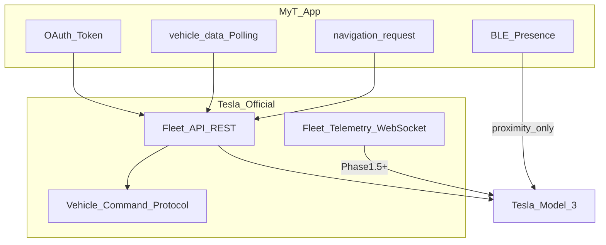
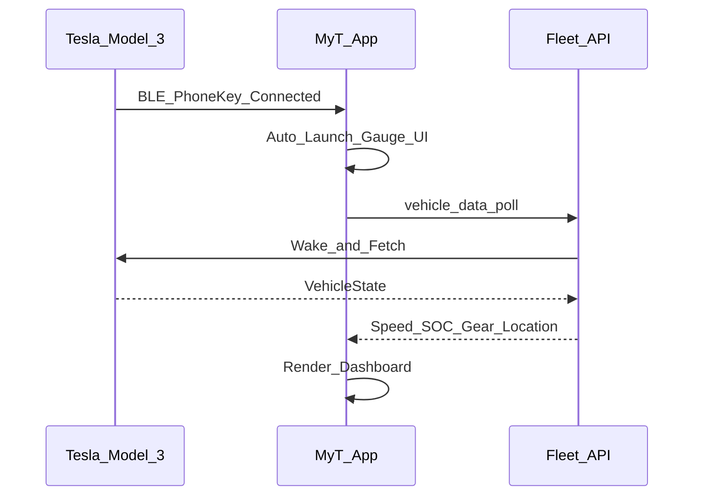
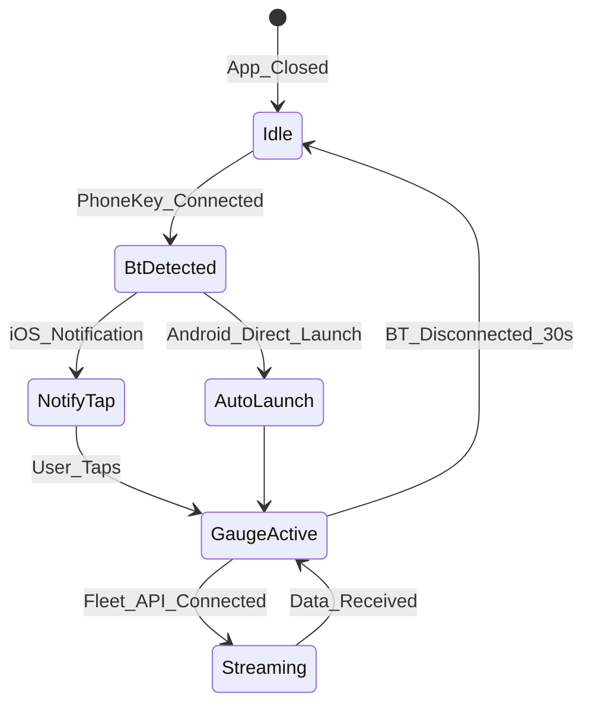

# Tesla API · Bluetooth 조사 결과

## 1. Tesla 공식 API 개요

Tesla는 서드파티 앱을 위해 **Fleet API**를 공식 제공한다. Owner API(비공식)는 상용 배포에 부적합하므로 MyT는 Fleet API만 사용한다.



### 1.1 Fleet API 등록 절차

| 단계 | 내용 |
|---|---|
| 1 | Tesla 계정 생성 (이메일 인증 + MFA) |
| 2 | [developer.tesla.com](https://developer.tesla.com)에서 앱 등록 |
| 3 | EC P-256 키쌍 생성, 공개키를 도메인에 호스팅 |
| 4 | `register` 엔드포인트 호출 (리전별) |
| 5 | OAuth 토큰 발급, 가상 키 페어링 (`tesla.com/_ak/<domain>`) |

**필수 OAuth Scopes (MyT):**

| Scope | 용도 |
|---|---|
| `openid` | 사용자 인증 |
| `offline_access` | Refresh token |
| `vehicle_device_data` | 차량 상태 조회 |
| `vehicle_location` | GPS, 내비 목적지, RouteLine |
| `vehicle_cmds` | 내비 목적지 설정, 차량 제어 |
| `vehicle_charging_cmds` | 충전 제어 (Phase 2) |

### 1.2 데이터 수집 방식 비교

| 방식 | 지연 | 비용 | 배터리 영향 | Phase |
|---|---|---|---|---|
| `vehicle_data` 폴링 | 1~5초 (웨이크 포함) | API 호출당 과금 | 차량 웨이크 발생 | Phase 1 |
| Fleet Telemetry | ~1초 (스트림) | 서버 호스팅 | 웨이크 없음 | Phase 1.5+ |

**Phase 1 결정:** 주행 중 `vehicle_data` 2초 간격 폴링. 주차/충전 시 30초~5분 간격.

### 1.3 Fleet Telemetry 주요 필드 (계기판용)

| 필드 | 카테고리 | 타입 | 설명 | UI 매핑 |
|---|---|---|---|---|
| `VehicleSpeed` | Driving | real (mph) | 현재 속도 | 속도계 메인 |
| `Gear` | Driving | ShiftState | P/R/N/D | 기어 표시 |
| `Soc` | Charging | real (%) | 사용 가능 SOC | 배터리 % |
| `BatteryLevel` | Charging | real (%) | 전체 SOC | 배터리 % (보조) |
| `EstBatteryRange` | Charging | real (mi) | 예상 항속거리 | 항속거리 |
| `InsideTemp` | Climate | real (°C) | 실내 온도 | 온도 위젯 |
| `OutsideTemp` | Climate | real (°C) | 외기 온도 | 온도 위젯 |
| `Location` | Location | Location | GPS 좌표 | 지도·과속카메라 |
| `GpsHeading` | Location | real (°) | 진행 방향 | 나침반·지도 |
| `DestinationName` | Location | string | 목적지 이름 | 내비 위젯 |
| `DestinationLocation` | Location | Location | 목적지 좌표 | 내비 위젯 |
| `MilesToArrival` | Location | real | 도착까지 거리 | ETA 위젯 |
| `MinutesToArrival` | Location | real | 도착까지 시간 | ETA 위젯 |
| `RouteLine` | Location | string | base64 polyline | 경로 지도 |
| `ChargeState` | Charging | string | 충전 상태 | 충전 위젯 |
| `DetailedChargeState` | Charging | enum | 상세 충전 상태 | 충전 위젯 |
| `ChargeLimitSoc` | Charging | integer | 충전 한도 % | 충전 위젯 |
| `TimeToFullCharge` | Charging | real (h) | 완충까지 시간 | 충전 위젯 |
| `ChargeRate` | Charging | real | 충전 속도 | 충전 위젯 |
| `TpmsPressureFl/Fr/Rl/Rr` | Vehicle State | real | 타이어 공기압 | 타이어 위젯 |
| `DriverSeatBelt` | Safety | boolean | 안전벨트 | 안전 위젯 |
| `DriverSeatOccupied` | Vehicle State | boolean | 운전석 점유 | 상태 표시 |
| `Odometer` | Vehicle State | real (mi) | 주행거리 | 통계 |
| `Power` | Driving | real (kW) | 순간 전력 | 효율 위젯 |
| `LongAccel` | Driving | real | 종방향 가속 | G-미터 |
| `LatAccel` | Driving | real | 횡방향 가속 | G-미터 |
| `HvacPower` | Climate | enum | HVAC 상태 | 클라이-mate |
| `Locked` | Vehicle State | boolean | 잠금 상태 | 상태 표시 |
| `SentryMode` | Vehicle State | boolean | 센트리 모드 | 상태 표시 |

> `vehicle_location` scope 필요: Location, DestinationName, RouteLine, GpsHeading 등

## 2. Bluetooth (BLE) 조사

### 2.1 BLE의 역할 (MyT에서)

BLE는 **계기판 데이터 소스가 아니다**. Phone Key 프로토콜(VCSEC)은 차량 근접 감지·잠금/해제용이다.



### 2.2 BLE 기술 상세

| 항목 | 값 |
|---|---|
| Service UUID | `00000211-b2d1-43f0-9b88-960cebf8b91e` |
| Write Characteristic | `00000212-b2d1-43f0-9b88-960cebf8b91e` |
| Read Characteristic | `00000213-b2d1-43f0-9b88-960cebf8b91e` |
| Advertisement Name | `S` + SHA1(VIN)[0:8] + `C` |
| 동시 BLE 연결 제한 | ~3개 (Phone Key + Fob 공유) |
| 암호화 | AES-128-GCM, 4-byte nonce |

### 2.3 플랫폼별 BLE 구현

| 플랫폼 | API | 라이브러리 | 용도 |
|---|---|---|---|
| Android | BluetoothLeScanner, CompanionDeviceManager | Kable (KMP) | Phone Key 연결 감지 |
| iOS | CoreBluetooth (CBCentralManager) | Kable / TeslaBLEKeyKit | Phone Key 연결 감지 |
| iPadOS | CoreBluetooth | 동일 | Phone Key 연결 감지 |

**Phase 1:** OS 수준 Bluetooth 연결 이벤트로 Tesla Phone Key 페어링 감지 → 앱 자동 실행.
**Phase 1.5+:** Vehicle Command Protocol BLE 직접 통신 (로컬 명령 보조).

### 2.4 플랫폼별 자동 실행

| 플랫폼 | 메커니즘 | 제약 |
|---|---|---|
| Android | Foreground Service + BluetoothBroadcastReceiver + CompanionDeviceManager | 백그라운드 제한 (Android 12+) |
| iOS | CoreBluetooth background mode + Local Notification | 앱 직접 실행 불가 → 알림 탭으로 진입 |
| iPadOS | iOS와 동일 | Split View 시 Gauge UI 전체화면 권장 |



## 3. Vehicle Command Protocol

### 3.1 명령 카테고리

| 카테고리 | 예시 | SignerRequired | MyT Phase |
|---|---|---|---|
| 잠금/해제 | lock, unlock | Yes | 2 |
| 내비 | navigation_request | No (REST) | 1 |
| 클라이-mate | auto_conditioning_start/stop | Yes | 2 |
| 충전 | charge_start/stop, set_charge_limit | Yes | 2 |
| 창문/트렁크 | window_control, actuate_trunk | Yes | 2 |
| 경적/라이트 | honk_horn, flash_lights | Yes | 2 |

### 3.2 navigation_request (Phase 1 핵심)

```
POST /api/1/vehicles/{vin}/command/navigation_request
Body: { "value": "강남역" }  // 또는 "37.4979,127.0276"
```

- Fleet REST API 직접 호출 (Vehicle Command Proxy 불필요)
- `vehicle_cmds` scope 필요
- 차량 내비게이션에 목적지 전송, 차량 UI에서 경로 표시

## 4. 리스크 및 대응

| 리스크 | 영향 | 대응 |
|---|---|---|
| Fleet API 폴링 비용 | Phase 2 운영비 | Telemetry 전환 (Phase 1.5) |
| BLE 3연결 제한 | Phone Key 충돌 | MyT는 연결 감지만, 직접 BLE 연결 최소화 |
| iOS 백그라운드 실행 제한 | 자동 실행 불가 | 알림 + Shortcuts + 위젯 |
| vehicle_location scope | 위치 공유 아이콘 표시 | 사용자 동의 UX |
| 가상 키 미페어링 | 명령 403 | 온보딩에서 페어링 필수 안내 |

## 5. 참고 자료

- [Tesla Fleet API 공식 문서](https://developer.tesla.com/docs/fleet-api)
- [Fleet Telemetry Available Data](https://developer.tesla.com/docs/fleet-api/fleet-telemetry/available-data)
- [Vehicle Command Protocol](https://github.com/teslamotors/vehicle-command/blob/main/pkg/protocol/protocol.md)
- [tesla-fleet-sdk-kotlin](https://github.com/boltfortesla/tesla-fleet-sdk-kotlin)
- [TeslaBLEKeyKit (Swift)](https://github.com/misakatao/TeslaBLEKeyKit)
