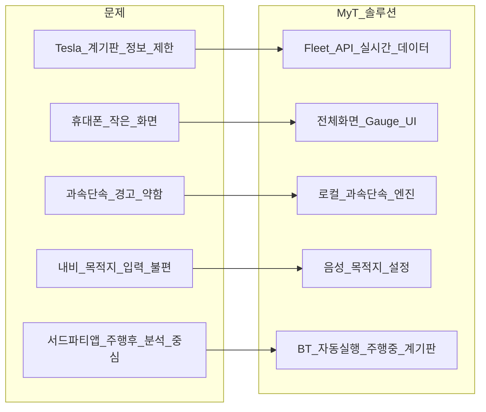
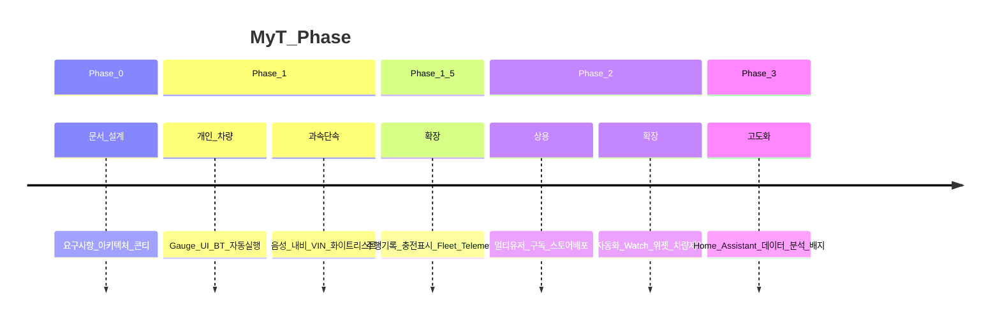
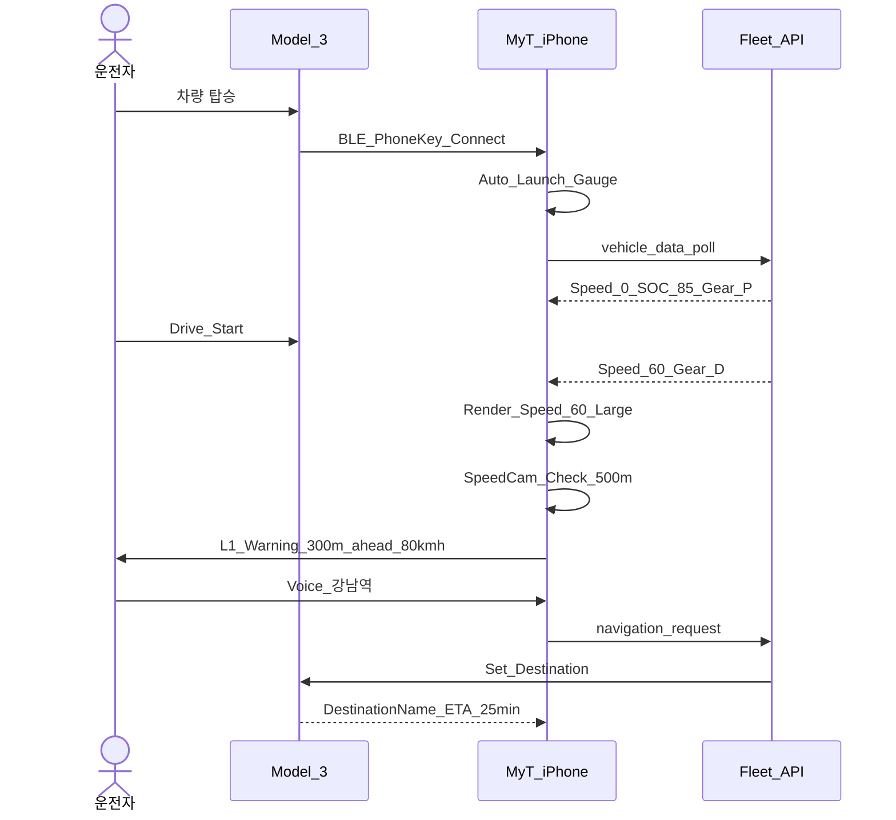

# MyT 제품 개념

## 1. 한 줄 정의

**MyT**는 Tesla Model 3와 블루투스·Fleet API로 연결하여, iPhone·iPad·Android 폰/태블릿에서 **실시간 계기판·과속단속 알림·음성 내비**를 제공하는 크로스플랫폼 드라이빙 컴패니언 앱이다.

## 2. 문제 · 솔루션

## 3. 타겟 사용자

### Phase 1: Early Adopter (본인)

| 속성 | 값 |
|---|---|
| 차량 | Tesla Model 3 (본인 소유 1대) |
| 디바이스 | iPhone / Android Phone + iPad (선택) |
| 사용 패턴 | 출퇴근·장거리 주행 시 휴대폰/태블릿 거치 |
| 기술 수준 | Fleet API 등록·OAuth 가능 |
| 핵심 니즈 | 실시간 계기판 + 과속단속 + 음성 내비 |

### Phase 2: Tesla 운전자 (유상)

| 속성 | 값 |
|---|---|
| 차량 | Tesla Model 3/Y/S/X (Fleet API 지원) |
| 디바이스 | iOS 16+ / Android 8+ (폰·태블릿) |
| 사용 패턴 | 일상 주행 + 충전 관리 + 차량 제어 |
| 핵심 니즈 | 올인원 Tesla 컴패니언 (Tessie 대안) |

## 4. Phase 구분

| Phase | 범위 | 배포 |
|---|---|---|
| **0** | 문서·설계 | - |
| **1** | Gauge UI, BT 자동실행, 과속단속, 음성 내비, 1 VIN | 사이드로드/APK |
| **1.5** | 주행/충전 기록, Fleet Telemetry, 지도 | 사이드로드 |
| **2** | 멀티유저, 구독, 차량 제어, 자동화, Watch/위젯 | App Store + Play |
| **3** | Home Assistant, 고급 분석, 배지, Web | 업데이트 |

## 5. 핵심 사용자 시나리오

### US-01: 출근 (Phone, 세로)

### US-02: 장거리 (iPad, 가로)

1. iPad를 차량 거치대에 세로/가로 배치
2. BT 연결 → Gauge UI 3-패널 (속도계 + 지도 + 정보)
3. 주행 중 과속단속 L1→L2→L3 단계 경고
4. 구간단속 진입 → 평균속도 추적 표시
5. 목적지 도착 → 주행 기록 자동 저장 (Phase 1.5)

### US-03: 충전 (Phone/Tablet)

1. 주차 후 Gauge UI → 충전 모드 자동 전환
2. 충전 진행률, kW, 완충까지 시간 표시
3. 충전 완료 알림 (Phase 1.5)

## 6. MyT vs 경쟁앱 포지셔닝

| | Tessie | TezLab | MyT |
|---|---|---|---|
| **핵심 가치** | 올인원 관리 | EV 분석 | **주행 중 계기판** |
| **실시간 Gauge** | ✗ | ✗ | **✓ 전체화면** |
| **BT 자동 실행** | ✗ | ✗ | **✓** |
| **과속단속 (로컬)** | ✗ | ✗ | **✓ 다단계** |
| **음성 내비** | ✗ | ✗ | **✓** |
| **크로스플랫폼 Gauge** | ✗ | ✗ | **✓ iPad 최적화** |
| 주행 후 분석 | ✓ | ✓ | Phase 1.5+ |
| 자동화 | ✓ | ✓ | Phase 2 |
| Watch/위젯 | ✓ | ✗ | Phase 2 |
| 가격 | $5.99/월 | 구독 | Phase 2 결정 |

## 7. 성공 기준

| Phase | 기준 |
|---|---|
| Phase 1 | 본인 Model 3에서 Gauge·과속단속·음성내비 2주간 무중단 사용 |
| Phase 1.5 | 주행/충전 기록 100건+, Telemetry 전환 |
| Phase 2 | 100+ 유료 사용자, App Store/Play 4.0+ 평점 |
