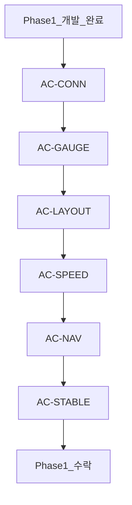
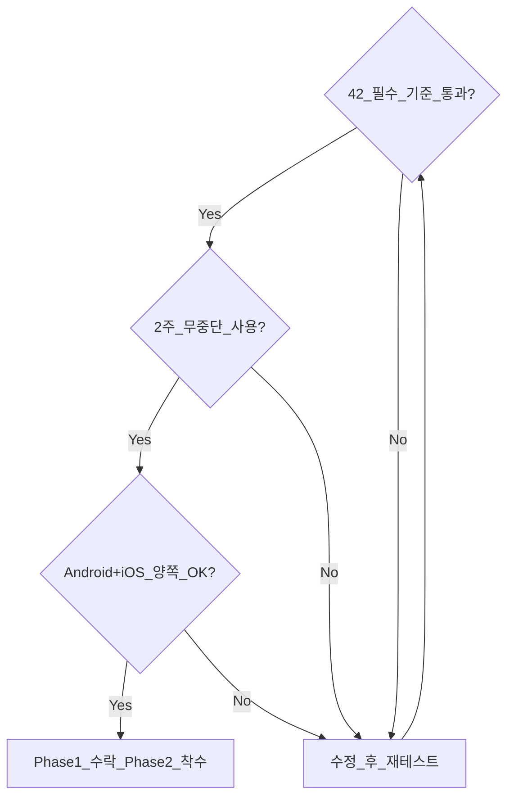

# Phase 1 수락 기준 (Acceptance Criteria)

## 1. 수락 기준 개요

Phase 1 완료 = **본인 Tesla Model 3에서 2주간 일상 주행(Gauge + SpeedCam + Voice Nav)을 무중단 사용**.

---

## AC-CONN: 연결 · 자동 실행

| # | 기준 | 검증 방법 |
|---|---|---|
| AC-C01 | Tesla Phone Key BT 연결 후 3초 이내 Gauge UI 시작 (Android) | 실차 테스트 10회 |
| AC-C02 | iOS: BT 연결 후 알림 표시, 탭 시 2초 이내 Gauge 시작 | iPhone 실차 10회 |
| AC-C03 | BT 해제 30초 후 Gauge 종료 또는 대기 화면 | 실차 테스트 5회 |
| AC-C04 | Tesla OAuth 로그인 → 토큰 저장 → 재실행 시 자동 로그인 | 수동 테스트 |
| AC-C05 | 지정 VIN 외 차량 접근 차단 | 다른 VIN 시도 |
| AC-C06 | Fleet API vehicle_data 2초 간격 폴링 (주행 중) | 로그 확인 |
| AC-C07 | 차량 Sleep 시 "대기 중" 표시 + 30s 폴링 | 주차 후 5분 |
| AC-C08 | Android + iOS 모두 동작 | 양 플랫폼 실차 |

## AC-GAUGE: 계기판 표시

| # | 기준 | 검증 방법 |
|---|---|---|
| AC-G01 | 속도 ±2km/h 이내 정확도 (차량 계기판 대비) | 100km/h 구간 비교 |
| AC-G02 | 속도 갱신 ≤ 2초 지연 | 타임스탬프 비교 |
| AC-G03 | SOC ±1% 이내 | 차량 화면 대비 |
| AC-G04 | 기어 P/R/N/D 정확 표시 | 기어 변경 시 확인 |
| AC-G05 | 실내/외기 온도 ±1°C | 차량 화면 대비 |
| AC-G06 | 목적지 설정 시 ETA/거리 표시 | 내비 시작 후 확인 |
| AC-G07 | 충전 중: %, kW, 남은 시간 표시 | 충전 세션 |
| AC-G08 | 전체화면 (상태바 숨김) | 시각 확인 |
| AC-G09 | Keep Screen On 동작 | 10분 주행 중 화면 유지 |

## AC-LAYOUT: 적응형 레이아웃

| # | 기준 | 검증 방법 |
|---|---|---|
| AC-L01 | iPhone 세로: 속도 중앙, 정보 하단 | 시각 확인 |
| AC-L02 | iPhone 가로: 2-패널 레이아웃 | 회전 테스트 |
| AC-L03 | iPad 세로: 2-패널 (Gauge + Map) | iPad 실기 |
| AC-L04 | iPad 가로: 3-패널 | iPad 실기 |
| AC-L05 | Android Phone: iPhone과 동등 레이아웃 | Android 실기 |
| AC-L06 | Android Tablet: iPad와 동등 레이아웃 | Tablet 실기 |
| AC-L07 | 회전 시 300ms 이내 재배치 | slow-mo 녹화 |

## AC-SPEED: 과속단속

| # | 기준 | 검증 방법 |
|---|---|---|
| AC-S01 | POI DB 15,000건+ 로드 | DB count 확인 |
| AC-S02 | 알려진 카메라 위치 500m 전 탐지 | 실제 카메라 구간 |
| AC-S03 | L1 배너 300m+ 전 표시 | 실차 + GPS 로그 |
| AC-S04 | L2 오버레이 100~300m + 비프 | 실차 |
| AC-S05 | L3 과속 시 (<100m, speed>limit) 플래시+비프+진동 | 실차 (안전 속도) |
| AC-S06 | 반대 방향 카메라 미표시 | 반대 차로 구간 |
| AC-S07 | 구간단속 평균속도 표시 | 구간단속 구간 |
| AC-S08 | 경고 3초 후 자동 해제 (L3 제외) | 타이머 확인 |

## AC-NAV: 음성 내비

| # | 기준 | 검증 방법 |
|---|---|---|
| AC-N01 | "강남역" 음성 → STT → 확인 UI | 음성 테스트 5회 |
| AC-N02 | 확인 후 navigation_request → 차량 내비 반영 | 차량 화면 확인 |
| AC-N03 | STT 인식률 80%+ (한국어 목적지) | 10개 목적지 테스트 |
| AC-N04 | 전송 실패 시 에러 메시지 + 재시도 | 네트워크 off 테스트 |
| AC-N05 | iOS + Android STT 모두 동작 | 양 플랫폼 |

## AC-STABLE: 안정성

| # | 기준 | 검증 방법 |
|---|---|---|
| AC-ST01 | 2주간 Gauge 크래시 0건 | 일상 사용 |
| AC-ST01 | 1회 주행 2시간+ 무중단 Gauge | 장거리 테스트 |
| AC-ST03 | 네트워크 끊김 → 재연결 자동 복구 | 터널/지하 주차장 |
| AC-ST04 | OAuth 토큰 자동 refresh | 24h+ 사용 |
| AC-ST05 | Android 배터리 1h Gauge ≤ 5% | 배터리 프로파일 |
| AC-ST06 | iOS 배터리 1h Gauge ≤ 8% | 배터리 프로파일 |

---

## 2. 수락 테스트 매트릭스

| 카테고리 | 항목 수 | 필수 | 선택 |
|---|---|---|---|
| CONN | 8 | 8 | 0 |
| GAUGE | 9 | 9 | 0 |
| LAYOUT | 7 | 7 | 0 |
| SPEED | 8 | 7 | 1 (S07) |
| NAV | 5 | 5 | 0 |
| STABLE | 6 | 6 | 0 |
| **합계** | **43** | **42** | **1** |

## 3. Phase 1.5 추가 수락 (참고)

| # | 기준 |
|---|---|
| AC-15-01 | 주행 자동 기록 (100건+) |
| AC-15-02 | 충전 세션 기록 |
| AC-15-03 | Fleet Telemetry 전환 (폴링 대비 지연 50% 감소) |
| AC-15-04 | POI DB OTA 갱신 |

## 4. Go/No-Go 체크리스트

- [ ] AC-CONN 8/8 통과
- [ ] AC-GAUGE 9/9 통과
- [ ] AC-LAYOUT 7/7 통과
- [ ] AC-SPEED 7/8 통과 (S07 선택)
- [ ] AC-NAV 5/5 통과
- [ ] AC-STABLE 6/6 통과
- [ ] 2주 일상 사용 크래시 0
- [ ] Android + iOS 양 플랫폼 확인
