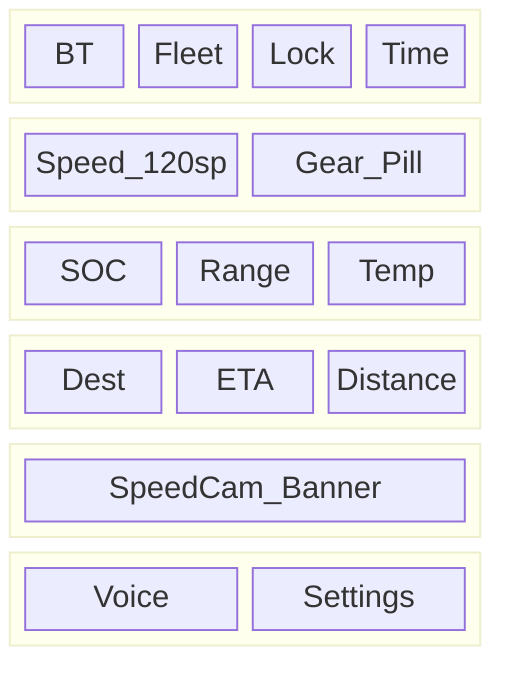
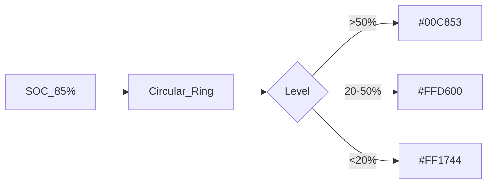
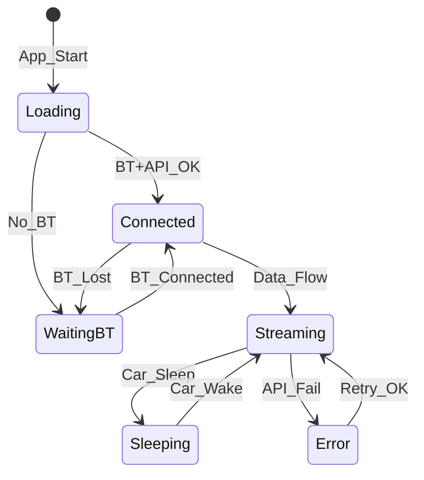

# 화면 표시 정보 · 레이아웃 · 표시 방식 명세

## 1. 표시 정보 전체 목록

### 1.1 주행 중 (Driving) — Fleet API 필드 매핑

| # | 표시명 | API 필드 | 단위 | 변환 | 갱신 | Phase |
|---|---|---|---|---|---|---|
| 1 | **현재 속도** | `VehicleSpeed` | km/h | mph × 1.60934 | 2s | 1 |
| 2 | **기어** | `Gear` | P/R/N/D | enum → 문자 | 1s | 1 |
| 3 | **SOC** | `Soc` | % | round 1 | 5s | 1 |
| 4 | **항속거리** | `EstBatteryRange` | km | mi × 1.60934 | 5s | 1 |
| 5 | **실내 온도** | `InsideTemp` | °C | round 1 | 10s | 1 |
| 6 | **외기 온도** | `OutsideTemp` | °C | round 1 | 10s | 1 |
| 7 | **순간 전력** | `Power` | kW | round 1, +/- 색상 | 2s | 1 |
| 8 | **종방향 G** | `LongAccel` | G | round 2 | 2s | 1 |
| 9 | **횡방향 G** | `LatAccel` | G | round 2 | 2s | 1 |
| 10 | **FL 타이어** | `TpmsPressureFl` | bar | psi→bar or user pref | 30s | 1 |
| 11 | **FR 타이어** | `TpmsPressureFr` | bar | 동일 | 30s | 1 |
| 12 | **RL 타이어** | `TpmsPressureRl` | bar | 동일 | 30s | 1 |
| 13 | **RR 타이어** | `TpmsPressureRr` | bar | 동일 | 30s | 1 |
| 14 | **안전벨트** | `DriverSeatBelt` | ✓/✗ | boolean → icon | 5s | 1 |
| 15 | **운전석** | `DriverSeatOccupied` | ✓/✗ | boolean → icon | 5s | 1 |
| 16 | **목적지** | `DestinationName` | text | truncate 20 | 30s | 1 |
| 17 | **ETA** | `MinutesToArrival` | min | round | 30s | 1 |
| 18 | **남은 거리** | `MilesToArrival` | km | mi × 1.60934 | 30s | 1 |
| 19 | **GPS 좌표** | `Location` | lat/lng | 6 decimal | 2s | 1 |
| 20 | **진행 방향** | `GpsHeading` | ° | round, 0=N | 5s | 1 |
| 21 | **주행거리** | `Odometer` | km | mi × 1.60934 | 60s | 1.5 |
| 22 | **경로** | `RouteLine` | polyline | base64 decode | 30s | 1 |

### 1.2 충전 중 (Charging)

| # | 표시명 | API 필드 | 단위 | 변환 | 갱신 | Phase |
|---|---|---|---|---|---|---|
| 23 | **충전 상태** | `DetailedChargeState` | text | enum → 한글 | 5s | 1 |
| 24 | **충전 %** | `Soc` / `BatteryLevel` | % | round 1 | 5s | 1 |
| 25 | **충전 속도** | `ChargeRate` / `DCChargingPower` | kW | round 1 | 5s | 1 |
| 26 | **완충까지** | `TimeToFullCharge` | h:min | format | 10s | 1 |
| 27 | **충전 한도** | `ChargeLimitSoc` | % | int | 30s | 1 |
| 28 | **추가 에너지** | session calc | kWh | diff | 10s | 1.5 |

### 1.3 상태 · 연결

| # | 표시명 | 소스 | 표시 | Phase |
|---|---|---|---|---|
| 29 | **BT 연결** | BLE | ●녹색/●회색 | 1 |
| 30 | **Fleet 연결** | API | ●녹색/●노랑/●빨강 | 1 |
| 31 | **차량 상태** | API | Online/Sleep/Offline | 1 |
| 32 | **잠금** | `Locked` | 🔒/🔓 | 1 |
| 33 | **Sentry** | `SentryMode` | 🛡️ ON/OFF | 1.5 |
| 34 | **HVAC** | `HvacPower` | ❄️/🔥 ON/OFF | 1 |

### 1.4 과속단속 (로컬 POI)

| # | 표시명 | 소스 | 표시 | Phase |
|---|---|---|---|---|
| 35 | **카메라 거리** | POI DB + GPS | "300m 전방" | 1 |
| 36 | **제한 속도** | POI DB | "80 km/h" | 1 |
| 37 | **단속 유형** | POI DB | 과속/신호/구간 | 1 |
| 38 | **구간 평균속도** | local calc | "평균 72 km/h" | 1 |
| 39 | **경고 단계** | engine | L1/L2/L3 badge | 1 |

---

## 2. 레이아웃별 표시 배치

### 2.1 폰 세로 (Compact Portrait)

```
┌─────────────────────────┐
│ ●BT  ●Fleet  🔒  12:34  │ ← Status Bar (32dp)
├─────────────────────────┤
│                         │
│                         │
│         108             │ ← Speed (120sp, Bold)
│        km/h             │ ← Unit (24sp)
│                         │
│      ┌───┐              │
│      │ D │              │ ← Gear (48sp, pill)
│      └───┘              │
│                         │
├─────────────────────────┤
│ ⚡85%  📏320km  🌡22°C  │ ← Info Row (16sp)
├─────────────────────────┤
│ 📍강남역  ⏱25min  📏8km │ ← Nav Row (14sp)
├─────────────────────────┤
│ ⚠ 300m 전방 80km/h     │ ← SpeedCam Banner (L1)
├─────────────────────────┤
│  🎤          ⚙         │ ← Voice + Settings (48dp)
└─────────────────────────┘
```

**Mermaid:**



### 2.2 폰 가로 (Compact Landscape)

```
┌──────────────────────────────────────────────┐
│ ●BT ●Fleet          ⚠ 300m 80km/h         │
├────────────────────┬─────────────────────────┤
│                    │  ⚡ 85%    ┌───┐        │
│                    │  📏 320km  │ D │        │
│       108          │  🌡 22°C  └───┘        │
│      km/h          │                         │
│                    │  📍 강남역              │
│                    │  ⏱ 25min  📏 8km       │
│                    │                         │
│                    │  FL 2.4  FR 2.4        │
│                    │  RL 2.4  RR 2.4        │
├────────────────────┴─────────────────────────┤
│  🎤                              ⚙          │
└──────────────────────────────────────────────┘
```

### 2.3 태블릿 세로 (Medium Portrait)

```
┌─────────────────────────────────┐
│ ●BT ●Fleet 🔒        12:34     │
├─────────────────────────────────┤
│                                 │
│           108                   │
│          km/h        ┌───┐     │
│                      │ D │     │
│                      └───┘     │
│                                 │
│  ⚡85%  📏320km  🌡22°C  ⚡12kW │
├─────────────────────────────────┤
│  ┌─────────────────────────┐   │
│  │                         │   │
│  │      🗺 Map View         │   │
│  │      (Route + Cameras)  │   │
│  │                         │   │
│  └─────────────────────────┘   │
├─────────────────────────────────┤
│ 📍강남역 ⏱25min │ FL2.4 FR2.4  │
│ 📏8km           │ RL2.4 RR2.4  │
├─────────────────────────────────┤
│  🎤                    ⚙       │
└─────────────────────────────────┘
```

### 2.4 태블릿 가로 (Expanded Landscape) — 3-패널

```
┌──────────────────────────────────────────────────────────┐
│ ●BT ●Fleet 🔒 Sentry:OFF              ⚠ 300m 80km/h  │
├──────────────┬──────────────────┬──────────────────────┤
│              │                  │  ⚡ SOC: 85%         │
│              │                  │  📏 Range: 320 km    │
│    108       │   🗺 Map View    │  🌡 In: 22°C        │
│   km/h       │   Route Line     │  🌡 Out: 18°C       │
│              │   Speed Cams     │  ⚡ Power: 12 kW    │
│   ┌───┐     │   Vehicle Pos    │                      │
│   │ D │     │                  │  📍 강남역           │
│   └───┘     │                  │  ⏱ 25 min           │
│              │                  │  📏 8.2 km          │
│  G: 0.2/0.1 │                  │                      │
│              │                  │  FL 2.4  FR 2.4     │
│              │                  │  RL 2.4  RR 2.4     │
│              │                  │  🔒 Locked           │
├──────────────┴──────────────────┴──────────────────────┤
│  🎤                                         ⚙         │
└──────────────────────────────────────────────────────────┘
```

---

## 3. 표시 방식 상세

### 3.1 속도계 (Speed)

| 속성 | 값 |
|---|---|
| 폰트 | SF Pro Display / Roboto (Bold) |
| 크기 | 120sp (폰), 160sp (태블릿) |
| 색상 (주간) | #FFFFFF on #1A1A2E |
| 색상 (야간) | #00FF88 on #0A0A14 |
| 단위 | 24sp, 속도 아래 |
| 애니메이션 | 숫자 변경 시 200ms fade |
| 과속 시 | 제한속도 초과 → 빨간색 (#FF4444) + pulse |

### 3.2 SOC / 항속거리

| 속성 | 값 |
|---|---|
| SOC | Circular progress ring (280° arc) |
| Ring 색상 | >50%: Green, 20~50%: Yellow, <20%: Red |
| 항속거리 | SOC 아래 텍스트 |
| 충전 중 | Ring animated (회전 gradient) |



### 3.3 기어 (Gear)

| 기어 | 색상 | 배경 |
|---|---|---|
| P | #888888 | Pill (#333) |
| R | #FF9800 | Pill (#333) |
| N | #888888 | Pill (#333) |
| D | #00E676 | Pill (#1B5E20) |

### 3.4 과속단속 경고

| 단계 | 배경 | 텍스트 | 아이콘 | 소리 | 진동 |
|---|---|---|---|---|---|
| L1 | #FFF3E0 (20% opacity) | #E65100 "300m 전방 80km/h" | ⚠ | 없음 | 없음 |
| L2 | #FFE0B2 (40%) | #BF360C "100m! 80km/h" | 🚨 | Beep×1 (800Hz, 200ms) | Short |
| L3 | #FFCDD2 (60%) flash | #B71C1C "과속! 95/80" | ⛔ | Beep×3 (1000Hz, 300ms) | Long |
| 구간 | #E3F2FD (30%) | #1565C0 "구간 72/80 avg" | 📏 | Beep×1 (입구) | Short |

### 3.5 타이어 공기압

```
     FL 2.4        FR 2.4
        ┌──────────┐
        │  🚗      │
        └──────────┘
     RL 2.4        RR 2.4
```

| 압력 | 색상 |
|---|---|
| 정상 (2.2~2.8 bar) | #FFFFFF |
| 주의 (2.0~2.2 or 2.8~3.0) | #FFD600 |
| 위험 (<2.0 or >3.0) | #FF1744 |

### 3.6 G-미터

```
        +1.0G
          │
  -1.0G ──┼── +1.0G (Lat)
          │
        -1.0G (Long)
```

- 2D dot position: (LatAccel, LongAccel)
- Dot 색상: White, Trail: 30% opacity fade
- 범위: ±1.0G (클리핑)

### 3.7 충전 UI (Gauge → Charging Mode)

주차 + ChargeState ≠ Disconnected 시 자동 전환:

```
┌─────────────────────────┐
│      ⚡ 충전 중          │
│   ┌──────────────┐      │
│   │  ████████░░  │ 85%  │ ← Progress bar
│   └──────────────┘      │
│   48 kW  │  32 min left │
│   +35 kWh added         │
└─────────────────────────┘
```

### 3.8 음성 내비 UI

```
┌─────────────────────────┐
│  🎤 "강남역으로 안내"   │ ← STT listening animation
├─────────────────────────┤
│  목적지: 강남역          │ ← Confirmation
│  [ 취소 ]  [ 🚗 전송 ]  │
└─────────────────────────┘
```

---

## 4. 테마 · 색상 시스템

### 4.1 Gauge Dark Theme (기본, 야간)

| 토큰 | 값 | 용도 |
|---|---|---|
| `gauge-bg` | #0A0A14 | 배경 |
| `gauge-surface` | #1A1A2E | 카드/패널 |
| `gauge-speed` | #00FF88 | 속도 숫자 |
| `gauge-speed-warn` | #FF4444 | 과속 |
| `gauge-text-primary` | #FFFFFF | 주 텍스트 |
| `gauge-text-secondary` | #8899AA | 보조 텍스트 |
| `gauge-accent` | #00B0FF | 강조 (ETA, Nav) |
| `gauge-warning-l1` | #E65100 | L1 경고 |
| `gauge-warning-l2` | #BF360C | L2 경고 |
| `gauge-warning-l3` | #B71C1C | L3 경고 |

### 4.2 Gauge Light Theme (주간)

| 토큰 | 값 | 용도 |
|---|---|---|
| `gauge-bg` | #F5F5F5 | 배경 |
| `gauge-surface` | #FFFFFF | 카드 |
| `gauge-speed` | #1B5E20 | 속도 |
| `gauge-text-primary` | #212121 | 주 텍스트 |
| `gauge-text-secondary` | #757575 | 보조 |

---

## 5. 데이터 없음 · 오류 표시

| 상태 | 표시 | 위치 |
|---|---|---|
| Fleet API 연결 중 | Skeleton shimmer | Speed 영역 |
| 차량 Sleep | "😴 차량 대기 중" + 마지막 데이터 (50% opacity) | Speed 영역 |
| BT 미연결 | "📡 블루투스 연결 대기" | 전체 중앙 |
| GPS 없음 | "---" + GPS icon grey | Nav 영역 |
| API 오류 | "⚠ 연결 오류" + 재시도 버튼 | Status Bar |
| 토큰 만료 | "🔑 재로그인 필요" | Full screen overlay |



---

## 6. Fleet API → UI 위젯 매핑 다이어그램

```mermaid
flowchart TB
  subgraph api [Fleet_API_Fields]
    VS[VehicleSpeed]
    GR[Gear]
    SO[Soc]
    BR[EstBatteryRange]
    IT[InsideTemp]
    OT[OutsideTemp]
    PW[Power]
    LA[LatAccel_LongAccel]
    TP[Tpms_x4]
    DN[DestinationName]
    ETA[MinutesToArrival]
    ML[MilesToArrival]
    RL[RouteLine]
    CS[ChargeState]
    CR[ChargeRate]
    TT[TimeToFullCharge]
  end
  subgraph ui [UI_Widgets]
    W1[SpeedDisplay_120sp]
    W2[GearPill]
    W3[SOC_Ring]
    W4[RangeText]
    W5[TempRow]
    W6[PowerIndicator]
    W7[GMeter_2D]
    W8[TireGrid_2x2]
    W9[NavRow]
    W10[MapView_Polyline]
    W11[ChargeProgress]
  end
  VS --> W1
  GR --> W2
  SO --> W3
  BR --> W4
  IT --> W5
  OT --> W5
  PW --> W6
  LA --> W7
  TP --> W8
  DN --> W9
  ETA --> W9
  ML --> W9
  RL --> W10
  CS --> W11
  CR --> W11
  TT --> W11
```


