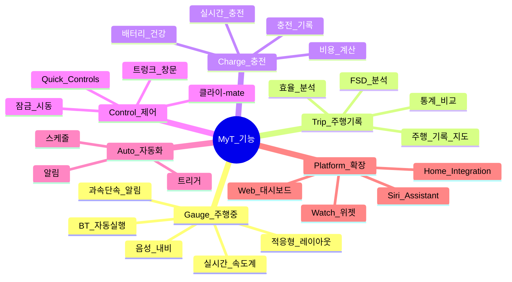
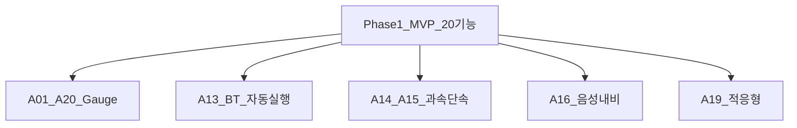

# MyT 전체 기능 카탈로그

> 경쟁앱(Tessie, TezLab, Stats, Nikola, Teslascope, TeslaFi, TeslaMate, Watch app)의 **모든 기능** + MyT 고유 기능을 포함한다.
> Phase: **1** = Phase 1, **1.5** = Phase 1.5, **2** = Phase 2, **3** = Phase 3

## 기능 분류 개요

---

## A. Gauge · 주행 중 (MyT 핵심)

| ID | 기능 | 설명 | Phase | 출처 |
|---|---|---|---|---|
| A01 | **실시간 속도계** | Fleet API VehicleSpeed, 대형 숫자 표시 | **1** | MyT 고유 |
| A02 | **기어 표시** | P/R/N/D, 색상 구분 | **1** | MyT 고유 |
| A03 | **SOC / 항속거리** | Soc%, EstBatteryRange km | **1** | 공통 |
| A04 | **실내/외기 온도** | InsideTemp, OutsideTemp °C | **1** | Tessie, TezLab |
| A05 | **순간 전력** | Power kW (+/- 충전/방전) | **1** | MyT 고유 |
| A06 | **G-미터** | LongAccel, LatAccel | **1** | MyT 고유 |
| A07 | **타이어 공기압** | 4륜 TPMS bar/psi, 색상 경고 | **1** | Tessie |
| A08 | **안전벨트/좌석** | DriverSeatBelt, DriverSeatOccupied | **1** | MyT 고유 |
| A09 | **목적지/ETA** | DestinationName, Minutes/MilesToArrival | **1** | Tessie |
| A10 | **GPS + 나침반** | Location, GpsHeading | **1** | 공통 |
| A11 | **충전 진행 (Gauge)** | ChargeState, kW, TimeToFullCharge | **1** | 공통 |
| A12 | **전체화면 Gauge** | Immersive, Keep Screen On | **1** | MyT 고유 |
| A13 | **BT 자동 실행** | Phone Key 연결 → Gauge 시작 | **1** | MyT 고유 |
| A14 | **과속단속 L1~L3** | 다단계 시각+청각+햅틱 | **1** | MyT 고유 |
| A15 | **구간단속 추적** | 평균속도 실시간 계산 | **1** | MyT 고유 |
| A16 | **음성 목적지** | STT → navigation_request | **1** | MyT 고유 |
| A17 | **주야간 테마** | Auto/Manual Dark/Light | **1** | Tessie, TezLab |
| A18 | **OBD Profiler** | 실시간 ECU급 진단 | 2 | Tessie |
| A19 | **적응형 레이아웃** | 폰/태블릿/가로/세로 | **1** | MyT 고유 |
| A20 | **경로 polyline 지도** | RouteLine 디코딩 + 지도 | **1** | MyT 고유 |

## B. 주행 기록 · 분석

| ID | 기능 | 설명 | Phase | 출처 |
|---|---|---|---|---|
| B01 | 주행 자동 기록 | 거리, 시간, 시작/종료 위치 | 1.5 | Tessie, TezLab |
| B02 | 주행 지도 | polyline + 마커 | 1.5 | Tessie, Teslascope |
| B03 | 주행 효율 | Wh/km, mi/kWh | 1.5 | 공통 |
| B04 | 주행 태그 | Business/Personal 등 | 2 | TezLab |
| B05 | FSD/Autopilot 분석 | FSD miles, utilization | 2 | Tessie, Teslascope |
| B06 | Self-Driving 통계 | SD miles, disengagement | 2 | Teslascope |
| B07 | 최고/평균 속도 | Trip max/avg speed | 1.5 | Nikola |
| B08 | 고도/온도 프로필 | Elevation, temp chart | 2 | TezLab |
| B09 | CO₂/연료비 절감 | vs ICE comparison | 2 | TezLab, Stats |
| B10 | 커뮤니티 비교 | Efficiency vs others | 2 | Tessie, TezLab |
| B11 | 주행 배지 | Miles/day, efficiency badge | 3 | TezLab |
| B12 | CSV/JSON 내보내기 | Drive data export | 2 | Tessie, Stats |
| B13 | 일/주/월 통계 | Aggregated stats | 1.5 | 공통 |
| B14 | 주행 캘린더 | Calendar view | 2 | Teslascope |
| B15 | Usage Report | Idle/efficiency/climate breakdown | 2 | TezLab |
| B16 | Carbon Offset | Tree planting integration | 3 | TezLab |
| B17 | Mileage Expense | Automatic mileage tracking | 3 | TezLab |

## C. 충전 · 배터리

| ID | 기능 | 설명 | Phase | 출처 |
|---|---|---|---|---|
| C01 | 충전 세션 기록 | Start/end, kWh, duration | 1.5 | 공통 |
| C02 | 충전 비용 | Time-of-Use rate calc | 2 | Tessie, Teslascope |
| C03 | Geo-fencing 요금 | Location-based pricing | 2 | Teslascope |
| C04 | Supercharger 비용 | Auto cost + invoice | 2 | Teslascope |
| C05 | 팬텀 드레인 | Daily/weekly drain stats | 2 | Tessie, Stats |
| C06 | 배터리 건강 | Degradation %, cycles | 2 | Tessie, Stats |
| C07 | 배터리 비교 | vs community average | 2 | Tessie |
| C08 | Smart Charging | Stop at specified time | 2 | Stats |
| C09 | Smart Battery Prep | Pre-warm before departure | 2 | Stats |
| C10 | 충전 알림 | Complete/interrupted push | 1.5 | Tessie |
| C11 | 충전소 지도 | Nearby chargers | 2 | TezLab |
| C12 | 충전 히스토리 그래프 | kW over time chart | 2 | Nikola |
| C13 | 충전 Limit 설정 | set_charge_limit | 2 | Stats |
| C14 | Live Charging View | Lock Screen widget | 2 | Tessie |

## D. 차량 제어

| ID | 기능 | 설명 | Phase | 출처 |
|---|---|---|---|---|
| D01 | 잠금/해제 | lock/unlock | 2 | 공통 |
| D02 | 원격 시동 | remote_start_drive | 2 | Tessie, Watch |
| D03 | 트렁크/프렁크 | actuate_trunk | 2 | 공통 |
| D04 | 창문 제어 | window_control | 2 | Tessie |
| D05 | 경적/라이트 | honk_horn, flash_lights | 2 | Tessie |
| D06 | 클라이-mate ON/OFF | auto_conditioning | 2 | 공통 |
| D07 | 클라이-mate 온도 | set_temps | 2 | 공통 |
| D08 | Dog Mode | keep_cabin_temp for pets | 2 | TezLab |
| D09 | Camp Mode | maintain temp + screen | 2 | TezLab |
| D10 | Sentry Mode | set_sentry_mode | 2 | Tessie |
| D11 | 충전 포트 | charge_port_door_open/close | 2 | 공통 |
| D12 | 충전 시작/중지 | charge_start/stop | 2 | 공통 |
| D13 | Quick Controls | Customizable dashboard buttons | 2 | TezLab |
| D14 | Valet Mode | Enhanced monitoring | 3 | Nikola |
| D15 | 차량 이름 변경 | set_vehicle_name | 3 | Tessie |

## E. 자동화 · 알림

| ID | 기능 | 설명 | Phase | 출처 |
|---|---|---|---|---|
| E01 | 시간 스케줄 | Climate/charge at time | 2 | Tessie, TezLab |
| E02 | 조건 트리거 | If SOC<X then notify | 2 | Tessie |
| E03 | 출발시간 클라이-mate | Departure-based climate | 2 | TezLab |
| E04 | 위치 진입/이탈 | Geofence push | 2 | Teslascope |
| E05 | 문/트렁크 열림 | Open door alert | 2 | Stats, Nikola |
| E06 | 자동 잠금 | Lock if door open | 2 | Stats |
| E07 | SOC 낮음 | Low battery alert | 2 | Nikola |
| E08 | Sentry 이벤트 | Sentry mode alert | 2 | Tessie |
| E09 | Sentry 침입 | Break-in detection | 2 | Teslascope |
| E10 | 충전 완료 | Charge complete push | 1.5 | Tessie |
| E11 | 펌웨어 업데이트 | SW update available | 2 | Teslascope |
| E12 | 서비스 이슈 | Hardware failure alert | 2 | Teslascope |
| E13 | 클라이-mate 방치 | Remote climate left on | 2 | Stats |
| E14 | 과속 알림 | Excessive speed alert | **1** | Teslascope |
| E15 | 충전 리마인더 | Unplugged at home, low SOC | 2 | Stats |

## F. 플랫폼 · 확장

| ID | 기능 | 설명 | Phase | 출처 |
|---|---|---|---|---|
| F01 | Android + iOS | Cross-platform | **1** | MyT |
| F02 | iPad/Tablet | Adaptive layout | **1** | Tessie |
| F03 | Apple Watch | SOC, lock, climate | 2 | Tessie, Nikola |
| F04 | Wear OS | SOC, lock, climate | 2 | Tessie |
| F05 | 홈 화면 위젯 | SOC, doors, charging | 2 | Stats, Tessie |
| F06 | Lock Screen 위젯 | Live charging | 2 | Tessie |
| F07 | Live Activity | Supercharging session | 2 | Teslascope |
| F08 | Siri Shortcuts | Voice commands | 2 | Stats, Tessie |
| F09 | Google Assistant | Voice commands | 2 | Tessie |
| F10 | Home Assistant | MQTT/Webhook | 3 | Tessie |
| F11 | HomeKit | Home automation | 3 | Tessie |
| F12 | Alexa | Voice integration | 3 | Tessie |
| F13 | Web 대시보드 | Browser control | 2 | Tessie, Teslascope |
| F14 | Mac/PC | Desktop browser | 3 | Tessie |
| F15 | 다중 차량 | Multi-vehicle | 2 | 공통 |
| F16 | 데이터 가져오기 | Import from Tessie etc | 3 | Tessie |
| F17 | 데이터 내보내기 | CSV/JSON export | 2 | Tessie |
| F18 | 구독/결제 | Play Billing + StoreKit | 2 | 공통 |
| F19 | Live Camera | View vehicle cameras | 3 | Tesla Official |
| F20 | Software Update Tracking | FW version history | 2 | Teslascope |

---

## Phase별 기능 수

| Phase | 기능 수 | 핵심 |
|---|---|---|
| **1** | 20 (A01~A20) | Gauge + BT + SpeedCam + Voice + Layout |
| **1.5** | +10 (B01~B03,B07,B13,C01,C10) | Trip + Charge 기록 |
| **2** | +45 | Control + Auto + Platform + Analytics |
| **3** | +10 | Home Integration + Advanced |
| **합계** | **~85** | |

## Phase 1 MVP 기능 (20개)

