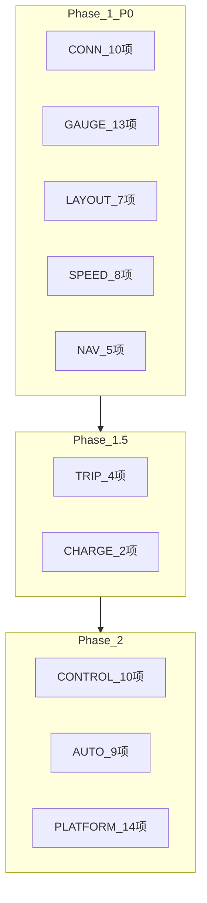

# 기능 요구사항 (Functional Requirements)

> ID 형식: `FR-{카테고리}{번호}`. Phase: 1=Phase1, 1.5=Phase1.5, 2=Phase2, 3=Phase3

## 1. 연결 · 자동 실행 (CONN)

| ID | 요구사항 | Phase | 우선순위 |
|---|---|---|---|
| FR-C01 | Tesla Phone Key BLE 연결 상태를 실시간 감지한다 | 1 | P0 |
| FR-C02 | BLE 연결 확인 시 Gauge UI를 자동 실행한다 (Android: 직접, iOS: 알림→탭) | 1 | P0 |
| FR-C03 | BLE 연결 해제 30초 후 Gauge UI를 종료하거나 대기 상태로 전환한다 | 1 | P0 |
| FR-C04 | Tesla Fleet API OAuth 인증을 지원한다 | 1 | P0 |
| FR-C05 | Phase 1에서 지정 VIN 1대만 접근을 허용한다 (화이트리스트) | 1 | P0 |
| FR-C06 | 차량 온라인/오프라인/sleep 상태를 표시한다 | 1 | P0 |
| FR-C07 | Fleet API vehicle_data 폴링 (주행 60s, 주차 5분, 크레딧 보호) | 1 | P0 |
| FR-C11 | BLE가 없어도 OAuth+VIN이 있으면 Fleet API로 원격 차량 상태를 조회·표시한다 | 1 | P0 |
| FR-C12 | Tesla 월 $10 무료 크레딧을 넘지 않도록 호출을 제한하고, 사용량을 Gauge에서 표시·상세 시각화한다 | 1 | P0 |
| FR-C08 | Fleet Telemetry 스트림으로 전환한다 | 1.5 | P1 |
| FR-C09 | 다중 차량 등록·전환을 지원한다 | 2 | P1 |
| FR-C10 | 가상 키 페어링 온보딩 UX를 제공한다 | 1 | P0 |

## 2. 실시간 계기판 (GAUGE)

| ID | 요구사항 | Phase | 우선순위 |
|---|---|---|---|
| FR-G01 | 전체화면 Gauge UI를 제공한다 (상태바/내비바 숨김) | 1 | P0 |
| FR-G02 | 현재 속도를 대형 숫자(72pt+)로 표시한다 | 1 | P0 |
| FR-G03 | 기어(P/R/N/D)를 표시한다 | 1 | P0 |
| FR-G04 | SOC(%)와 예상 항속거리(km)를 표시한다 | 1 | P0 |
| FR-G05 | 실내/외기 온도(°C)를 표시한다 | 1 | P0 |
| FR-G06 | 순간 전력(kW)과 가속(G)을 표시한다 | 1 | P1 |
| FR-G07 | 4륜 타이어 공기압(bar/psi)을 표시한다 | 1 | P1 |
| FR-G08 | 안전벨트/운전석 점유 상태를 표시한다 | 1 | P1 |
| FR-G09 | 현재 내비 목적지·ETA·남은 거리를 표시한다 | 1 | P0 |
| FR-G10 | GPS 위치와 진행 방향(나침반)을 표시한다 | 1 | P0 |
| FR-G11 | 충전 중: 진행률, kW, 완충까지 시간을 표시한다 | 1 | P0 |
| FR-G12 | 주야간 자동 테마 전환 (06:00~18:00 주간) | 1 | P1 |
| FR-G13 | 화면 항상 켜짐 (Keep Screen On) 옵션 | 1 | P0 |
| FR-G14 | OBD급 실시간 진단 (Profiler) | 2 | P3 |
| FR-G15 | 원격 상태 패널: 잠금, 충전(상태·kW·한도), 공조, Sentry, 외기, 타이어, 누적주행 | 1 | P0 |

## 3. 적응형 레이아웃 (LAYOUT)

| ID | 요구사항 | Phase | 우선순위 |
|---|---|---|---|
| FR-L01 | 폰 세로: 단일 패널 Gauge (속도 중앙, 정보 하단) | 1 | P0 |
| FR-L02 | 폰 가로: 2-패널 (좌: 속도계, 우: SOC+기어+ETA) | 1 | P0 |
| FR-L03 | 태블릿 세로: 2-패널 (상: Gauge, 하: 지도+정보) | 1 | P0 |
| FR-L04 | 태블릿 가로: 3-패널 (Gauge + 지도 + 상세정보) | 1 | P0 |
| FR-L05 | Window Size Class 기반 자동 레이아웃 전환 | 1 | P0 |
| FR-L06 | 가로/세로 회전 시 레이아웃 즉시 재배치 (<300ms) | 1 | P0 |
| FR-L07 | Navigation Bar/Rail/Drawer 적응형 네비게이션 | 1 | P1 |
| FR-L08 | 폰 가로(높이 Compact): 속도는 축소, 상태 타일은 스크롤, 액션 버튼은 36~40dp | 1 | P0 |

## 4. 과속단속 알림 (SPEED)

| ID | 요구사항 | Phase | 우선순위 |
|---|---|---|---|
| FR-S01 | 공공데이터포털 과속단속 카메라 POI DB를 로컬 저장한다 | 1 | P0 |
| FR-S02 | 차량 GPS+방향 기준 전방 500m 이내 카메라를 탐지한다 | 1 | P0 |
| FR-S03 | 도로 진행 방향과 카메라 방향을 필터링한다 | 1 | P0 |
| FR-S04 | L1 예고 (300~500m): 화면 상단 배너 | 1 | P0 |
| FR-S05 | L2 임박 (100~300m): 중앙 오버레이 + 비프 1회 | 1 | P0 |
| FR-S06 | L3 과속 (<100m + 속도>제한): 전체 플래시 + 비프 3회 + 진동 | 1 | P0 |
| FR-S07 | 구간단속: 진입~이탈 평균속도 추적·경고 | 1 | P1 |
| FR-S08 | 경고 임계값·소리·진동 사용자 설정 | 1 | P1 |
| FR-S09 | POI DB 월 1회 자동 갱신 | 1.5 | P2 |
| FR-S10 | 이동식 단속 카메라 (크라우드소싱) | 3 | P3 |

## 5. 내비게이션 · 음성 (NAV)

| ID | 요구사항 | Phase | 우선순위 |
|---|---|---|---|
| FR-N01 | 음성으로 목적지를 입력한다 (STT) | 1 | P0 |
| FR-N02 | STT 결과를 확인 UI로 보여준 후 차량에 전송한다 | 1 | P0 |
| FR-N03 | Fleet API navigation_request로 차량 내비에 목적지 설정 | 1 | P0 |
| FR-N04 | 텍스트 입력으로 목적지 설정 (주차 중) | 1 | P1 |
| FR-N05 | 현재 활성 내비 목적지·ETA·경로 polyline 표시 | 1 | P0 |
| FR-N06 | 즐겨찾기 (Home/Work) 원터치 설정 | 2 | P2 |
| FR-N07 | Supercharger 검색·내비 연동 | 2 | P2 |
| FR-N08 | **스마트 목적지**: 음성/텍스트 자연어 조건으로 후보를 검색·순위화한 뒤 확인 후 `navigation_request` (예: 「광교중앙역 인근 가장 저렴한 공영 주차장」) | 2 | P1 |
| FR-N09 | 스마트 목적지 시 **이전 목적지·즐겨찾기·최근 충전/주차 이력**을 후보에 포함한다 | 2 | P1 |
| FR-N10 | **음성 호출(웨이크)**: 「헤이 MyT」등 호출어 또는 앱 내 상시 청취 진입점으로 음성 제어를 시작한다 | 2 | P1 |
| FR-N11 | (조사·가능 시) **차량 핸들 음성 버튼** 연동으로 MyT 음성 세션을 시작한다. 불가 시 BT 연결·앱 포그라운드 대체 UX를 제공한다 | 2 | P2 |

## 6. 주행 기록 · 분석 (TRIP)

| ID | 요구사항 | Phase | 우선순위 |
|---|---|---|---|
| FR-T01 | 주행 자동 기록 (시작/종료, 거리, 시간, 효율) | 1.5 | P1 |
| FR-T02 | 주행 지도 표시 (경로 polyline) | 1.5 | P1 |
| FR-T03 | 주행 효율 Wh/km 계산·표시 | 1.5 | P1 |
| FR-T04 | 일/주/월 주행 통계 | 1.5 | P2 |
| FR-T05 | FSD/Autopilot 사용 분석 | 2 | P2 |
| FR-T06 | CO₂/연료비 절감 계산 | 2 | P3 |
| FR-T07 | 다른 운전자와 효율 비교 | 2 | P3 |
| FR-T08 | 주행 데이터 CSV 내보내기 | 2 | P2 |
| FR-T09 | 주행 태그/분류 | 2 | P3 |
| FR-T10 | 주행 히스토리 캘린더 | 2 | P3 |

## 7. 충전 · 배터리 (CHARGE)

| ID | 요구사항 | Phase | 우선순위 |
|---|---|---|---|
| FR-CH01 | 충전 세션 자동 기록 | 1.5 | P1 |
| FR-CH02 | 충전 비용 계산 (Time-of-Use · 사용자 단가) | 2 | P2 |
| FR-CH03 | 팬텀 드레인 추적 | 2 | P2 |
| FR-CH04 | 배터리 건강 (degradation) 그래프 | 2 | P2 |
| FR-CH05 | Smart Charging (시간 지정 충전) | 2 | P2 |
| FR-CH06 | Smart Battery Prep (출발 전 예열) | 2 | P3 |
| FR-CH07 | 충전 완료/중단 Push 알림 | 1.5 | P1 |
| FR-CH08 | Supercharger 비용/영수증 연동·추정 | 2 | P2 |
| FR-CH09 | 충전소 지도 | 2 | P3 |
| FR-CH10 | **충전 차계부**: Supercharger / 홈·공용 일반 충전기 등 **유형별 비용 구분·합산** 히스토리 | 2 | P1 |
| FR-CH11 | 차계부 UI: 일/주/월 합계, 유형 필터, 세션 상세(kWh·단가·장소), CSV 내보내기 | 2 | P1 |

## 8. 차량 제어 (CONTROL)

| ID | 요구사항 | Phase | 우선순위 |
|---|---|---|---|
| FR-V01 | 잠금/해제 | 2 | P1 |
| FR-V02 | 원격 시동 | 2 | P2 |
| FR-V03 | 트렁크/프렁크 | 2 | P1 |
| FR-V04 | 창문 열기/닫기 | 2 | P2 |
| FR-V05 | 경적/라이트 | 2 | P3 |
| FR-V06 | 클라이-mate ON/OFF + 온도 | 2 | P1 |
| FR-V06a | **공조 세밀 예약**: 출발 시각, 목표 실내온도, 좌석·스티어링 열선/통풍, defrost, 반복(매일/주중) 등 조건을 설정·저장·실행 | 2 | P1 |
| FR-V07 | Dog Mode / Camp Mode | 2 | P2 |
| FR-V08 | Sentry Mode ON/OFF | 2 | P2 |
| FR-V09 | 충전 포트 / 충전 시작·중지 | 2 | P1 |
| FR-V10 | Quick Controls (사용자 커스텀) | 2 | P2 |

## 9. 자동화 · 알림 (AUTO)

| ID | 요구사항 | Phase | 우선순위 |
|---|---|---|---|
| FR-A01 | 시간 기반 스케줄 (클라이-mate 등) | 2 | P2 |
| FR-A02 | 조건 기반 트리거 | 2 | P2 |
| FR-A03 | 출발 시간 기반 클라이-mate 예약 | 2 | P2 |
| FR-A03a | FR-V06a 세밀 공조 예약을 자동화 엔진과 동일 스케줄러로 실행·알림한다 | 2 | P1 |
| FR-A04 | 위치 진입/이탈 Push 알림 | 2 | P2 |
| FR-A05 | 문/트렁크 열림 알림 + 자동 잠금 | 2 | P2 |
| FR-A06 | SOC 낮음 알림 | 2 | P2 |
| FR-A07 | Sentry 이벤트/침입 알림 | 2 | P2 |
| FR-A08 | 펌웨어 업데이트 알림 | 2 | P3 |
| FR-A09 | 원격 클라이-mate 방치 알림 | 2 | P3 |

## 10. 플랫폼 · 확장 (PLATFORM)

| ID | 요구사항 | Phase | 우선순위 |
|---|---|---|---|
| FR-P01 | Android 8.0+ 지원 | 1 | P0 |
| FR-P02 | iOS/iPadOS 16.0+ 지원 | 1 | P0 |
| FR-P03 | iPad 적응형 레이아웃 | 1 | P0 |
| FR-P04 | Apple Watch 앱 | — | ✕ 범위 밖 (D4) |
| FR-P05 | Wear OS 앱 | — | ✕ 범위 밖 (D4) |
| FR-P06 | 홈/Lock Screen 위젯 | 2 | P2 |
| FR-P07 | Live Activity (충전 진행) | 2 | P2 |
| FR-P08 | Siri Shortcuts / Google Assistant | 2 | P2 |
| FR-P09 | Home Assistant / HomeKit / Alexa | 3 | P3 |
| FR-P10 | Web 대시보드 | 2 | P3 |
| FR-P11 | 다중 차량 | 2 | P1 |
| FR-P12 | 데이터 가져오기 (Tessie, TezLab 등) | 3 | P3 |
| FR-P13 | 데이터 내보내기 (CSV/JSON) | 2 | P2 |
| FR-P14 | 구독/일회성 결제 (Play Billing + StoreKit) | 2 | P0 |

## 11. 요구사항 추적 매트릭스

**Phase 1 P0 합계: 43개 FR**

## 12. 유료화 티어 예고 (W9 · Free 선출시에는 전기능 포함 가능)

| 티어 | 포함 예 (W9 게이트 후보) |
|---|---|
| **Free** | Gauge, SpeedCam, BT 자동실행, 기본 음성 목적지(단문), 기본 제어·히스토리 |
| **Plus** | FR-V06a 공조 세밀 예약, FR-CH10/11 충전 차계부, FR-N10 음성 호출, FCM 고급 자동화 |
| **Pro** | FR-N08/N09 스마트 목적지(자연어·다후보), FR-N11 핸들 음성 버튼(가능 시), Live Camera, 고급 FSD/배터리 |

상세 Wave: [docs/09-commercial/decisions-and-backlog.md](../09-commercial/decisions-and-backlog.md)

