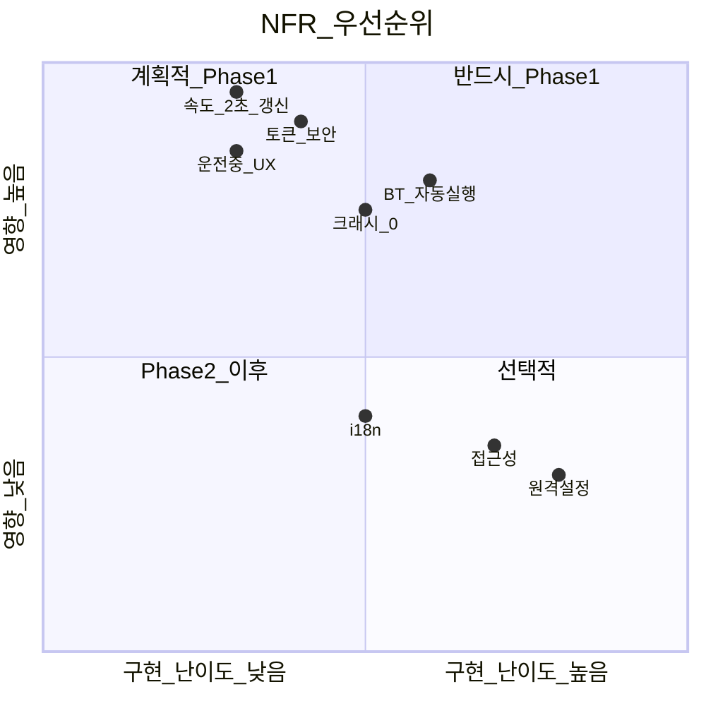

# 비기능 요구사항 (Non-Functional Requirements)

## 1. 성능 (PERF)

| ID | 요구사항 | 목표 | 측정 |
|---|---|---|---|
| NFR-P01 | 속도 표시 갱신 지연 | ≤ 2초 (주행 중) | Fleet API 응답~UI 렌더 |
| NFR-P02 | Gauge UI 초기 렌더 | ≤ 1초 (BT 연결 후) | Cold start~첫 프레임 |
| NFR-P03 | 레이아웃 회전 전환 | ≤ 300ms | Orientation change~재배치 |
| NFR-P04 | 과속단속 탐지 지연 | ≤ 500ms | GPS 수신~경고 표시 |
| NFR-P05 | STT 응답 시간 | ≤ 3초 | 음성 종료~텍스트 표시 |
| NFR-P06 | navigation_request 응답 | ≤ 5초 | API 호출~차량 반영 |
| NFR-P07 | POI DB 쿼리 (500m) | ≤ 50ms | R-Tree 검색 |
| NFR-P08 | 앱 메모리 사용 | ≤ 150MB (Gauge 모드) | Profiler |
| NFR-P09 | 배터리 소모 (Gauge 1h) | ≤ 5% (Android), ≤ 8% (iOS) | 실측 |
| NFR-P10 | Fleet API 폴링 (주행) | 2초 간격 | 설정값 |

## 2. 가용성 · 안정성 (AVAIL)

| ID | 요구사항 | 목표 |
|---|---|---|
| NFR-A01 | Gauge UI 크래시율 | 0% (Phase 1 기간) |
| NFR-A02 | Fleet API 실패 시 재시도 | 3회 exponential backoff |
| NFR-A03 | 네트워크 끊김 시 UI | 마지막 데이터 + "연결 끊김" 표시 |
| NFR-A04 | BT 연결 불안정 시 | 5초 디바운스 후 상태 변경 |
| NFR-A05 | 차량 sleep 시 | "차량 대기 중" + 30s 폴링 |
| NFR-A06 | OAuth 토큰 만료 | 자동 refresh, 실패 시 재로그인 |

## 3. 보안 (SEC)

| ID | 요구사항 | 구현 |
|---|---|---|
| NFR-S01 | OAuth 토큰 저장 | Android Keystore / iOS Keychain |
| NFR-S02 | Private Key 저장 | 동일 (가상 키) |
| NFR-S03 | API 통신 | TLS 1.2+ |
| NFR-S04 | 로그에 토큰/키 미포함 | ProGuard/R8 난독화 |
| NFR-S05 | VIN 화이트리스트 | Phase 1: 하드코딩 (빌드 config) |
| NFR-S06 | vehicle_location 동의 | 온보딩에서 명시적 동의 |
| NFR-S07 | 데이터 로컬 저장 | SQLDelight 암호화 (Phase 1.5) |

## 4. 사용성 (UX)

| ID | 요구사항 | 기준 |
|---|---|---|
| NFR-U01 | 운전 중 조작 | 탭 3회 이내로 모든 Gauge 기능 |
| NFR-U02 | 속도 숫자 크기 | 최소 72pt (폰), 120pt (태블릿) |
| NFR-U03 | 경고 가독성 | 5m 거리에서 속도 숫자 식별 가능 |
| NFR-U04 | 색상 대비 | WCAG AA (4.5:1) |
| NFR-U05 | 주간/야간 | 자동 전환 + 수동 오버라이드 |
| NFR-U06 | 한국어 UI | Phase 1 전체 한국어 |
| NFR-U07 | 영어 UI | Phase 2 i18n |
| NFR-U08 | VoiceOver/TalkBack | Phase 2 접근성 |
| NFR-U09 | 설정 화면 | 주차 중에만 접근 (운전 중 숨김) |
| NFR-U10 | 첫 실행 온보딩 | 5단계 이내 완료 |

## 5. 호환성 (COMPAT)

| ID | 요구사항 | 범위 |
|---|---|---|
| NFR-C01 | Android | 8.0+ (API 26), target 35 |
| NFR-C02 | iOS | 16.0+ |
| NFR-C03 | iPadOS | 16.0+ (모든 iPad) |
| NFR-C04 | Tesla Model 3 | 2017~ (Fleet API 지원 FW) |
| NFR-C05 | Tesla FW | 2023.38+ (location_data) |
| NFR-C06 | 화면 크기 | 4.7"~13" (iPhone SE ~ iPad Pro) |
| NFR-C07 | 해상도 | 720p~2732p |

## 6. 확장성 (SCALE)

| ID | 요구사항 | Phase |
|---|---|---|
| NFR-SC01 | 1대 → N대 차량 | Phase 2 |
| NFR-SC02 | 1명 → N명 사용자 | Phase 2 |
| NFR-SC03 | 폴링 → Telemetry | Phase 1.5 |
| NFR-SC04 | 로컬만 → 클라우드 동기화 | Phase 2 |
| NFR-SC05 | Model 3 → Model Y/S/X | Phase 2 |

## 7. 운영 (OPS)

| ID | 요구사항 | Phase |
|---|---|---|
| NFR-O01 | 크래시 리포팅 | Phase 1.5 (Firebase Crashlytics) |
| NFR-O02 | 원격 설정 (Feature Flag) | Phase 2 |
| NFR-O03 | OTA 앱 업데이트 | App Store / Play |
| NFR-O04 | POI DB OTA 갱신 | Phase 1.5 |
| NFR-O05 | API 사용량 모니터링 | Phase 2 |

## 8. 비기능 요구사항 우선순위

