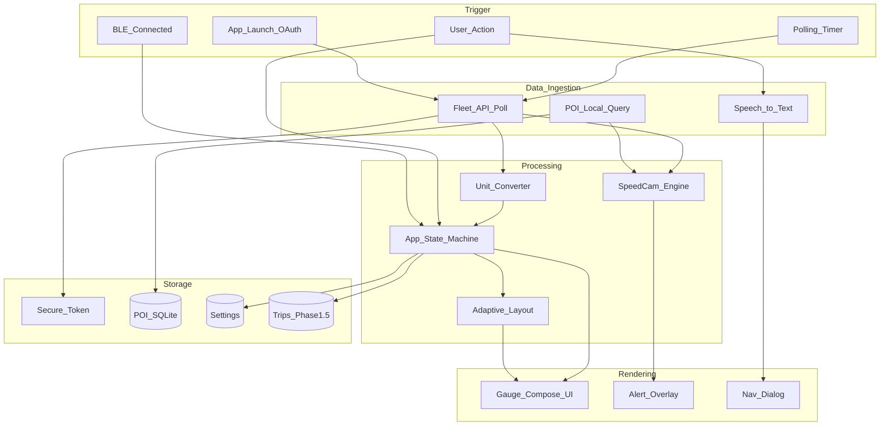
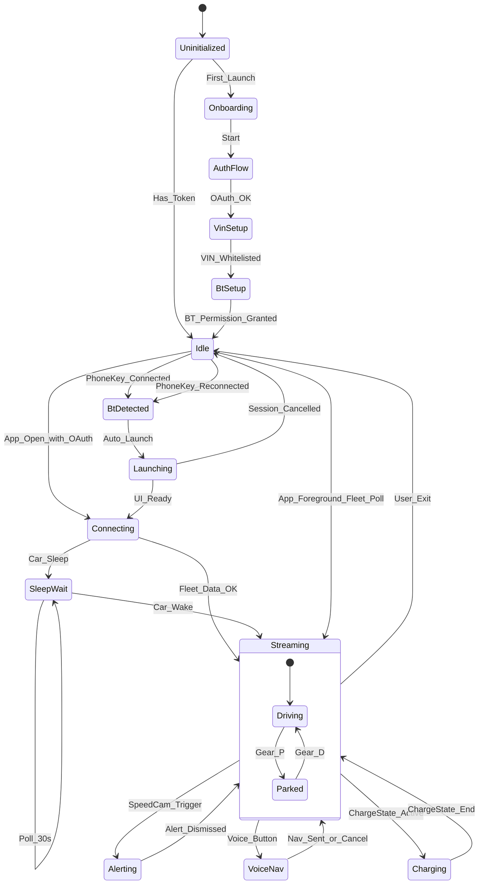
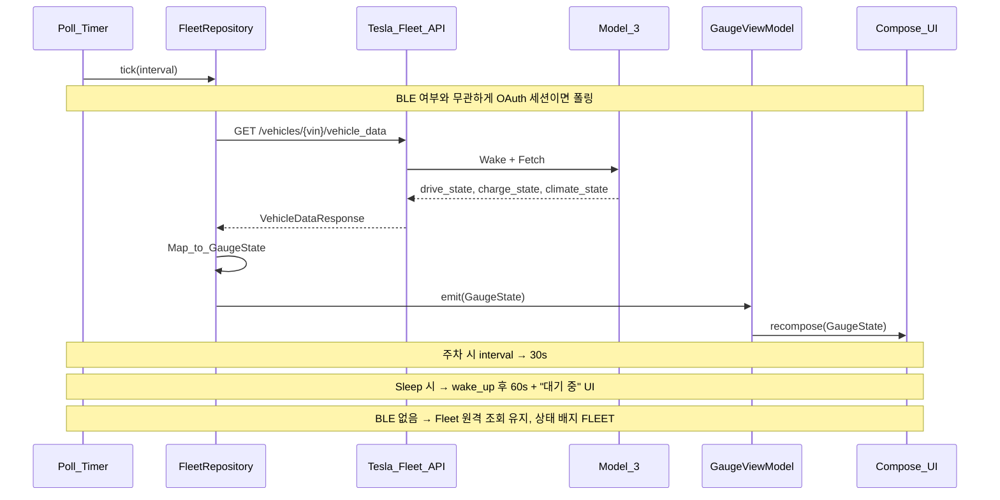
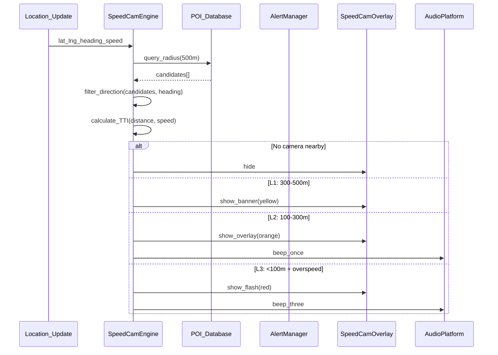
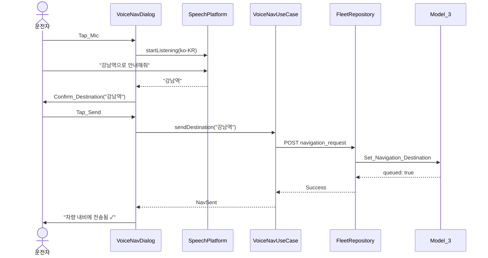
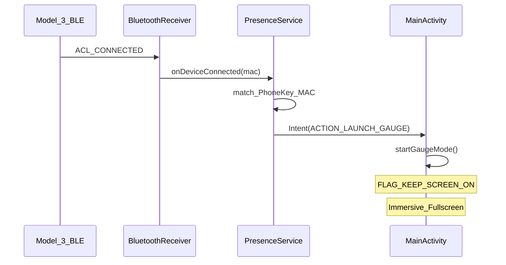
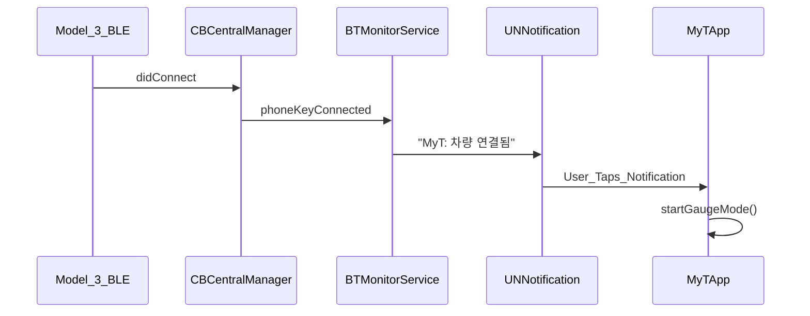
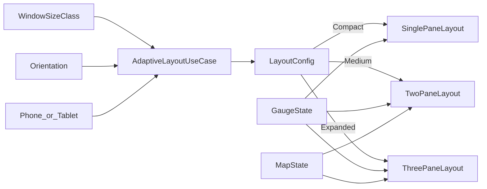
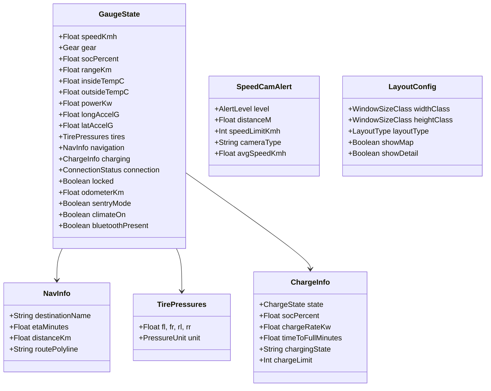
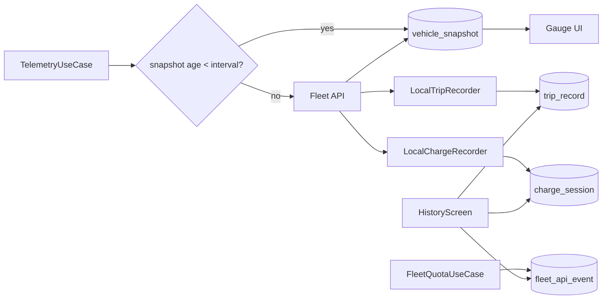

# 데이터 흐름 · 상태머신

## 1. 전체 데이터 흐름

## 2. 앱 상태머신

## 3. Telemetry 폴링 흐름

## 4. SpeedCam 엔진 흐름

## 5. Voice Nav 흐름

## 6. BT 자동 실행 흐름

### Android

### iOS

## 7. 적응형 레이아웃 데이터 흐름

## 8. 데이터 모델

## 9. 이벤트 버스 (Domain Events)

| Event | Publisher | Subscriber | Action |
|---|---|---|---|
| `BtConnected` | BTPlatform | PresenceUC | Launch Gauge |
| `BtDisconnected` | BTPlatform | PresenceUC | 자동실행만 해제. Fleet 폴링은 유지 |
| `GaugeStateUpdated` | FleetRepo | GaugeUI, SpeedCamUC | Recompose |
| `SpeedCamAlert` | SpeedCamUC | AlertUI, AudioPlatform | Show+Beep |
| `NavDestinationSent` | VoiceNavUC | GaugeUI | Update NavInfo |
| `TokenExpired` | FleetRepo | AuthUC | Re-login flow |
| `LayoutChanged` | LayoutUC | GaugeUI | Re-layout |
| `CarSleeping` | FleetRepo | GaugeUI | Show sleep UI |

## 10. 히스토리 · 로컬 캐시 (Phase 1.5+)

- **캐시 우선**: `vehicle_snapshot`이 폴링 간격보다 신선하면 Fleet API 호출 생략
- **오프라인/쿼터**: fetch 실패 시 DB 스냅샷으로 게이지 표시
- 상세 설계: [history-and-voice-design.md](../05-design/history-and-voice-design.md)

## 11. 디버그 로그 · Gmail 내보내기

- **DebugLogger**: 링 버퍼(최대 2,000건), DEBUG/INFO/WARN/ERROR, 토큰·VIN·secret 자동 마스킹
- **수집 위치**: App/Lifecycle, Telemetry, Fleet API, Quota, Auth, Voice
- **UI**: 설정 → 「디버그 로그 보기 / Gmail 전송」→ `Route.DebugLogs`
- **내보내기**: UTF-8 `.txt` 리포트 + Gmail 우선 `ACTION_SEND` (미설치 시 공유 시트)
- **iOS**: `UIActivityViewController` 공유 (Mail 포함)
