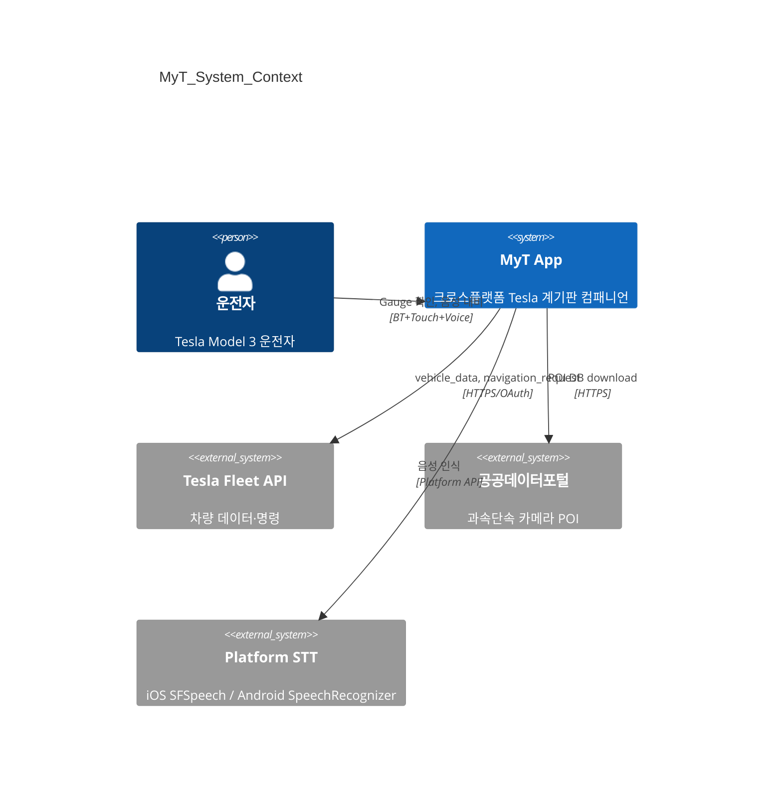
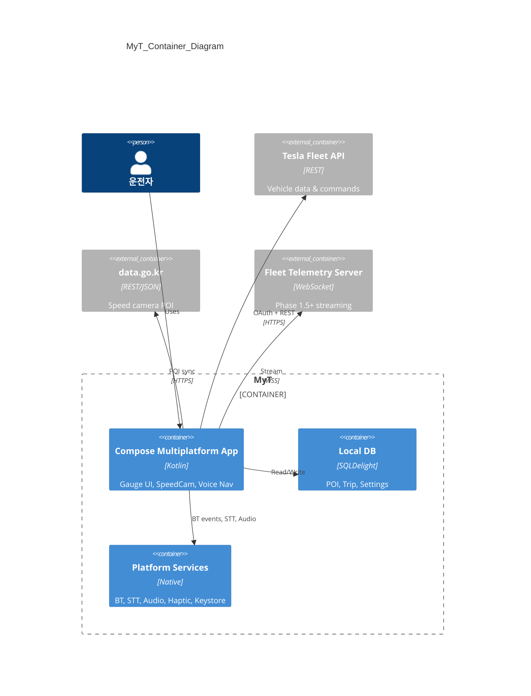
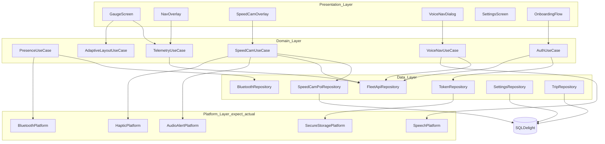
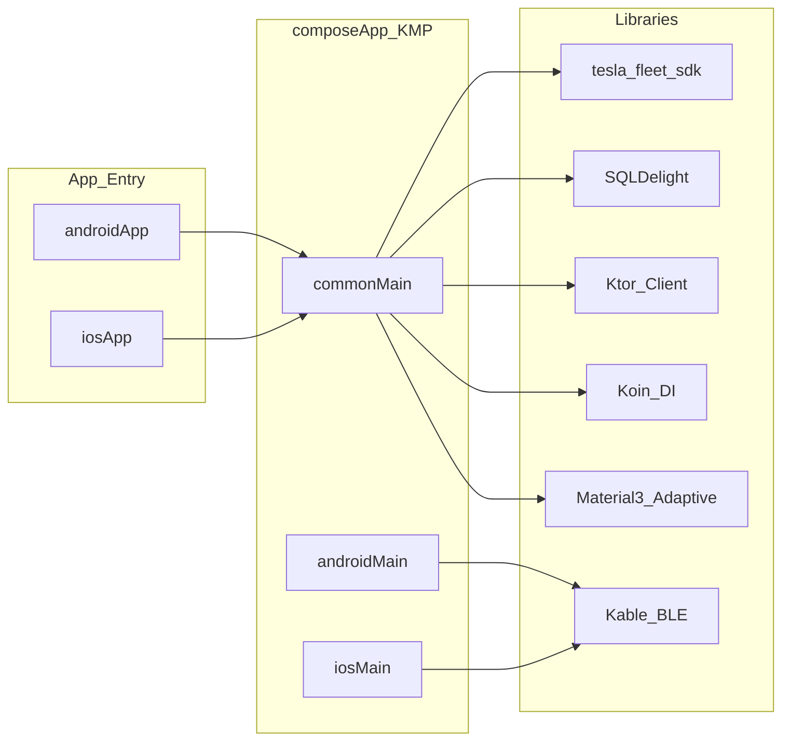
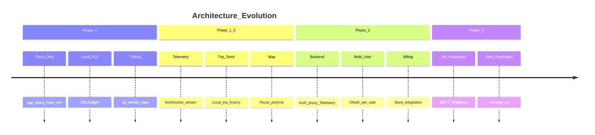
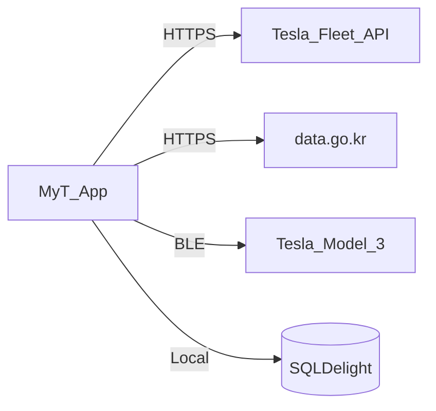
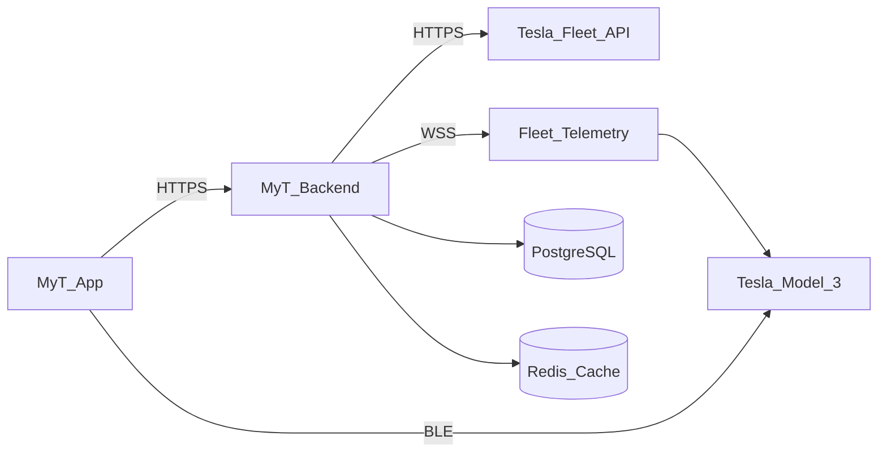
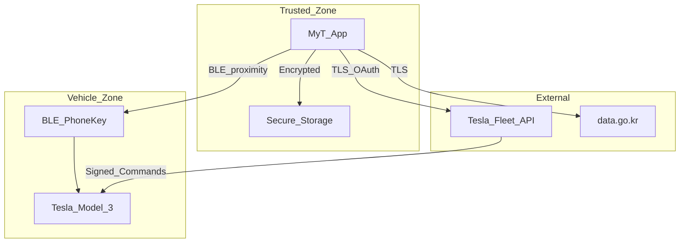

# 시스템 아키텍처

## 1. C4 Level 1 — 시스템 컨텍스트

## 2. C4 Level 2 — 컨테이너

## 3. C4 Level 3 — 컴포넌트 (KMP shared)

## 4. 모듈 의존성

## 5. Phase별 아키텍처 진화

## 6. 배포 아키텍처

### Phase 1 (Client-Only)

### Phase 2 (Client + Backend)

## 7. 보안 경계

## 8. 크로스플랫폼 아키텍처 원칙

| 원칙 | 설명 |
|---|---|
| **Shared First** | UI·로직·데이터 90%+ commonMain |
| **expect/actual Last** | BT, STT, Audio, Storage만 플랫폼 분리 |
| **Single Source of Truth** | Fleet API = 차량 상태 유일 소스 |
| **Local First (SpeedCam)** | POI DB 로컬, 네트워크 불필요 |
| **Adaptive by Default** | WindowSizeClass 기반, hardcode 금지 |
