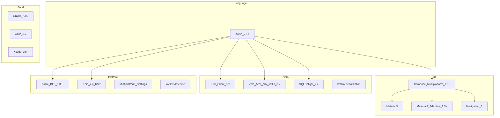

# 기술 스택 · 모듈 구조

## 1. 기술 스택 총览



## 2. 프로젝트 구조

```
MyT/
├── settings.gradle.kts
├── build.gradle.kts
├── gradle/
│   └── libs.versions.toml          # 버전 카탈로그
├── buildSrc/                        # Convention plugins
│
├── composeApp/                      # KMP 메인 모듈
│   ├── build.gradle.kts
│   └── src/
│       ├── commonMain/kotlin/com/myt/
│       │   ├── App.kt               # NavHost root
│       │   ├── di/                  # Koin modules
│       │   ├── ui/
│       │   │   ├── gauge/           # GaugeScreen, widgets
│       │   │   ├── speedcam/        # SpeedCamOverlay
│       │   │   ├── voice/           # VoiceNavDialog
│       │   │   ├── onboarding/      # Auth, VIN, BT setup
│       │   │   ├── settings/        # SettingsScreen
│       │   │   └── theme/           # GaugeTheme, colors
│       │   ├── domain/
│       │   │   ├── model/           # GaugeState, SpeedCamAlert
│       │   │   ├── usecase/         # TelemetryUC, SpeedCamUC
│       │   │   └── repository/      # Interfaces
│       │   └── data/
│       │       ├── fleet/           # FleetApiRepository impl
│       │       ├── poi/             # SpeedCamPoiRepository
│       │       ├── bluetooth/       # BluetoothRepository
│       │       ├── token/           # TokenRepository
│       │       └── local/           # SQLDelight queries
│       ├── androidMain/kotlin/com/myt/
│       │   ├── MainActivity.kt
│       │   ├── MyTApplication.kt
│       │   ├── service/
│       │   │   ├── PresenceService.kt    # FG Service
│       │   │   └── BtBroadcastReceiver.kt
│       │   └── platform/
│       │       ├── AndroidBluetoothPlatform.kt
│       │       ├── AndroidSpeechPlatform.kt
│       │       ├── AndroidAudioPlatform.kt
│       │       └── AndroidSecureStorage.kt
│       └── iosMain/kotlin/com/myt/
│           ├── MainViewController.kt
│           └── platform/
│               ├── IosBluetoothPlatform.kt
│               ├── IosSpeechPlatform.kt
│               ├── IosAudioPlatform.kt
│               └── IosSecureStorage.kt
│
├── androidApp/                      # Android APK entry
│   ├── build.gradle.kts
│   └── src/main/AndroidManifest.xml
│
├── iosApp/                            # Xcode project
│   ├── iosApp.xcodeproj
│   └── iosApp/
│       ├── ContentView.swift
│       └── Info.plist
│
└── docs/                              # 설계 문서
```

## 3. 의존성 버전 (libs.versions.toml)

| Library | Version | Module |
|---|---|---|
| Kotlin | 2.1.0 | All |
| Compose Multiplatform | 1.9.0 | composeApp |
| Material3 Adaptive | 1.3.0-beta02 | composeApp |
| Navigation 3 | 1.10.0 | composeApp |
| Ktor | 3.0.0 | composeApp |
| tesla-fleet-sdk-kotlin | 3.1.5 | composeApp |
| SQLDelight | 2.0.2 | composeApp |
| Kable | 0.36.0 | androidMain, iosMain |
| Koin | 4.0.0 | composeApp |
| kotlinx-serialization | 1.7.0 | composeApp |
| kotlinx-coroutines | 1.9.0 | composeApp |
| kotlinx-datetime | 0.6.0 | composeApp |
| Multiplatform Settings | 1.2.0 | composeApp |

## 4. Koin DI 모듈

```mermaid
flowchart TB
  subgraph modules [Koin_Modules]
    AppModule[appModule]
    DataModule[dataModule]
    DomainModule[domainModule]
    PlatformModule[platformModule]
  end

  AppModule --> |ViewModels| GaugeVM[GaugeViewModel]
  AppModule --> |ViewModels| SpeedCamVM[SpeedCamViewModel]
  AppModule --> |ViewModels| VoiceNavVM[VoiceNavViewModel]
  AppModule --> |ViewModels| OnboardVM[OnboardingViewModel]

  DataModule --> FleetRepo[FleetApiRepository]
  DataModule --> POIRepo[SpeedCamPoiRepository]
  DataModule --> BTRepo[BluetoothRepository]
  DataModule --> TokenRepo[TokenRepository]

  DomainModule --> TelemetryUC[TelemetryUseCase]
  DomainModule --> SpeedCamUC[SpeedCamUseCase]
  DomainModule --> VoiceNavUC[VoiceNavUseCase]
  DomainModule --> PresenceUC[PresenceUseCase]
  DomainModule --> LayoutUC[AdaptiveLayoutUseCase]

  PlatformModule --> BTPlatform[BluetoothPlatform]
  PlatformModule --> STTPlatform[SpeechPlatform]
  PlatformModule --> AudioPlatform[AudioAlertPlatform]
  PlatformModule --> StoragePlatform[SecureStoragePlatform]
```



## 5. SQLDelight 스키마 (Phase 1)

```sql
-- Speed Camera POI
CREATE TABLE speed_camera (
    id TEXT PRIMARY KEY,
    latitude REAL NOT NULL,
    longitude REAL NOT NULL,
    road_name TEXT,
    road_direction TEXT,
    speed_limit INTEGER NOT NULL,
    camera_type TEXT NOT NULL,
    section_type TEXT,
    section_length INTEGER,
    province TEXT,
    city TEXT,
    install_year INTEGER
);
CREATE INDEX idx_camera_location ON speed_camera(latitude, longitude);

-- User Settings
CREATE TABLE settings (
    key TEXT PRIMARY KEY,
    value TEXT NOT NULL
);

-- Trips (Phase 1.5)
CREATE TABLE trip (
    id TEXT PRIMARY KEY,
    start_time INTEGER NOT NULL,
    end_time INTEGER,
    distance_km REAL,
    efficiency_wh_km REAL,
    start_lat REAL,
    start_lng REAL,
    end_lat REAL,
    end_lng REAL
);
```

## 6. API 엔드포인트 (Phase 1 — Client Direct)

| Method | Endpoint | Scope | 용도 |
|---|---|---|---|
| POST | `/oauth/token` | - | OAuth token |
| GET | `/api/1/vehicles` | vehicle_device_data | 차량 목록 |
| GET | `/api/1/vehicles/{vin}/vehicle_data` | vehicle_device_data, vehicle_location | 실시간 상태 |
| POST | `/api/1/vehicles/{vin}/command/navigation_request` | vehicle_cmds | 목적지 설정 |
| GET | `/api/1/vehicles/{vin}/fleet_telemetry_config` | vehicle_device_data | Telemetry config (1.5) |
| POST | `/api/1/vehicles/{vin}/fleet_telemetry_config` | vehicle_device_data | Telemetry setup (1.5) |

## 7. 빌드 타겟

| Target | Min | Output |
|---|---|---|
| Android Phone/Tablet | API 26 (8.0) | APK / AAB |
| iOS iPhone | 16.0 | IPA |
| iPadOS | 16.0 | IPA (Universal) |

## 8. 개발 환경

| Tool | Version | 용도 |
|---|---|---|
| Android Studio | Ladybug+ | Primary IDE |
| Xcode | 16+ | iOS build & deploy |
| JDK | 17 | Kotlin compilation |
| CocoaPods/SPM | - | iOS dependencies |

## 9. 테스트 전략

| Level | Tool | Scope |
|---|---|---|
| Unit | kotlin.test | UseCase, SpeedCamEngine, UnitConverter |
| Integration | Ktor MockEngine | FleetApiRepository |
| UI | Compose Test (commonMain) | GaugeScreen layout |
| E2E | Manual | 실차 테스트 (AC 기준) |
