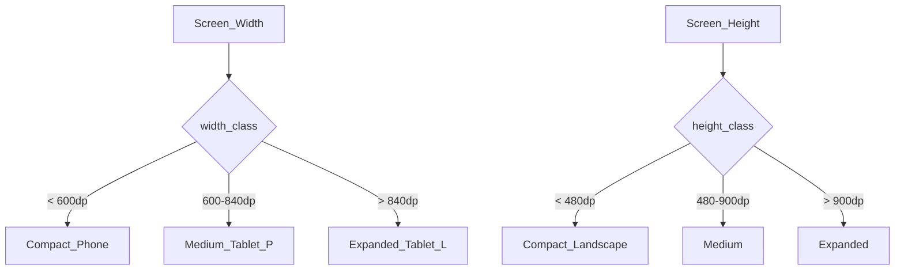
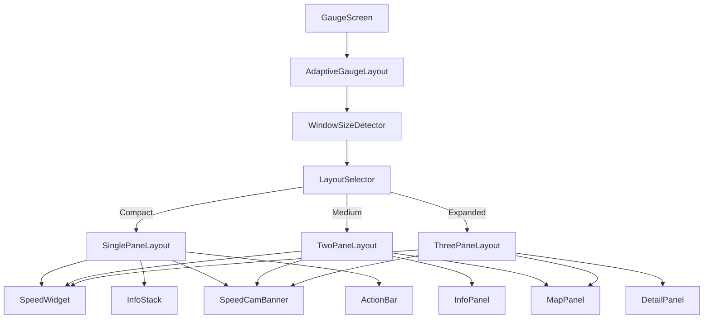
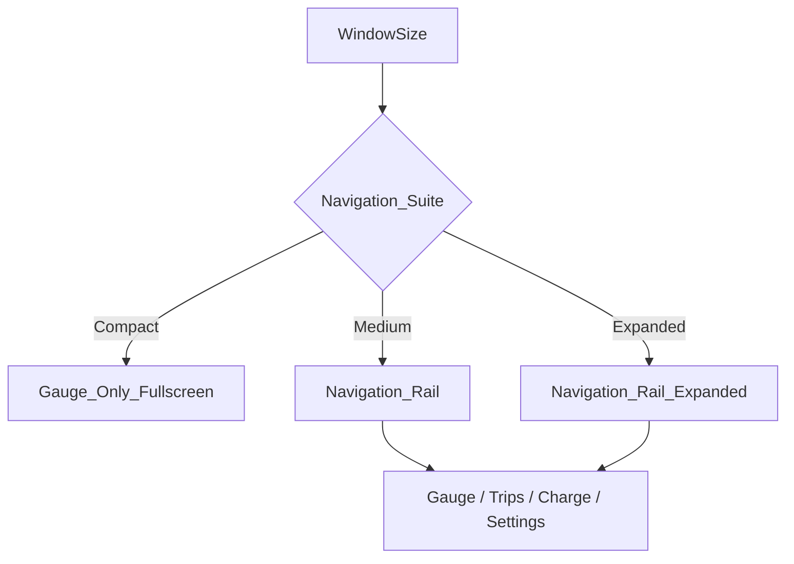
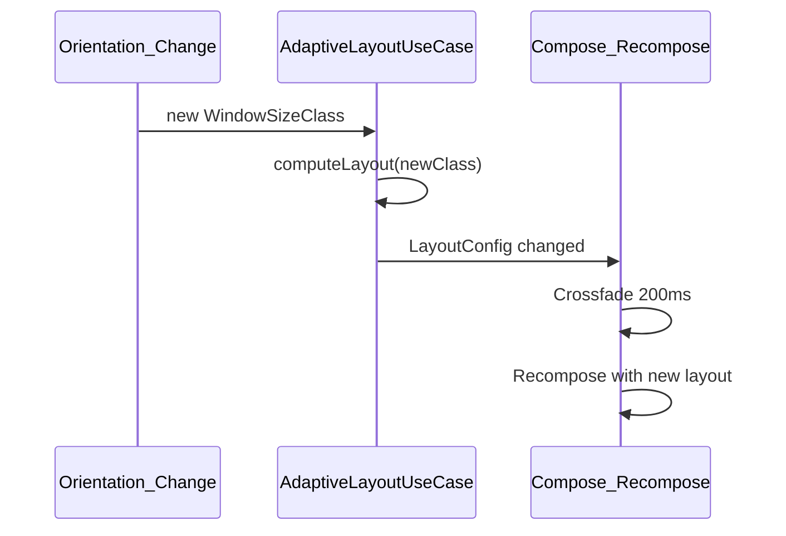

# 적응형 레이아웃 설계

## 1. Window Size Class 기준



| Class | Width | 대표 디바이스 |
|---|---|---|
| Compact | < 600dp | iPhone 15, Galaxy S24 |
| Medium | 600~840dp | iPad Mini, Galaxy Tab |
| Expanded | > 840dp | iPad Pro 11/13, Galaxy Tab S |

## 2. 디바이스 × 방향 매트릭스

| 디바이스 | 방향 | Width Class | Layout | Navigation |
|---|---|---|---|---|
| iPhone | Portrait | Compact | SinglePane | None (Gauge only) |
| iPhone | Landscape | Compact | TwoPane (Speed\|Info) | None |
| iPad Mini | Portrait | Medium | TwoPane (Speed+Info\|Map) | Rail collapsed |
| iPad Mini | Landscape | Expanded | ThreePane | Rail expanded |
| iPad Pro 13 | Portrait | Medium~Expanded | TwoPane~ThreePane | Rail |
| iPad Pro 13 | Landscape | Expanded | ThreePane | Rail expanded |
| Android Phone | Portrait | Compact | SinglePane | None |
| Android Phone | Landscape | Compact | TwoPane | None |
| Android Tablet | Portrait | Medium | TwoPane | Rail |
| Android Tablet | Landscape | Expanded | ThreePane | Rail expanded |

## 3. 레이아웃 Composable 구조



## 4. SinglePaneLayout (폰 세로)

```
┌───────────────────────┐
│ StatusBar    32dp     │
├───────────────────────┤
│                       │
│    SpeedDisplay       │  flex 1 (weight=1)
│    120sp centered     │
│    GearPill           │
│                       │
├───────────────────────┤
│ InfoRow      48dp     │  SOC | Range | Temp
├───────────────────────┤
│ NavRow       40dp     │  Dest | ETA | Dist
├───────────────────────┤
│ SpeedCam     40dp     │  Alert banner (conditional)
├───────────────────────┤
│ ActionBar    56dp     │  🎤 Voice | ⚙ Settings
└───────────────────────┘
```

**Compose 구조:**

```kotlin
@Composable
fun GaugeSinglePaneLayout(state: GaugeState, alert: SpeedCamAlert?) {
    Column(Modifier.fillMaxSize().background(GaugeTheme.bg)) {
        StatusBar(state.connection)
        Box(Modifier.weight(1f), contentAlignment = Center) {
            SpeedDisplay(state.speedKmh, state.gear)
        }
        InfoRow(state.socPercent, state.rangeKm, state.insideTempC)
        NavRow(state.navigation)
        if (alert != null) SpeedCamBanner(alert)
        ActionBar(onVoice = {}, onSettings = {})
    }
}
```

## 5. TwoPaneLayout (폰 가로 / 태블릿 세로)

```
┌─────────────────────────────────────┐
│ StatusBar + SpeedCam Banner         │
├──────────────────┬──────────────────┤
│                  │ InfoPanel        │
│  SpeedDisplay    │ ├ SOC Ring       │
│  120sp           │ ├ Range          │
│  GearPill        │ ├ Temp           │
│                  │ ├ Power          │
│  GMeter (opt)    │ ├ Tires 2x2      │
│                  │ ├ Nav Info       │
│                  │ └ G-Meter        │
├──────────────────┴──────────────────┤
│ ActionBar                           │
└─────────────────────────────────────┘
```

태블릿 세로일 때 InfoPanel 하단에 MapPanel 추가:

```
┌─────────────────────────────────────┐
│ StatusBar                           │
├──────────────────┬──────────────────┤
│  SpeedDisplay    │ InfoPanel        │
│  + GearPill      │ (compact)        │
├──────────────────┴──────────────────┤
│ MapPanel (Route + Cameras)          │
├─────────────────────────────────────┤
│ SpeedCam Banner + ActionBar         │
└─────────────────────────────────────┘
```

## 6. ThreePaneLayout (태블릿 가로)

```
┌──────────────────────────────────────────────────────┐
│ StatusBar + SpeedCam Banner                          │
├──────────────┬──────────────────┬──────────────────┤
│ SpeedPanel   │ MapPanel         │ DetailPanel      │
│              │                  │                  │
│ SpeedDisplay │ Route Polyline   │ SOC Ring (large) │
│ 160sp        │ Vehicle Marker   │ Range            │
│ GearPill     │ SpeedCam Icons   │ Temps            │
│ GMeter       │ Heading Arrow    │ Power            │
│              │                  │ Tires 2x2        │
│              │                  │ Nav Detail       │
│              │                  │ Connection       │
├──────────────┴──────────────────┴──────────────────┤
│ ActionBar                                            │
└──────────────────────────────────────────────────────┘
```

**Pane 비율:** SpeedPanel 35% | MapPanel 35% | DetailPanel 30%

## 7. Navigation Suite (Phase 1.5+ — History/Settings)

Phase 1은 Gauge 단일 화면. Phase 1.5부터 Navigation Rail/Bar 추가:



| Tab | Icon | Phase | Layout |
|---|---|---|---|
| Gauge | Speedometer | 1 | Fullscreen |
| Trips | Route | 1.5 | ListDetail |
| Charge | Bolt | 1.5 | ListDetail |
| Settings | Gear | 1 | Form |

## 8. Typography Scale

| Element | Phone | Tablet | Weight |
|---|---|---|---|
| Speed | 120sp | 160sp | Bold |
| Speed Unit | 24sp | 32sp | Regular |
| Gear | 48sp | 64sp | Bold |
| SOC | 32sp | 40sp | SemiBold |
| Info Label | 14sp | 16sp | Regular |
| Info Value | 16sp | 20sp | Medium |
| Nav Dest | 16sp | 20sp | Medium |
| Alert Text | 18sp | 22sp | Bold |
| Status Bar | 12sp | 14sp | Regular |

## 9. Spacing · Grid

| Token | Phone | Tablet |
|---|---|---|
| screen-padding | 16dp | 24dp |
| widget-gap | 8dp | 12dp |
| section-gap | 16dp | 24dp |
| speed-margin-top | 32dp | 48dp |
| action-bar-height | 56dp | 64dp |
| status-bar-height | 32dp | 40dp |
| min-touch-target | 48dp | 48dp |

## 10. 회전 전환 애니메이션



- Orientation 변경 시 `Crossfade` 200ms
- Speed 숫자는 유지 (recompose only layout, not data)
- MapPanel: 회전 시 카메라 위치 유지

## 11. iPad Split View / Slide Over

| Mode | Width | Layout |
|---|---|---|
| Full Screen | Device width | Normal adaptive |
| Split View 1/2 | ~507dp (iPad) | Compact → SinglePane |
| Split View 1/3 | ~320dp | Compact → SinglePane (minimal) |
| Slide Over | ~320dp | Compact → SinglePane |

> Split View 1/3, Slide Over에서는 InfoStack만 표시, Map/G-Meter 숨김
