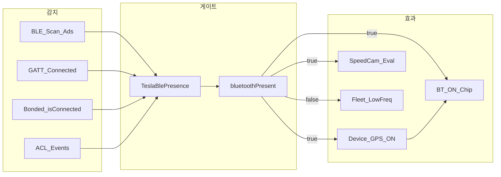
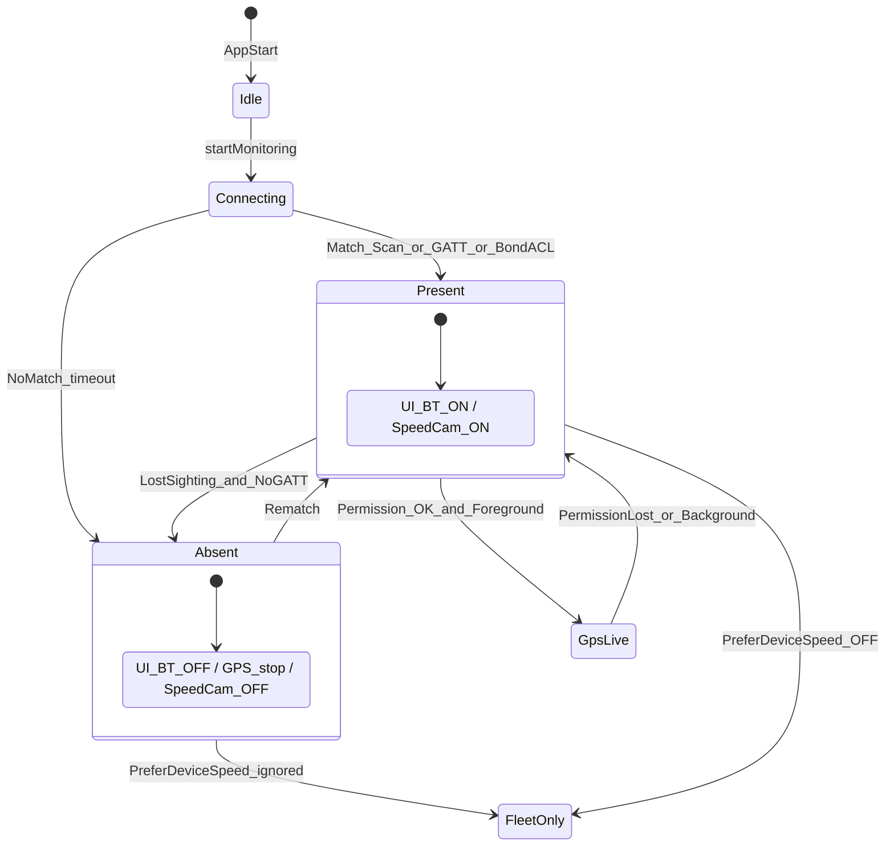
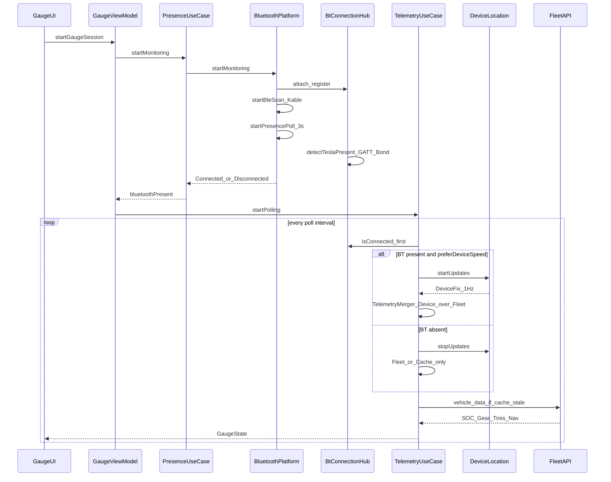
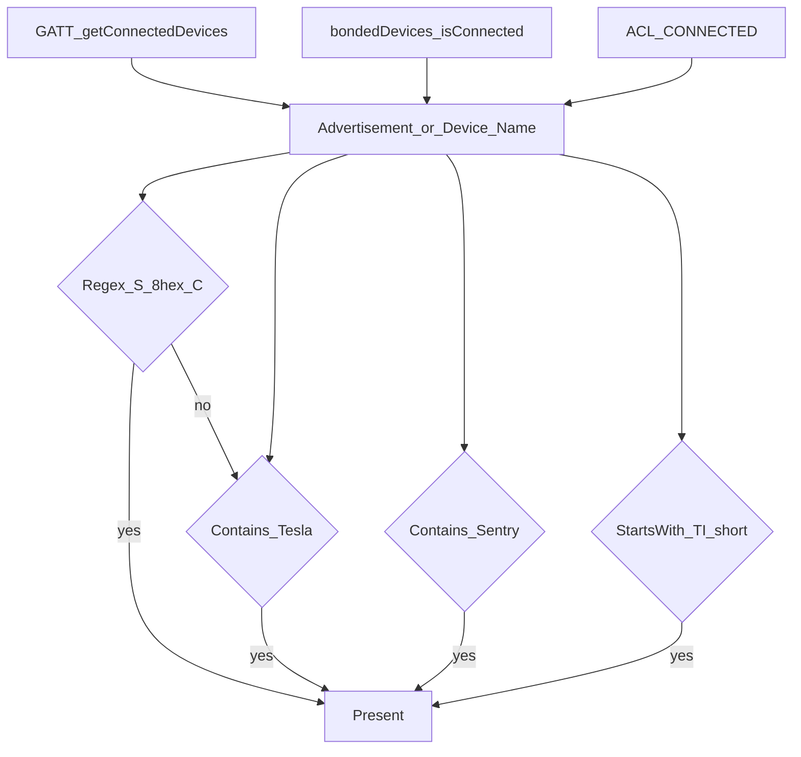

# BT / BLE Presence · 수집 가능 정보 · 타이밍 (사용성 검토용)

> 작성: 2026-08-27  
> 목적: 차량 실연결이 어려운 기간에도 **구현된 BT/BLE 동작**과 **확장 후보**를 검토할 수 있도록 도식화  
> 관련 코드: `AndroidBluetoothPlatform`, `BtConnectionHub`, `TeslaBlePresence`, `TelemetryUseCase`, `PresenceUseCase`  
> 관련: [ble-vehicle-data-feasibility.md](./ble-vehicle-data-feasibility.md), [device-telemetry-hybrid.md](./device-telemetry-hybrid.md)

---

## 1. 한눈에 보기

**핵심:** BLE는 **게이지 숫자 스트림이 아니라 “차 안인가?” 게이트**다.  
속도·위치는 Device GPS, SOC·타이어 등은 Fleet.

---

## 2. 구성요소 · 역할

| 모듈 | 파일 | 역할 |
|------|------|------|
| `TeslaBlePresence` | `domain/bluetooth/TeslaBlePresence.kt` | Phone Key 이름 `S########C`, Tesla/Sentry 매칭 |
| `AndroidBluetoothPlatform` | `platform/AndroidBluetoothPlatform.kt` | Kable 스캔 + 3s Presence 폴링 + FGS |
| `BtConnectionHub` | `platform/BtConnectionHub.kt` | GATT/bonded/ACL 공유, **adapter ON ≠ Connected** |
| `BtBroadcastReceiver` | `service/BtBroadcastReceiver.kt` | ACL / adapter STATE |
| `PresenceService` | `service/PresenceService.kt` | connectedDevice FGS |
| `PresenceUseCase` | `domain/usecase/PresenceUseCase.kt` | `isVehiclePresent` Flow |
| `TelemetryUseCase` | `domain/usecase/TelemetryUseCase.kt` | BT 게이트로 GPS start/stop + Fleet 병합 |
| `SpeedCamUseCase` | `domain/usecase/SpeedCamUseCase.kt` | **BT OFF면 단속 평가 중지** |

---

## 3. 상태 머신

---

## 4. 런타임 시퀀스 (앱 포그라운드)

---

## 5. 매칭 규칙 (무엇이 “Tesla”인가)

| 입력 | 주기 / 트리거 | 비고 |
|------|----------------|------|
| BLE advertisement name | 스캔 연속 | Phone Key는 연결 후 광고가 줄어들 수 있음 |
| GATT connected | **3초 폴링** | 연결 유지 시 핵심 |
| Bonded `isConnected` (reflection) | 3초 폴링 | OEM별 편차 |
| ACL connected | 이벤트 | 이름 필터 후 Present |
| Adapter STATE_ON | 이벤트 | **재평가만** (단독 Present 금지) |
| BLE sighting TTL | **20초** | 스캔 히트 후 유지 |

---

## 6. 수집 가능 정보 · 타이밍 매트릭스

### 6.1 BLE / Presence 경로에서 **직접** 얻는 것

| 정보 | 소스 | 타이밍 | UI 사용 |
|------|------|--------|---------|
| `bluetoothPresent` bool | 매칭 결과 | 이벤트 + 3s | BT ON/OFF, GPS 게이트 |
| 광고/디바이스 이름 | 스캔·ACL | 이벤트 | 로그/디버그 |
| (간접) Device GPS 허용 | BT AND 권한 AND FG | BT 전이 시 | 속도·좌표·단속 |

### 6.2 BT Present일 때 **Device GPS**로 얻는 것 (대체 성공)

| 정보 | 주기 | Fleet 대체 |
|------|------|------------|
| `speedKmh` | ~1–2 Hz | 주행 중 Fleet 속도 불필요 |
| `latitude` / `longitude` | 동일 | 단속·경로 샘플 |
| `headingDegrees` | fix에 있으면 | 보조 게이지 나침반 |

### 6.3 Fleet에서만 얻는 것 (BLE로 **불가**)

| 정보 | 폴링 | 비고 |
|------|------|------|
| SOC, Range, Gear, Power | 주행 BT ON 시 90–120s | |
| 타이어 psi, 온도, 잠금, HVAC | 동일 | |
| `active_route_destination` / miles·minutes | 동일 | **차선·다음 회전 없음** |
| 충전 kW / ETA | 충전 모드 간격 | |

### 6.4 BLE vehicle-command로 **미래에** 가능 (미구현)

| 능력 | 조건 | 게이지 대체? |
|------|------|--------------|
| lock/unlock, HVAC, trunk | Virtual Key + VCSEC 세션 | 아니오 (명령) |
| navigation_request | 이미 Fleet REST | 목적지 **설정**만 |
| VCSEC status 일부 | 프로토콜 실험 | SOC 연속 스트림 대체 **기대 금지** |

---

## 7. 타이밍 다이어그램 (차 탑승 시나리오)

```mermaid
gantt
  title InCar_Session_Timeline
  dateFormat X
  axisFormat %s
  section Presence
  BLE_scan_or_GATT_hit     :a1, 0, 3
  bluetoothPresent_true    :a2, 2, 600
  section DeviceGPS
  permission_check         :b1, 2, 3
  fixes_stream_1Hz         :b2, 3, 600
  section Fleet
  vehicle_data_poll        :c1, 5, 8
  cache_skip_until_105s    :c2, 8, 113
  next_poll                :c3, 113, 116
  section SpeedCam
  evaluate_on_each_fix    :d1, 3, 600
```

---

## 8. 사용성 관점 — 추가 기능 후보

| 후보 | 가치 | 난이도 | 의존 |
|------|------|--------|------|
| Companion Device Manager 페어링 UX | Presence 안정 | M | Android |
| BT ON 시 단속 힌트 배너 | 신뢰 | S | 이미 게이트 있음 |
| Virtual Key BLE 잠금 | 판매 차별 | L | vehicle-command |
| Presence 디버그 화면 (매칭 이름·GATT 목록) | 현장 QA | S | 개발 옵션 |
| 차선/TBT 안내 | 보조 게이지 완성 | **XL / 외부** | Fleet에 없음 → Google/Kakao/HERE 또는 차 화면 의존 |
| RouteLine polyline 보조 게이지 미니맵 | 중 | M | Fleet `RouteLine` 필드 확보 시 |

---

## 9. 실패 모드 · UX 카피 제안

| 증상 | 원인 | 사용자에게 |
|------|------|------------|
| 차 안인데 BT OFF | 스캔 이름 미매칭 / 권한 / Phone Key 미페어링 | “Tesla Phone Key가 이 폰에 켜져 있는지 확인” |
| BT ON인데 속도 멈춤 | 위치 권한 / GPS fix | “위치 권한을 허용하면 GPS 속도가 표시됩니다” |
| 단속 안 뜸 | BT OFF 게이트 | “Bluetooth로 차량이 연결되면 단속이 켜집니다” |

---

## 10. 내비 정보 (Fleet / BT) 요약

| 항목 | Fleet `vehicle_data` | BLE | MyT 보조 게이지 |
|------|----------------------|-----|-----------------|
| 목적지 이름 | `active_route_destination` | — | ✅ |
| 남은 거리 | `active_route_miles_to_arrival` | — | ✅ |
| ETA 분 | `active_route_minutes_to_arrival` (배선됨) | — | ✅ |
| 진행 방위 | `heading` / Device GPS | — | ✅ 나침반 |
| **다음 회전 / 차선** | **미제공** | **미제공** | 자리만 (확장 필요) |
| 도로명 | 단속 POI `roadName` | — | 단속 시 ✅ |
| 목적지 설정 | `navigation_request` 명령 | VCSEC 아님 (REST) | 음성 내비 |

상세 UI: 보조 게이지는 **단속 우선 → 내비 활성 → 대기** 순으로 전환한다.
