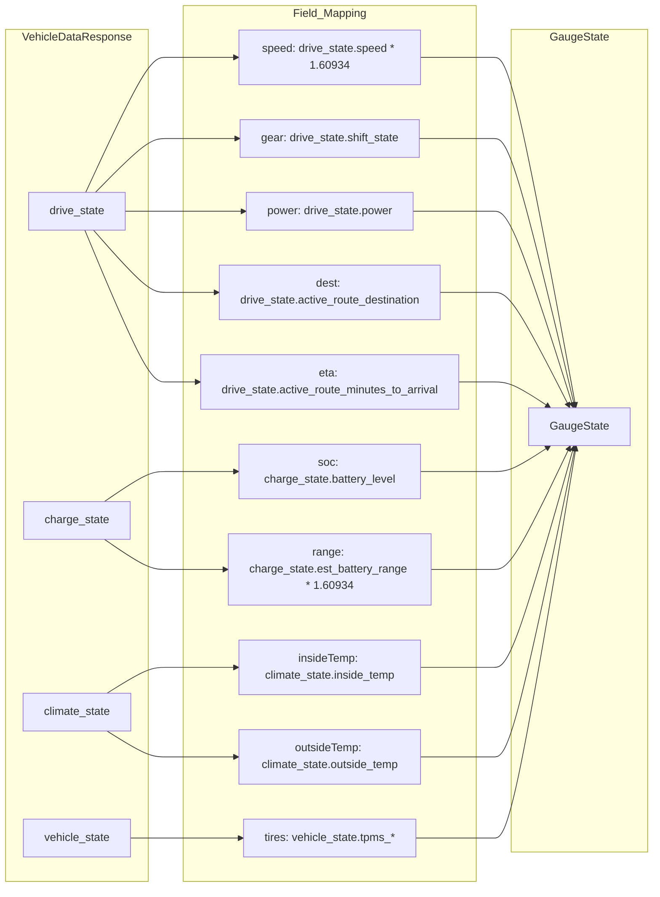
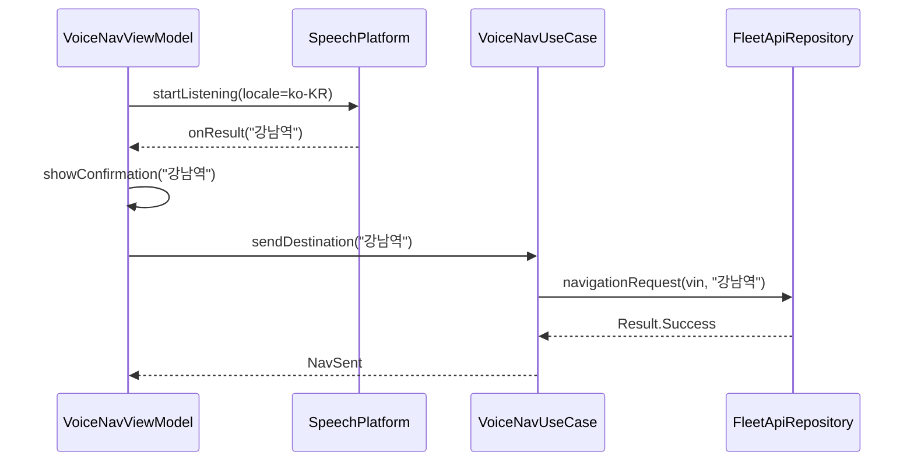
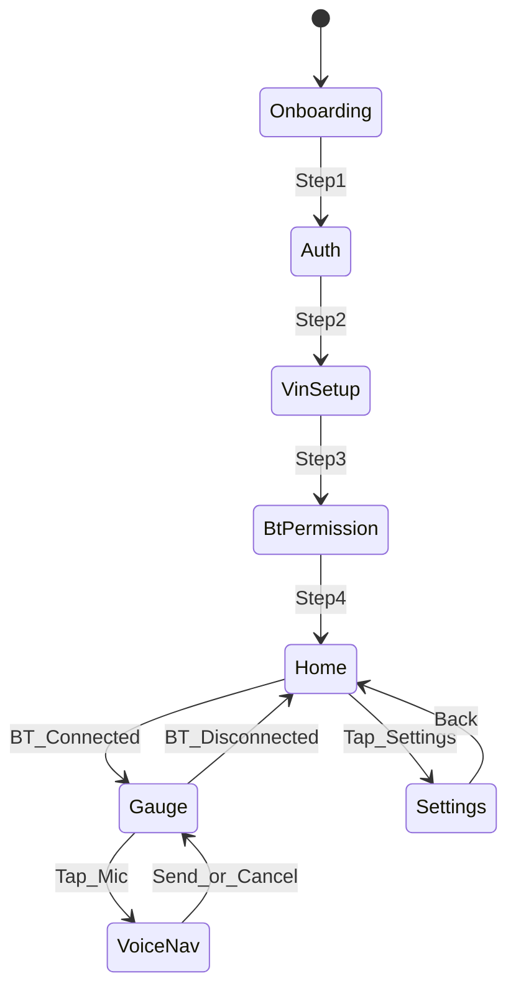

# 상세 설계

## 1. GaugeViewModel

```kotlin
// commonMain — 핵심 ViewModel
class GaugeViewModel(
    private val telemetryUseCase: TelemetryUseCase,
    private val presenceUseCase: PresenceUseCase,
    private val speedCamUseCase: SpeedCamUseCase,
    private val layoutUseCase: AdaptiveLayoutUseCase,
) : ViewModel() {

    val gaugeState: StateFlow<GaugeState>
    val speedCamAlert: StateFlow<SpeedCamAlert?>
    val layoutConfig: StateFlow<LayoutConfig>
    val connectionStatus: StateFlow<ConnectionStatus>

    fun startGaugeSession()
    fun stopGaugeSession()
    fun onVoiceNavRequested()
}
```

### GaugeState 데이터 클래스

```kotlin
data class GaugeState(
    val speedKmh: Float = 0f,
    val gear: Gear = Gear.PARK,
    val socPercent: Float = 0f,
    val rangeKm: Float = 0f,
    val insideTempC: Float? = null,
    val outsideTempC: Float? = null,
    val powerKw: Float? = null,
    val longAccelG: Float = 0f,
    val latAccelG: Float = 0f,
    val tires: TirePressures? = null,
    val navigation: NavInfo? = null,
    val charging: ChargeInfo? = null,
    val connection: ConnectionStatus = ConnectionStatus.Disconnected,
    val isSleeping: Boolean = false,
    val lastUpdated: Long = 0L,
)
```

## 2. FleetApiRepository — API 매핑



### 폴링 전략

| 상태 | 간격 | API Endpoint |
|---|---|---|
| 주행 중 (Gear ≠ P), 포그라운드 | 60초 | vehicle_data |
| 주차 (Gear = P), 포그라운드 | 5분 | vehicle_data |
| 충전 중 | 3분 | vehicle_data |
| Sleep | 호출 없음 | 사용자 새로고침 시에만 wake |
| 백그라운드 | 폴링 중지 | - |
| 크레딧 70% 이상 | 위 간격 × 2 | - |
| 크레딧 95% 이상 | 호출 차단 | - |

## 3. SpeedCamEngine 설계

```kotlin
class SpeedCamEngine(
    private val poiRepository: SpeedCamPoiRepository,
) {
    fun evaluate(
        lat: Double, lng: Double,
        heading: Float, speedKmh: Float,
    ): SpeedCamAlert?

    // Internal
    private fun queryNearby(lat, lng, radiusM): List<SpeedCamera>
    private fun filterByDirection(cameras, heading): List<SpeedCamera>
    private fun calculateAlertLevel(camera, distance, speed): AlertLevel
    private fun trackSectionSpeed(camera, speedHistory): Float?
}
```

### AlertLevel 판정

```
distance > 500m          → null (no alert)
500m ≥ distance > 300m → L1 (Advance)
300m ≥ distance > 100m → L2 (Imminent)
100m ≥ distance          → L3 if speed > limit, else L2
section active           → SectionTracking (avg speed)
```

## 4. VoiceNavUseCase



## 5. AdaptiveLayoutUseCase

```kotlin
class AdaptiveLayoutUseCase {
    fun computeLayout(
        widthClass: WindowWidthSizeClass,
        heightClass: WindowHeightSizeClass,
    ): LayoutConfig = when {
        heightClass == WindowHeightSizeClass.Compact -> LayoutConfig.Landscape
        widthClass == WindowWidthSizeClass.Compact -> LayoutConfig.SinglePane
        widthClass == WindowWidthSizeClass.Medium -> LayoutConfig.TwoPane
        widthClass == WindowWidthSizeClass.Expanded -> LayoutConfig.ThreePane
        else -> LayoutConfig.SinglePane
    }
}
```

회전은 Compose `BoxWithConstraints`로 매 프레임 크기를 읽어 즉시 재배치한다. ViewModel 폴링 틱을 기다리지 않는다.

### LayoutConfig → Composable 매핑

| LayoutConfig | Composable | 패널 |
|---|---|---|
| SinglePane | `GaugeSinglePaneLayout` | 세로: Speed + 상태 그리드 |
| Landscape | `GaugeLandscapeLayout` | 가로 Compact 높이: 축소 Speed \| 스크롤 상태 |
| TwoPane | `GaugeTwoPaneLayout` | Speed \| Info |
| ThreePane | `GaugeTwoPaneLayout` | 태블릿 가로 확장 |

## 6. Platform expect/actual

```kotlin
// commonMain
expect class BluetoothPlatform {
    val connectionState: Flow<BtConnectionState>
    fun startMonitoring()
    fun stopMonitoring()
}

expect class SpeechPlatform {
    suspend fun recognizeSpeech(locale: String): Result<String>
}

expect class AudioAlertPlatform {
    fun playBeep(frequency: Int, durationMs: Int, count: Int)
}

expect class HapticPlatform {
    fun vibrate(durationMs: Long)
}

expect class SecureStoragePlatform {
    fun saveToken(key: String, value: String)
    fun getToken(key: String): String?
    fun deleteToken(key: String)
}
```

## 7. 화면 네비게이션



### Navigation 3 Routes

```kotlin
@Serializable sealed interface Route {
    @Serializable data object Onboarding : Route
    @Serializable data object Home : Route
    @Serializable data object Gauge : Route
    @Serializable data object Settings : Route
    @Serializable data object VoiceNav : Route
    @Serializable data object TripHistory : Route  // Phase 1.5
}
```

## 8. 에러 처리

| Error | 처리 | UI |
|---|---|---|
| 401 Unauthorized | Token refresh → 실패 시 re-login | Full screen overlay |
| 403 key_not_paired | Virtual key 안내 | Dialog + link |
| 408 Vehicle asleep | Retry 60s, show sleep UI | "😴 대기 중" |
| 429 Rate limited | Exponential backoff | Status bar warning |
| Network error | Retry 3x, show last data | "⚠ 연결 오류" |
| BLE permission denied | Guide to settings | Permission dialog |

## 9. 성능 최적화

| 영역 | 전략 |
|---|---|
| Compose recomposition | `GaugeState` → `derivedStateOf`, 위젯별 분리 |
| Fleet API | Gear=P 시 interval 증가, Sleep 시 60s |
| SpeedCam | R-Tree index, 500m radius limit, 2s throttle |
| POI DB | Lazy init, memory-mapped SQLite |
| Layout | `LayoutConfig` cache, orientation debounce 100ms |
