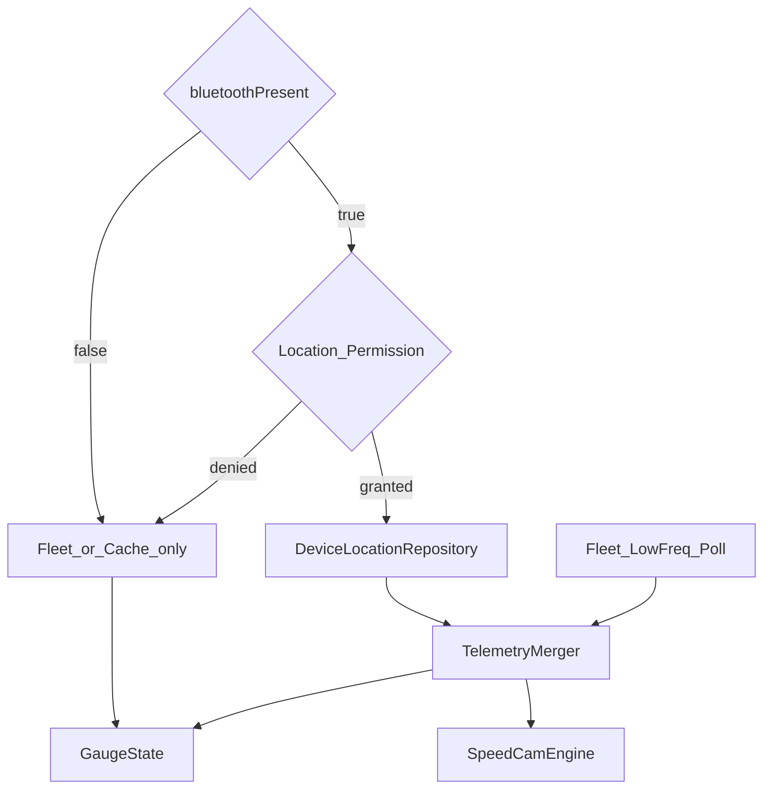

# 하이브리드 텔레메트리 — Device GPS + Fleet API

> 상태: **설계 확정 (2026-08-26)** — BT 미연결 시 Device GPS 사용 금지  
> **관련:** [ble-vehicle-data-feasibility.md](./ble-vehicle-data-feasibility.md) — BLE로 게이지 데이터 대체 불가·Presence/명령 역할 정리

## 1. 목표

| 목표 | 설명 |
|------|------|
| 쿼터 절감 | 속도·위치 때문에 `vehicle_data`를 촘촘히 치지 않음 |
| 실시간성 | BT 연결·차내 거치 시 속도·단속을 단말 GPS로 1–2 Hz급 갱신 |
| 안전 게이트 | **BT 미연결이면 GPS 스트림을 켜지 않음** (차 밖 오탐·배터리·불필요 권한 사용 방지) |

## 2. 아키텍처



### 구성요소 (구현 예정)

| 모듈 | 역할 |
|------|------|
| `DeviceLocationRepository` (expect/actual) | Android Fused Location / iOS CoreLocation When-In-Use |
| `DeviceFix` | lat, lng, speedKmh, headingDeg, accuracyM, timestampMs |
| `TelemetryMerger` | BT·권한·fix age에 따라 Device vs Fleet 필드 병합 |
| `TelemetryUseCase` | Fleet 폴링 + Device 구독 수명 주기 |
| `GaugeState` 메타 | `speedSource`, `locationSource`: `Device` / `Fleet` / `Cache` / `None` |

## 3. 필드별 소스

| 필드 | BT 연결 + GPS OK | BT 미연결 | 비고 |
|------|------------------|-----------|------|
| `speedKmh` | **Device** | Fleet / Cache | 클러스터 대형 숫자 |
| lat / lng / heading | **Device** | Fleet / Cache / None | SpeedCam·trip 경로 |
| SpeedCam 입력 | Device만 | Fleet 좌표가 있으면 저품질 폴백 또는 단속 OFF(설정) | 기본: BT 없으면 단속도 Device 경로 없음 → Fleet 폴백 정책은 설정 토글 |
| SOC, Range | Fleet | Fleet / Cache | |
| Gear, Lock, HVAC, Sentry | Fleet | Fleet / Cache | |
| Power kW, 타이어, 온도 | Fleet | Fleet / Cache | UI는 시트/요약 |
| 충전 필드 | Fleet | Fleet / Cache | Charging 모드만 간격 단축 |

**확정 규칙 — BT 게이트**

1. `bluetoothPresent != true` → `DeviceLocationRepository.stop()`, Merger는 Device 필드를 **절대 적용하지 않음**.
2. BT가 다시 연결되면 권한 확인 후 구독 재개.
3. 설정에 「단말 GPS 속도 우선」토글(기본 ON)이 있어도, **BT OFF면 토글과 무관하게 GPS 미사용**.

## 4. 병합·신뢰

| 조건 | 동작 | UI 소스 점 |
|------|------|------------|
| BT ON, permission OK, fix age ≤ 3s | Device 속도/좌표 덮어씀 | Device (청록) |
| BT ON, fix age 3–5s | 마지막 Device 유지 | Degraded (앰버) |
| BT ON, fix 없음/age > 5s | Fleet/Cache 폴백 | Fleet (회황) |
| BT OFF | Fleet/Cache만 | Fleet 또는 None |
| Park + Device 속도 ≈ 0 (BT ON) | 속도 0 표시 | Device |

스무딩: 속도는 짧은 EMA(예: α≈0.35)로 터널·스파이크를 완화. 문서 구현 시 상수 테이블로 고정.

## 5. SpeedCam

- **입력 우선**: BT ON일 때 Device lat/lng/speed/heading.
- **BT OFF**: Device 경로 없음. 옵션 A(권장 기본): 단속 평가 **일시 중지** + “BT 연결 시 단속 활성” 힌트. 옵션 B: Fleet 위치 폴백(쿼터·지연·차량 UI 위치 아이콘 이슈) — 설정에서만 허용.
- 구간단속 샘플도 동일 게이트.

## 6. 권한 · 프라이버시

| 플랫폼 | 권한 | 시기 |
|--------|------|------|
| Android | `ACCESS_FINE_LOCATION` (+ 필요 시 foreground 안내) | BT Hub/온보딩 이후, 차내 사용 전 |
| iOS | When-In-Use, Info.plist 용도 문구 | 동일 |

- 위치는 **기기 내** 표시·SpeedCam·로컬 trip 샘플에만 사용. 서버 업로드 없음(현 Phase).
- 카피 예: “Bluetooth로 차량이 연결된 동안만 기기 GPS로 속도와 과속단속을 갱신해 Tesla API 사용량을 줄입니다.”

## 7. Fleet 폴링 간격 (개정 목표)

Device가 속도/위치를 담당하므로 Data 폴링은 **차량 전용 필드** 갱신 목적.

| 차량 상태 | 기존 목표 | 하이브리드 목표 (BT ON) | BT OFF |
|-----------|-----------|-------------------------|--------|
| 주행 · 포그라운드 | 60s | **90–120s** | 60–90s (속도도 Fleet 의존) |
| 주차 · 포그라운드 | 5min | 5min | 5min |
| 충전 | 3min | 2–3min | 3min |
| Sleep | 폴링 없음 | 동일 | 동일 |
| 백그라운드 | 폴링 없음 | Device도 중지 | 동일 |

Conserve(70%+)·Blocked(95%+) 규칙은 [fleet-api-quota.md](./fleet-api-quota.md)와 동일. 상세 표는 그 문서 §4에 반영.

## 8. 수명 주기

```
App foreground
  └─ BT connected? 
        yes → start Device GPS (if pref + permission)
        no  → stop Device GPS
App background / screen off
  └─ stop Device GPS, stop Fleet poll
BT disconnect event
  └─ stop Device GPS immediately; Gauge falls back to Fleet/Cache
```

## 9. 수락 기준

- [ ] BT OFF에서 Location API 호출 0 (로그/테스트로 검증)
- [ ] BT ON + 권한 + 이동 시 표시 속도 갱신 ≥ ~1 Hz
- [ ] 동일 주행 세션 `vehicle_data` 횟수가 기준선 대비 감소 (quota 이벤트 비교)
- [ ] 권한 거부 시에도 Gauge는 Fleet/캐시로 동작, 단속은 정책에 따라 중지/폴백
- [ ] 소스 인디케이터가 Drive Home 상단에 표시

## 10. 리스크 · 완화

| 리스크 | 완화 |
|--------|------|
| 폰 GPS ≠ 차량 속도 | EMA + Degraded 표시; 희소 Fleet 교차검증(옵션) |
| 터널·지하 | age 타임아웃 → Fleet/Cache; 단속 보류 |
| BT 허위 presence | ACL/허브 품질 개선; 수동 “차내 모드”는 후속(기본은 BT만) |
| Play/App 위치 정책 | 포그라운드 전용 Phase 1; 백그라운드 단속은 후속 |
