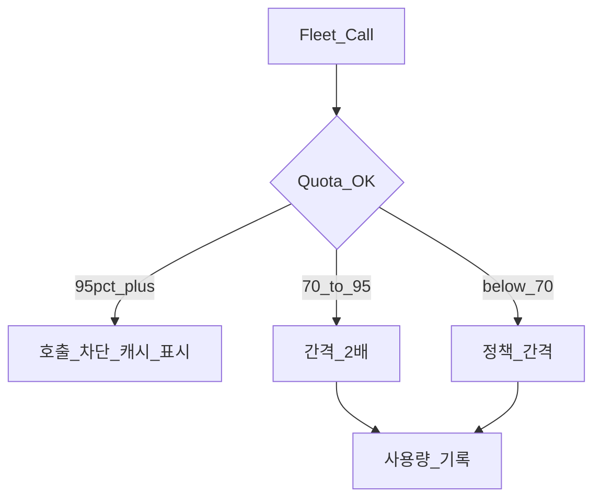

# Fleet API 개인 무료 한도 설계

> Phase 1 개인 1대. Tesla 월 $10 크레딧을 넘기지 않는 것이 목표다.  
> **관련:** [device-telemetry-hybrid.md](./device-telemetry-hybrid.md) — BT 연결 시 속도·위치는 단말 GPS.

## 1. 원칙

- BLE와 무관하게 **모든** `vehicle_data` / `wake_up` / command 가 카운트된다.
- 실패한 요청도 Tesla가 과금할 수 있으므로 **시도 시점**에 기록한다.
- 앱이 백그라운드면 폴링하지 않는다.
- 차량 Sleep 중 자동 웨이크는 하루 **8회**로 제한한다.
- **하이브리드:** BT 연결 시 속도·좌표·단속은 Device GPS가 담당하므로, Fleet Data 폴링은 SOC·기어·타이어 등 **차량 전용 필드** 갱신에 집중한다. BT 미연결 시 Device GPS는 사용하지 않으며, 속도 표시가 Fleet에 의존하므로 주행 폴링을 과도하게 늘리지 않는 선에서 유지한다.

## 2. Gauge UI

**현행:** 상태바 오른쪽에 높이 14dp, 너비 72dp 사용량 칩.  
**리뉴얼 목표** ([ui-renewal-commercial-roadmap.md](./ui-renewal-commercial-roadmap.md)): Drive Home에서 칩 제거 → More → 사용량. 상세 시트 내용은 동일:

- 월 추정 비용 / $10 크레딧
- Data · Command · Wake 잔여
- 최근 7일 막대
- 최근 호출 목록
- 현재 모드(정상 / 절약 / 차단)

## 3. 상태

| 모드 | 조건 | 동작 |
|---|---|---|
| Normal | < 70% | 기본 간격 |
| Conserve | 70~95% | 간격×2, 웨이크 금지 |
| Blocked | ≥ 95% 또는 일일 한도 | Fleet 호출 없음 |

## 4. 폴링 간격 — 하이브리드 개정 (목표)

| 차량 상태 | 기존 | BT ON + Device GPS | BT OFF (GPS 미사용) |
|-----------|------|--------------------|---------------------|
| 주행 · 포그라운드 | 60s | **90–120s** | 60–90s |
| 주차 · 포그라운드 | 5min | 5min | 5min |
| 충전 | 3min | 2–3min | 3min |
| Sleep | 없음 | 없음 | 없음 |
| 백그라운드 | 없음 | Fleet·Device 모두 중지 | 없음 |

Conserve / Blocked 배수는 §3과 동일하게 적용한다.

## 5. 월·일 상한 (요약)

[`commercial-constraints.md`](../01-research/commercial-constraints.md)와 동일:

| 카테고리 | 월 상한(앱 강제) | 일 상한 |
|----------|------------------|---------|
| Data | 3,000 | **300** (soft: 초과 시 15분마다 1회 허용) |
| Commands | 200 | 30 |
| Wakes | 50 | 8 |

합계 목표 ≤ 크레딧의 72%. 월 $ 사용 ≥95%에서 Fleet 호출 차단.  
일 상한은 Tesla 포털과 무관한 **앱 자체 가드**이며, 월 크레딧이 남아 있어도 일 상한으로 「한도 보호」 배너가 뜰 수 있다(배너에 사유 표시).

- Sleep 중 자동 웨이크: 하루 **8회** 상한(이전 2회는 과소).

