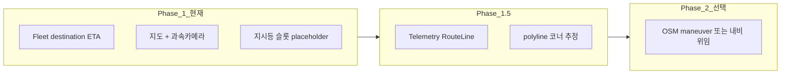

# 차선·다음 회전 표시 — 방법 비교

> MyT 듀얼 게이지에 **차선 안내·다음 회전**을 넣기 위한 옵션 정리.  
> Tesla Fleet `vehicle_data` / `drive_state`만으로는 **차선·턴-by-turn 화살표 데이터가 없음** ([navigation-guidance-feasibility.md](./navigation-guidance-feasibility.md)).

## 현재 가능한 Fleet 필드

| 필드 | 제공 | UI 활용 |
|---|---|---|
| `active_route_destination` | ○ | 목적지명 |
| `active_route_minutes/miles_to_arrival` | ○ | ETA·거리 |
| `RouteLine` (Telemetry) | Phase 1.5+ | 경로 polyline |
| 차선 수 / 추천 차선 | ✗ | — |
| 다음 회전 방향·거리 | ✗ | — |
| 방향지시등 / hazard | ✗ | UI 슬롯만 예약 (`GaugeState.turnSignal*`) |

---

## 옵션 A — Tesla 내비 메타만 (현재 + 소폭 개선)

**내용:** 목적지·ETA·거리 + “차선·회전 미지원” 안내. 보조 게이지 `NAVIGATION` 오버레이.

| 장점 | 단점 |
|---|---|
| Fleet만 사용, 추가 비용·권한 없음 | 차선·회전 화살표 불가 |
| 구현 완료에 가까움 | 운전자 기대(카카오/T맵 수준) 미충족 |

**적합:** Phase 1 최소 내비 표시, 충전·속도·과속카메라가 우선일 때.

---

## 옵션 B — RouteLine polyline + 지도 회전 (Phase 1.5 Telemetry)

**내용:** Fleet Telemetry `RouteLine`(base64) 디코드 → 보조 맵에 경로선 + 차량 heading. “다음 코너”는 polyline 기하로 **근사**(곡률 큰 지점 = 회전 추정).

| 장점 | 단점 |
|---|---|
| 공식 경로와 일치 | 차선 정보 없음, 회전은 추정치 |
| 지도 시각화 풍부 | Telemetry 서버·FW 요구 |
| API 폴링比 저비용 | 코너 ETA 정확도 낮음 |

**적합:** “대략적인 다음 구간” + 경로 지도가면 충분할 때.

---

## 옵션 C — OSM / Valhalla 외부 라우팅 (목적지 → 턴-by-turn)

**내용:** Fleet 목적지(또는 사용자 음성 목적지)를 받아 **OSRM/Valhalla**로 턴 리스트 생성 → Maneuver 아이콘(좌/우/직진/U턴) + Nm 표시.

| 장점 | 단점 |
|---|---|
| 명확한 “다음 회전” UI | Tesla 차량 내비와 경로 불일치 가능 |
| 차선 없이도 T맵급 화살표 | 외부 API·오프라인 타일 정책 |
| 시뮬레이션·테스트 용이 | 목적지 동기화 지연 |

**적합:** MyT가 **독립 안내 UI**를 제공하고, Tesla 내비와 100% 일치는 포기할 때.

---

## 옵션 D — Android/iOS **시스템 내비 인텐트** (앱 전환)

**내용:** `geo:` / Google Maps / 카카오내비 URL로 목적지만 넘기고, MyT는 속도·과속·G-meter에 집중.

| 장점 | 단점 |
|---|---|
| 차선·회전은 전문 내비 앱 | 게이지 안에 회전 UI 없음 |
| 구현·유지보수 최소 | 이중 화면, BT/Fleet 역할 분리 |

**적합:** “게이지 + 단속 알림”에 집중, 내비는 기존 앱 위임.

---

## 옵션 E — CAN / BLE / OBD (비공식, 고난이도)

**내용:** 차량 CAN에서 turn signal, steer angle, (일부) ADAS lane — **Tesla는 서드파티 CAN 접근 제한**.

| 장점 | 단점 |
|---|---|
| 실차 신호와 일치 가능 | Model 3 서드파티 비공식, 상용 리스크 |
| 지시등 UI 슬롯과 직결 | HW·펌웨어·법적 불확실 |

**적합:** 연구·프로토타입. Phase 1 상용 **비권장**.

---

## 옵션 F — **하이브리드 (권장 로드맵)**

1. **지금:** A + 지시등 UI placeholder + “테슬라API 미지원” 문구 (`UiLabels.laneTurnUnsupported`).
2. **Telemetry 도입 후:** B로 경로·코너 근사.
3. **사용자 설정:** C(독립 maneuver) vs D(외부 내비) 토글.

---

## UI 배치 제안 (의사결정용)

| 요소 | Primary 게이지 | Secondary (맵) |
|---|---|---|
| 다음 회전 화살표 | 속도 아래 소형 (옵션 C) | 맵 상단 maneuver chip |
| 차선 | ✗ 또는 “—” | 내비 활성 시 2–3칸 placeholder |
| 지시등 | `TurnSignalRow` (E/FW 후) | — |
| ETA/목적지 | — | `GuidanceOverlay` (현재) |

---

## 추천 결정 질문

1. **Tesla 내비와 경로 일치**가 필수인가, **MyT 자체 화살표**면 충분한가?
2. **Telemetry(RouteLine)** 도입 일정이 Phase 1.5 이내인가?
3. 게이지 **한 화면**에 회전까지 넣을지, **맵 패널**에만 넣을지?

오빠 결정에 따라 Phase 1.5 스펙(`docs/08-implementation/phase-specs/phase-1.5.md`)에 maneuver 소스(A/B/C)를 하나 고정하면 됩니다.
