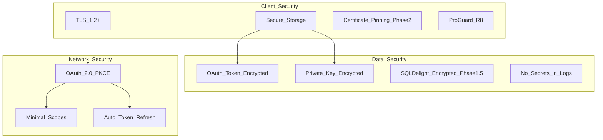
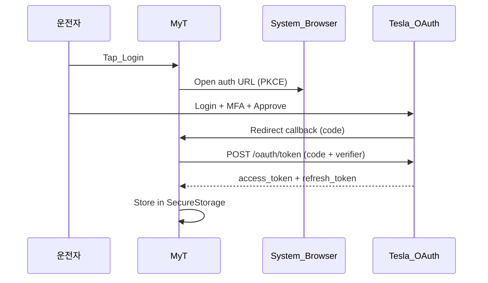

# 보안 · 개인정보 설계

## 1. 보안 아키텍처



## 2. 인증 · 토큰 관리

### OAuth Flow (Phase 1)



### 토큰 저장

| Platform | Storage | Encryption |
|---|---|---|
| Android | EncryptedSharedPreferences | AES-256-GCM (Keystore-backed) |
| iOS | Keychain | kSecAttrAccessibleWhenUnlockedThisDeviceOnly |

### 토큰 Refresh

```
access_token 만료 5분 전 → refresh_token으로 갱신
refresh 실패 → 재로그인 UI
백그라운드 refresh → WorkManager (Android) / BGTask (iOS)
```

## 3. Virtual Key (Vehicle Command)

| 항목 | Phase 1 | Phase 2 |
|---|---|---|
| Private Key 생성 | 앱 내 tesla-keygen equivalent | 서버-side (Phase 2) |
| Public Key 호스팅 | 개인 도메인 `.well-known/` | MyT 공식 도메인 |
| 페어링 | `tesla.com/_ak/<domain>` 링크 | In-app 페어링 UX |
| Key 저장 | SecureStorage | SecureStorage + 서버 백업 |

## 4. 데이터 분류

| 데이터 | 분류 | 저장 | 전송 | Phase 1 |
|---|---|---|---|---|
| OAuth Token | 🔴 Critical | Encrypted local | TLS | ✓ |
| Private Key | 🔴 Critical | Encrypted local | Never | ✓ |
| VIN | 🟡 Sensitive | Local | TLS (Fleet API) | ✓ |
| GPS Location | 🟡 Sensitive | Memory only | TLS (Fleet API) | ✓ |
| Speed/Telemetry | 🟢 Normal | Memory | TLS | ✓ |
| Trip History | 🟢 Normal | Local DB | None (Phase 1) | 1.5 |
| Speed Camera POI | ⚪ Public | Local DB | HTTPS (download) | ✓ |
| User Settings | 🟢 Normal | Local | None | ✓ |

## 5. 개인정보 · 동의

### Phase 1 (개인 사용)

| 동의 | 시점 | 내용 |
|---|---|---|
| Fleet API OAuth | 온보딩 Step 1 | Tesla 계정 연동 |
| vehicle_location | 온보딩 Step 2 | 위치 데이터 접근 (차량 UI 아이콘 안내) |
| Bluetooth | 온보딩 Step 3 | BT 연결 감지 |
| Microphone | Voice Nav 첫 사용 | 음성 인식 |

### Phase 2 (상용)

| 추가 | 내용 |
|---|---|
| 개인정보처리방침 | 위치·운행·차량 데이터 |
| 이용약관 | 서비스 조건 |
| GDPR | EU 사용자 데이터 삭제·이동 |
| 데이터 보관 기간 | 설정 가능 (30/90/365일) |

## 6. 네트워크 보안

| 항목 | Phase 1 | Phase 2 |
|---|---|---|
| TLS | 1.2+ (system default) | 1.3 |
| Certificate Pinning | ✗ | Tesla API pin |
| API Key in code | ✗ (OAuth only) | ✗ |
| Proxy support | 개발용 only | ✗ |

## 7. 로깅 · 디버깅

| Rule | Detail |
|---|---|
| 토큰/키 로깅 금지 | ProGuard strip + lint rule |
| VIN 마스킹 | 로그: `5YJSA1E**XXXXXX` |
| GPS 마스킹 | 로그: 소수점 2자리까지만 |
| Release 빌드 | Debug log disabled |
| Crash report | Firebase Crashlytics (Phase 1.5), PII excluded |

## 8. Phase 1 VIN 화이트리스트

```kotlin
// Phase 1: BuildConfig
object VehicleConfig {
    const val ALLOWED_VIN = "5YJSA1E4XKXXXXXXX" // 본인 VIN
    fun isAllowed(vin: String) = vin == ALLOWED_VIN
}
```

Phase 2: 서버-side VIN 검증 + 사용자-차량 매핑

## 9. Threat Model

| Threat | Impact | Mitigation |
|---|---|---|
| Token theft (rooted device) | 차량 제어 | Keystore, Phase 2 server-side token |
| MITM | Data intercept | TLS, Phase 2 cert pinning |
| Unauthorized VIN | Data access | VIN whitelist (Phase 1) |
| POI DB tampering | Wrong alerts | Signed bundle + hash verify |
| BLE spoofing | False auto-launch | Known MAC whitelist |
| Reverse engineering | API key extraction | ProGuard, no hardcoded secrets |
