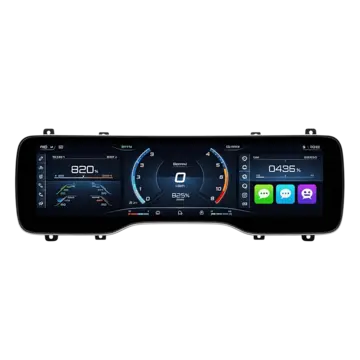
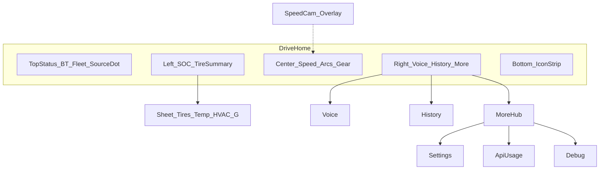

# MyT UI 전면 리뉴얼 · 판매용 개선 로드맵

> **상태:** Phase A0–D **코드 반영** (2026-08-26) — iOS Device GPS는 stub, Android 실기기 검증 권장  
> **컨펌 반영:** BT 미연결 시 Device GPS **미사용**  
> **비주얼 북스타:** [assets/cluster-visual-northstar.png](./assets/cluster-visual-northstar.png)  
> **하이브리드 텔레메트리:** [device-telemetry-hybrid.md](./device-telemetry-hybrid.md)

## 1. 배경 · 문제

현재 Gauge는 속도·SOC·타이어·G·충전·상태 타일·API 사용량·하단 텍스트 버튼을 **한 화면에 나열**한다.  
요구사항 수집 시 참고한 Tessie / TezLab / Stats / TeslaMate 등은 **주행 중에는 최소 정보**, 분석·제어는 별 화면으로 나눈다. MyT의 차별점인 “실시간 계기판”이 밀도 과다로 가려지고, 속도·위치까지 Fleet `vehicle_data`에 묶여 **쿼터 소모 + 표시 지연**이 난다.

### 목표

1. 첨부 클러스터 이미지와 **존 구조·톤**이 유사한 프리미엄 Drive Home.
2. Progressive disclosure로 불필요 정보 숨김.
3. **BT 연결 시에만** 단말 GPS로 속도·위치·단속을 채워 토큰 절감 + 실시간성.
4. 판매 가정 하에 시각·기능 로드맵을 Phase로 문서화.

---

## 2. 북스타 비주얼 (복제하지 말 것)

| 가져올 것 | 가져오지 말 것 |
|-----------|----------------|
| 3존(좌 차량 / 중 속도·아크 / 우 단축) | 장식용 SNS 아이콘, 과장 % 숫자 |
| 딥블랙 + 네온 블루·앰버 아크 | 픽셀 퍼펙트 카피 |
| 얇은 상단 상태 · 하단 아이콘 strip | 무관한 미디어 위젯 |
| 글래스·고대비 타이포 | 과한 glow 파티클 |

### 토큰 (구현 시 `GaugeTheme` 개정)

| 토큰 | 값 |
|------|-----|
| bg | `#030305` |
| surface / high | `#16161C` / `#22222A` |
| arc cyan → amber | `#3D9EFF` → `#FF8A3D` |
| text primary / secondary | `#F5F5F7` / `#9A9AA3` |
| brand CTA (선택) | Tesla 레드 `#E82127` — 로고·강조 버튼만 |
| Device 소스 점 | 청록 `#30D158` |
| Degraded / Fleet 소스 | 앰버 / 회황 |

---

## 3. 정보 아키텍처

### Drive Home — 항상 노출 (숫자 블록 ≤ 5)

| 영역 | 내용 | 데이터 소스 |
|------|------|-------------|
| 중앙 대형 | 속도 + 단위 | **Device GPS** (BT ON) / Fleet·캐시 (BT OFF) |
| 중앙 아크 | 전력·부하 존 | Fleet 캐시 (저빈도) |
| 중앙 하단 | SOC% · Range · Gear | Fleet |
| 좌 | SOC 히어로 + 타이어 점(이상 시만 강조) | Fleet |
| 우 | 음성 / 히스토리 / 더보기 타일 | — |
| 상단 | 시각, BT·Fleet, **속도 소스 점** | 메타 |
| 하단 strip | 벨트·HVAC·충전 등 **아이콘만** | Fleet |
| 오버레이 | 과속단속 L1–L3 | Device(BT ON) — [hybrid](./device-telemetry-hybrid.md) |

### Progressive disclosure

| 숨김 → 진입 | 방식 |
|--------------|------|
| 타이어 수치, 실내외온, G-미터 | 좌 패널 탭 → 바텀시트 |
| 충전 상세 | Charging 모드 또는 시트 |
| API 사용량 % | More → 사용량 (Drive Home 칩 제거) |
| 표시 필드·레이아웃 | Settings + Drive 프로필 |

### 메뉴 매핑

| 현재 | 리뉴얼 |
|------|--------|
| 하단 「히스토리」「음성」「설정」텍스트 | 우 컬러 타일 3 + Expanded 측 레일 |
| 상단 API % 칩 상시 | More 허브 |
| 필드 토글만 | **Minimal / Standard / Pro** + 「단말 GPS 속도 우선」(기본 ON, **BT 필수**) |

### 모드

- **Driving**: 위 Drive Home.
- **Charging**: 중앙을 충전 링·kW·ETA로 교체.
- **Parked**: 속도 축소, Wake/새로고침·히스토리 강조.
- **Portrait**: 속도 히어로 + 하단 도킹 3버튼 + 스와이프 시트로 좌/우 내용.

---

## 4. 경쟁·기존 문서에서 가져온 원칙

| 출처 | 원칙 | MyT 적용 |
|------|------|----------|
| Tessie / TezLab / Stats | 주행 중 최소 UI, 분석은 별탭 | Drive Home 슬림화 |
| TeslaMate | 고밀도 차트는 대시보드 | History만 |
| Tesla 공식 앱 | 제어·카메라 | Phase 2 우 레일 자리만 |
| [adaptive-layout-design](./adaptive-layout-design.md) | 속도 weight 최대 | 콘티 회복 |
| [commercial-constraints](../01-research/commercial-constraints.md) | 큰 글씨·최소 탭·음성 | 타일·단속 오버레이 |
| [fleet-api-quota](./fleet-api-quota.md) | $10 크레딧 보호 | Device로 Data 호출 감소 |

---

## 5. 하이브리드 텔레메트리 (요약)

상세는 **[device-telemetry-hybrid.md](./device-telemetry-hybrid.md)**.

| 규칙 | 내용 |
|------|------|
| **BT 게이트 (확정)** | BT 미연결 → Device GPS **구독·병합 금지** |
| BT ON + 권한 | 속도·좌표·헤딩·단속 = Device 1차 |
| Fleet | SOC·Gear·타이어·Power·충전 등 — 저빈도 폴링 |
| 프라이버시 | 위치는 기기 내만, 서버 업로드 없음(현 Phase) |

---

## 6. 판매 가정 — Phase 로드맵

각 Phase: Why / What / Acceptance / Effort.

### Phase A0 — Hybrid Telemetry

| | |
|--|--|
| **Why** | 토큰 절감 + 속도/단속 실시간성. UI만 바꾸면 “예쁜데 느린” 체감 |
| **What** | `DeviceLocationRepository`, `TelemetryMerger`, SpeedCam 전환, BT 게이트, 폴링 간격 개정, 소스 인디케이터 |
| **Acceptance** | BT OFF 시 Location 호출 0; BT ON 시 ~1 Hz 속도; Data 호출 감소 측정 가능 |
| **Effort** | M — Android 우선, iOS actual 스텁 가능 |

### Phase A — Visual + IA

| | |
|--|--|
| **Why** | 스토어·데모 첫인상 = 매출 전환 |
| **What** | 테마 토큰, 3존 `ClusterLayout`, 메뉴 타일, progressive sheets, Drive 프로필 |
| **Acceptance** | Drive Home 숫자 ≤ 5; Expanded 3존; R1–R12 라벨 갱신 후 PASS |
| **Effort** | L |

### Phase B — Polish

| | |
|--|--|
| **Why** | 리뷰·스크린샷·접근성 |
| **What** | Charging/Parked 모드 UI, 단속 오버레이 리디자인, 다크 가독성, 모션 2–3종 |
| **Acceptance** | 모드 전환 명확; WCAG AA 목표 대비 |
| **Effort** | M |

### Phase C — Product shell

| | |
|--|--|
| **Why** | 상용(Phase 2) 전환 자리 |
| **What** | 온보딩(위치 권한 카피·BT 설명), 페이월/구독 자리, Watch·위젯 placeholder, 다국어 골격 |
| **Acceptance** | 권한 플로우 완료; 스토어 정책 문구 |
| **Effort** | M |

### Phase D — Differentiator

| | |
|--|--|
| **Why** | Tessie 대비 “주행 중” 우위 |
| **What** | 구간단속+Device, 음성 내비 완성도, Fleet Telemetry 저지연 아크 |
| **Acceptance** | 실차 시나리오 AC 통과 |
| **Effort** | L |

### 판매용 기능 백로그 (UI 셸만 A/B, 구현은 제품 Phase 2+)

차량 제어(V01+), 충전 비용, 배터리 health, 자동화, Watch — Drive More / 우 레일에 **자리만** 확보.

---

## 7. 구현 터치포인트 (승인 후 코드)

| 영역 | 경로 |
|------|------|
| 레이아웃 | `composeApp/.../ui/gauge/layout/GaugeLayouts.kt`, 신규 `ClusterLayout.kt` |
| 테마 | `composeApp/.../ui/theme/GaugeTheme.kt` |
| Prefs | `GaugeDisplayPrefs` — `DriveDensity`, `preferDeviceSpeed` |
| 텔레메트리 | `TelemetryUseCase`, 신규 device 패키지, `SpeedCamUseCase` |
| 권한 | AndroidManifest, iOS Info.plist |
| 회귀 | `docs/08-implementation/device-regression-suite.md` + GPS/BT 케이스 |

권장 구현 순서: **A0 → A** (한 스프린트 또는 A0 先行).

---

## 8. 성공 KPI

| KPI | 목표 |
|-----|------|
| Drive Home 동시 숫자 블록 | ≤ 5 |
| BT ON 속도 갱신 | ≥ ~1 Hz (fix 유효 시) |
| BT OFF Location 호출 | 0 |
| Data 호출/주행세션 | 기준선 대비 감소 |
| 리그레션 | R1–R12 + R-GPS/BT PASS |

---

## 9. 리스크

| 리스크 | 완화 |
|--------|------|
| UI+텔레메트리 동시 변경 | A0 머지 후 A, 리그레션 매 빌드 |
| GPS≠차량속도 | EMA + 소스 점; BT 게이트로 차외 오용 차단 |
| 세로 3존 과밀 | Portrait는 히어로+시트 |
| 위치 권한 거부 | Fleet 폴백 Gauge 유지 |

---

## 10. 문서·다음 액션

| 문서 | 역할 |
|------|------|
| 본 문서 | UI·IA·판매 Phase |
| [device-telemetry-hybrid.md](./device-telemetry-hybrid.md) | BT 게이트·소스·수명주기 |
| [fleet-api-quota.md](./fleet-api-quota.md) | 폴링 간격 개정 |
| [adaptive-layout-design.md](./adaptive-layout-design.md) | 기존 적응형 — 본 리뉴얼이 상위 비전 |

**다음:** 오빠 컨펌 유지 시 **Phase A0 구현**부터 진행. 변경 요청이 있으면 본 문서부터 수정.
