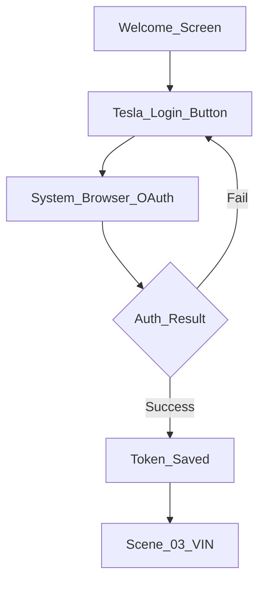
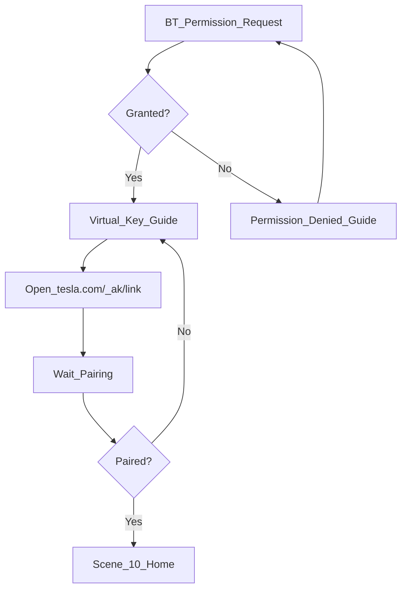
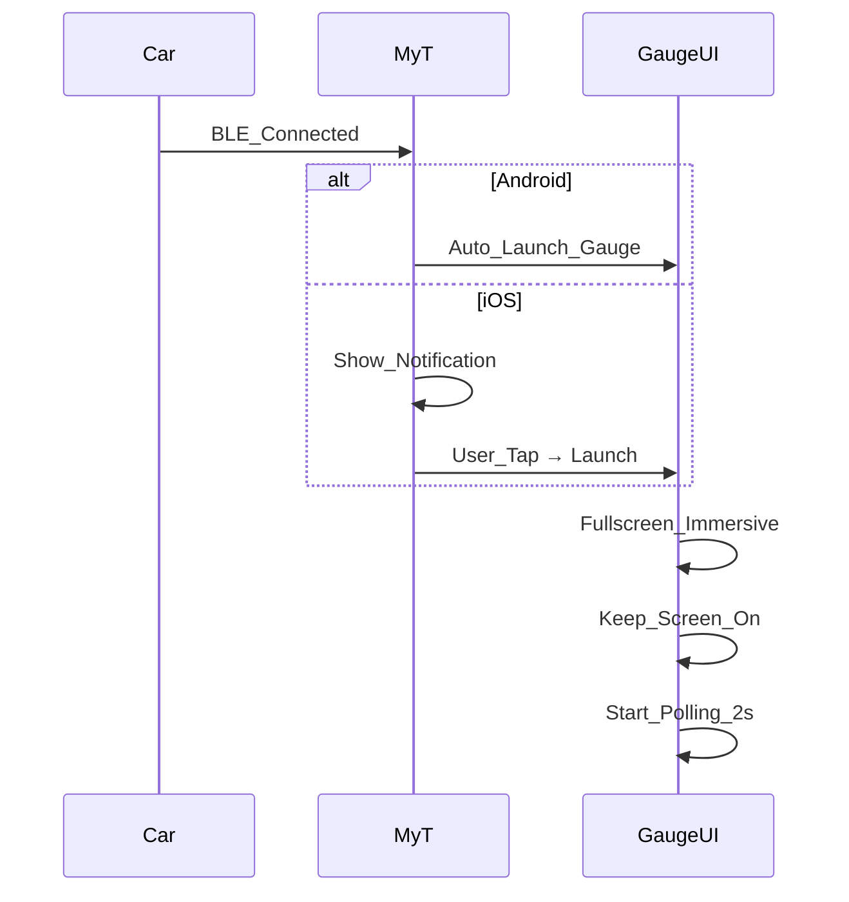
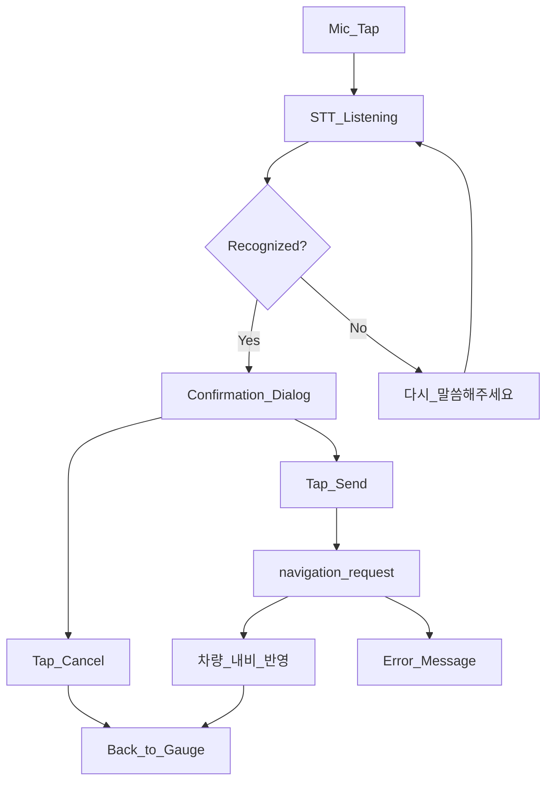
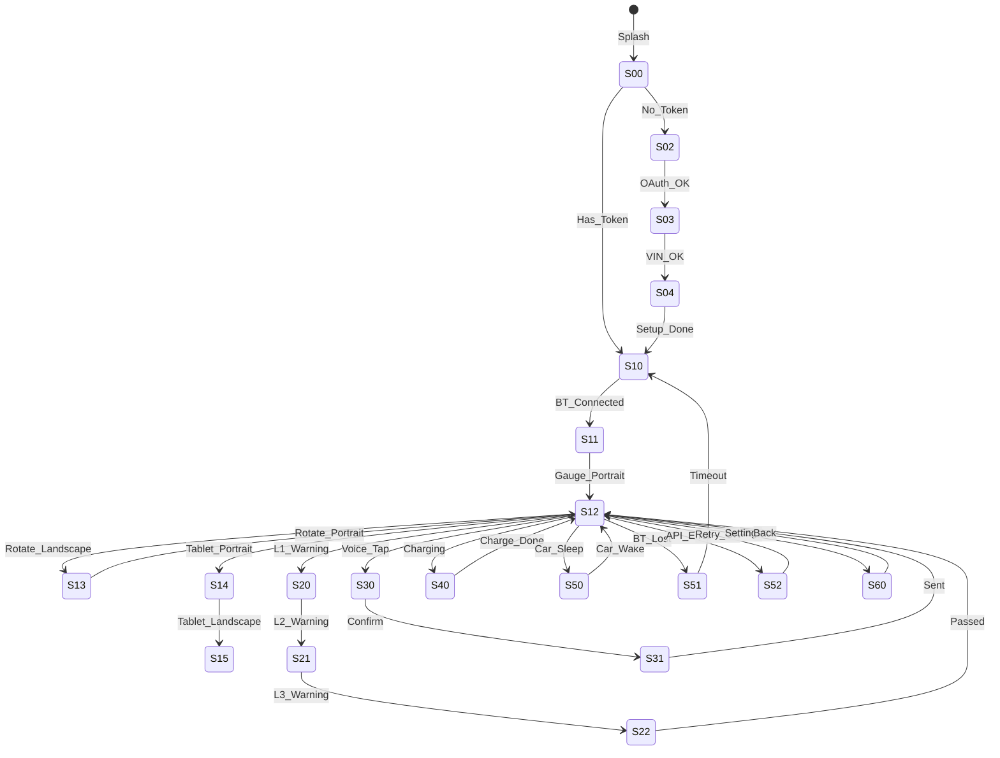

# MyT 상세 콘티 (Storyboard)

> 장면별: 목적 · 화면 · 입력 · API/센서 · 성공/실패 분기 · Mermaid 흐름

---

## Scene 00: 앱 아이콘 · 스플래시

**목적:** 앱 브랜드 인식, 초기화

```
┌─────────────────────┐
│                     │
│      ⚡ MyT         │
│   Tesla Companion   │
│                     │
│    ─── loading ───  │
│                     │
└─────────────────────┘
```

| 항목 | 내용 |
|---|---|
| 입력 | 앱 탭 / BT 자동 실행 |
| API | Token 존재 확인 |
| 성공 | Token 있음 → Scene 01 or 10 |
| 실패 | Token 없음 → Scene 02 (Onboarding) |
| 시간 | 1초 이내 |

---

## Scene 01: 온보딩 — Tesla 로그인

**목적:** Fleet API OAuth 인증



```
┌─────────────────────────┐
│                         │
│    ⚡ MyT에 오신 것을     │
│       환영합니다         │
│                         │
│  Tesla 계정을 연결하여    │
│  차량 데이터에 접근합니다  │
│                         │
│  ┌───────────────────┐  │
│  │  Tesla로 로그인    │  │
│  └───────────────────┘  │
│                         │
│  🔒 데이터는 기기에만     │
│     안전하게 저장됩니다   │
│                         │
└─────────────────────────┘
```

| 항목 | 내용 |
|---|---|
| 입력 | "Tesla로 로그인" 버튼 |
| API | OAuth PKCE → `/oauth/token` |
| Scope | vehicle_device_data, vehicle_location, vehicle_cmds |
| 성공 | → Scene 03 |
| 실패 | "로그인 실패" + 재시도 |

---

## Scene 02: (Skip — Scene 01에 통합)

---

## Scene 03: VIN 설정 · 화이트리스트

**목적:** Phase 1 본인 차량 VIN 확인

```
┌─────────────────────────┐
│  차량 선택               │
│                         │
│  ┌───────────────────┐  │
│  │ 🚗 Model 3        │  │
│  │ VIN: 5YJSA1E4X... │  │
│  │ ✅ 연결 가능       │  │
│  └───────────────────┘  │
│                         │
│  ⚠ 위치 데이터 접근 시   │
│  차량 화면에 📍 아이콘이  │
│  표시됩니다              │
│                         │
│  [ ✓ 동의하고 계속 ]     │
└─────────────────────────┘
```

| 항목 | 내용 |
|---|---|
| API | GET `/api/1/vehicles` |
| 검증 | VIN == ALLOWED_VIN |
| 성공 | → Scene 04 |
| 실패 | "등록되지 않은 차량" (Phase 1) |

---

## Scene 04: Bluetooth · Virtual Key 설정

**목적:** BT 권한 + Virtual Key 페어링



```
┌─────────────────────────┐
│  차량 연결 설정           │
│                         │
│  Step 1: 블루투스 권한   │
│  ┌───────────────────┐  │
│  │ 📡 BT 허용         │  │
│  └───────────────────┘  │
│                         │
│  Step 2: Virtual Key    │
│  ┌───────────────────┐  │
│  │ 🔑 Tesla 앱에서     │  │
│  │    키 페어링       │  │
│  └───────────────────┘  │
│                         │
│  ℹ Phone Key 연결 시     │
│  MyT가 자동 실행됩니다    │
│                         │
│  [ 설정 완료 ]           │
└─────────────────────────┘
```

---

## Scene 10: Home (대기)

**목적:** BT 연결 대기, 차량 상태 요약

```
┌─────────────────────────┐
│  ⚡ MyT                 │
│                         │
│  🚗 Model 3             │
│  📡 BT: 연결 대기 중...  │
│  🔋 -- %  📏 -- km      │
│                         │
│  ┌───────────────────┐  │
│  │                   │  │
│  │  차량에 가까이      │  │
│  │  가면 자동으로      │  │
│  │  계기판이 시작됩니다 │  │
│  │                   │  │
│  └───────────────────┘  │
│                         │
│  ⚙ 설정                  │
└─────────────────────────┘
```

| 항목 | 내용 |
|---|---|
| 트리거 | BT 연결 → Scene 11 |
| API | 30s 폴링 (요약 정보만) |

---

## Scene 11: BT 연결 → Gauge 자동 실행

**목적:** Phone Key BT 연결 감지 → Gauge UI 전환



**전환:** Crossfade 300ms (Home → Gauge)

---

## Scene 12: Gauge — 폰 세로 (주행 중)

**목적:** 핵심 계기판 UI

```
┌─────────────────────────┐
│ ●BT  ●API  🔒  14:32    │
├─────────────────────────┤
│                         │
│         108             │
│        km/h             │
│       ┌───┐             │
│       │ D │             │
│       └───┘             │
│                         │
├─────────────────────────┤
│ ⚡85%  📏320km  🌡22°C  │
├─────────────────────────┤
│ 📍강남역  ⏱25min  📏8km│
├─────────────────────────┤
│  🎤          ⚙         │
└─────────────────────────┘
```

| 데이터 | API 필드 | 갱신 |
|---|---|---|
| 108 km/h | VehicleSpeed | 2s |
| D | Gear | 1s |
| 85% | Soc | 5s |
| 320km | EstBatteryRange | 5s |
| 22°C | InsideTemp | 10s |
| 강남역 | DestinationName | 30s |

---

## Scene 13: Gauge — 폰 가로

```
┌──────────────────────────────────────────┐
│ ●BT ●API 🔒                    14:32    │
├────────────────────┬─────────────────────┤
│                    │ ⚡ 85%   ┌───┐      │
│       108          │ 📏 320km │ D │      │
│      km/h          │ 🌡 22°C  └───┘      │
│                    │ ⚡ 12 kW             │
│    ┌───┐          │                     │
│    │ D │          │ 📍 강남역            │
│    └───┘          │ ⏱ 25min  📏 8km    │
│                    │                     │
│   G: ●(0.1, 0.2)  │ FL2.4 FR2.4        │
│                    │ RL2.4 RR2.4        │
├────────────────────┴─────────────────────┤
│  🎤                          ⚙          │
└──────────────────────────────────────────┘
```

**전환:** Scene 12 ↔ 13 자동 (orientation)

---

## Scene 14: Gauge — iPad 세로

```
┌─────────────────────────────────┐
│ ●BT ●API 🔒            14:32   │
├─────────────────────────────────┤
│           108                   │
│          km/h        ┌───┐     │
│                      │ D │     │
│                      └───┘     │
│  ⚡85%  📏320km  🌡22°C  ⚡12kW│
├─────────────────────────────────┤
│  ┌─────────────────────────┐   │
│  │    🗺 Route Map          │   │
│  │    ────●───⚠───→        │   │
│  │    📍        🏁         │   │
│  └─────────────────────────┘   │
├─────────────────────────────────┤
│ 📍강남역 ⏱25min │ FL FR RL RR  │
├─────────────────────────────────┤
│  🎤                    ⚙       │
└─────────────────────────────────┘
```

---

## Scene 15: Gauge — iPad 가로 (3-패널)

```
┌──────────────────────────────────────────────────────────┐
│ ●BT ●API 🔒 Sentry:OFF                        14:32     │
├──────────────┬──────────────────┬────────────────────────┤
│              │                  │ ⚡ SOC: 85%            │
│    108       │   🗺 Map         │ 📏 Range: 320 km      │
│   km/h       │   ──●──⚠──→     │ 🌡 In: 22°C Out: 18°C│
│              │                  │ ⚡ Power: 12 kW       │
│   ┌───┐     │                  │                       │
│   │ D │     │                  │ 📍 강남역              │
│   └───┘     │                  │ ⏱ 25 min  📏 8.2 km  │
│              │                  │                       │
│  G: ●(0.1)  │                  │ FL 2.4  FR 2.4        │
│              │                  │ RL 2.4  RR 2.4       │
├──────────────┴──────────────────┴────────────────────────┤
│  🎤                                         ⚙           │
└──────────────────────────────────────────────────────────┘
```

---

## Scene 20: 과속단속 — L1 예고

**목적:** 300~500m 전방 카메라 예고

```
┌─────────────────────────┐
│ ●BT  ●API  🔒  14:32    │
├─────────────────────────┤
│ ⚠ 300m 전방 과속단속     │ ← 노란 배너 (L1)
│    제한속도 80 km/h      │
├─────────────────────────┤
│         108             │
│        km/h             │
│       ...               │
└─────────────────────────┘
```

| 항목 | 내용 |
|---|---|
| 트리거 | SpeedCamEngine L1 |
| 소리 | 없음 |
| 진동 | 없음 |
| 해제 | 통과 or 500m+ |

---

## Scene 21: 과속단속 — L2 임박

```
┌─────────────────────────┐
│ ●BT  ●API  🔒  14:32    │
├─────────────────────────┤
│ ┌─────────────────────┐ │
│ │  🚨 100m!           │ │ ← 주황 오버레이 (L2)
│ │  제한속도 80 km/h    │ │
│ └─────────────────────┘ │
│         108             │
│        km/h             │
└─────────────────────────┘
```

| 항목 | 내용 |
|---|---|
| 소리 | Beep ×1 (800Hz, 200ms) |
| 진동 | Short |

---

## Scene 22: 과속단속 — L3 과속

```
┌─────────────────────────┐
│▓▓▓▓▓▓▓▓▓▓▓▓▓▓▓▓▓▓▓▓▓▓▓▓▓│
│▓  ⛔ 과속! 95 / 80    ▓│ ← 빨간 플래시 (L3)
│▓▓▓▓▓▓▓▓▓▓▓▓▓▓▓▓▓▓▓▓▓▓▓▓▓│
│         95              │ ← 빨간색 속도
│        km/h             │
└─────────────────────────┘
```

| 항목 | 내용 |
|---|---|
| 조건 | <100m + speed > limit |
| 소리 | Beep ×3 (1000Hz, 300ms) |
| 진동 | Long |
| 해제 | 통과 or 감속 |

---

## Scene 23: 구간단속

```
┌─────────────────────────┐
│ 📏 구간단속 중            │
│ 평균 72 km/h / 제한 80   │
│ ━━━━━━━━━━░░  1.2km     │ ← 구간 진행률
├─────────────────────────┤
│         108             │
│        km/h             │
└─────────────────────────┘
```

---

## Scene 30: 음성 내비 — 듣기

**목적:** STT로 목적지 입력



```
┌─────────────────────────┐
│                         │
│      🎤 ●●●○○           │ ← Listening animation
│                         │
│  "목적지를 말씀해주세요"   │
│                         │
│  예: "강남역", "집으로"   │
│                         │
│  [ 취소 ]               │
└─────────────────────────┘
```

---

## Scene 31: 음성 내비 — 확인

```
┌─────────────────────────┐
│                         │
│  📍 목적지:              │
│                         │
│     강남역               │
│                         │
│  차량 내비에 전송합니다    │
│                         │
│  [ 취소 ]  [ 🚗 전송 ]  │
└─────────────────────────┘
```

| API | POST navigation_request `{ "value": "강남역" }` |
|---|---|
| 성공 | "✓ 차량 내비에 전송됨" → Scene 12 |
| 실패 | "⚠ 전송 실패" + 재시도 |

---

## Scene 40: 충전 모드

**목적:** 주차+충전 시 Gauge → Charging UI 자동 전환

```
┌─────────────────────────┐
│ ●BT  ●API  ⚡충전 중     │
├─────────────────────────┤
│                         │
│   ┌─────────────────┐   │
│   │ ████████████░░  │   │
│   │      85%        │   │
│   └─────────────────┘   │
│                         │
│   ⚡ 48 kW              │
│   ⏱ 32 min left        │
│   +35 kWh added         │
│                         │
├─────────────────────────┤
│  🎤          ⚙         │
└─────────────────────────┘
```

| 트리거 | ChargeState ≠ Disconnected + Gear = P |
|---|---|
| 복귀 | 충전 종료 → Scene 12 |

---

## Scene 50: 차량 Sleep

```
┌─────────────────────────┐
│ ●BT  ○API  🔒           │
├─────────────────────────┤
│                         │
│       😴                │
│   차량 대기 중            │
│                         │
│   마지막 데이터:          │
│   85% · 320km · 22°C    │
│   (50% opacity)         │
│                         │
│   30초마다 재연결 시도     │
│                         │
└─────────────────────────┘
```

---

## Scene 51: BT 연결 끊김

```
┌─────────────────────────┐
│ ○BT  ○API               │
├─────────────────────────┤
│                         │
│       📡                │
│   블루투스 연결 대기      │
│                         │
│   Phone Key 연결 시       │
│   자동으로 계기판이       │
│   시작됩니다              │
│                         │
│   30초 후 Home으로...    │
│                         │
└─────────────────────────┘
```

---

## Scene 52: API 오류

```
┌─────────────────────────┐
│ ●BT  ⚠API  🔒           │
├─────────────────────────┤
│                         │
│       ⚠                 │
│   연결 오류               │
│                         │
│   마지막 데이터 표시      │
│   (50% opacity)         │
│                         │
│  [ 🔄 재시도 ]           │
│                         │
└─────────────────────────┘
```

---

## Scene 60: 설정 (주차 중)

**목적:** Gauge 설정 (운전 중 접근 불가)

```
┌─────────────────────────┐
│  ← 설정                  │
├─────────────────────────┤
│  🎨 테마                 │
│     ○ 자동 ● 다크 ○ 라이트│
│                         │
│  ⚠ 과속단속              │
│     ☑ L1 예고           │
│     ☑ L2 임박           │
│     ☑ L3 과속           │
│     ☑ 소리              │
│     ☑ 진동              │
│     경고 거리: [500m ▾]  │
│                         │
│  📡 연결                 │
│     VIN: 5YJSA1E4X...   │
│     BT MAC: XX:XX:...   │
│     [ Virtual Key 재설정 ]│
│                         │
│  🔑 계정                 │
│     [ Tesla 재로그인 ]    │
│     [ 로그아웃 ]          │
│                         │
│  ℹ MyT v0.1.0           │
└─────────────────────────┘
```

---

## Scene 90: Phase 2 예고 (구현 제외)

```
┌─────────────────────────┐
│  🚀 MyT Pro              │
│                         │
│  ✓ 다중 차량             │
│  ✓ 차량 원격 제어         │
│  ✓ 자동화 & 알림          │
│  ✓ Apple Watch           │
│  ✓ 주행/충전 분석         │
│                         │
│  [ 출시 알림 받기 ]       │
└─────────────────────────┘
```

---

## 전체 Scene 흐름



## Scene-Platform 매트릭스

| Scene | iPhone | iPad | Android Phone | Android Tablet |
|---|---|---|---|---|
| 00 Splash | ✓ | ✓ | ✓ | ✓ |
| 02~04 Onboarding | ✓ | ✓ | ✓ | ✓ |
| 10 Home | ✓ | ✓ | ✓ | ✓ |
| 12 Gauge Portrait | ✓ | ✓ | ✓ | ✓ |
| 13 Gauge Landscape | ✓ | ✓ | ✓ | ✓ |
| 14 iPad Portrait | - | ✓ | - | ✓ |
| 15 iPad Landscape | - | ✓ | - | ✓ |
| 20~23 SpeedCam | ✓ | ✓ | ✓ | ✓ |
| 30~31 Voice Nav | ✓ | ✓ | ✓ | ✓ |
| 40 Charging | ✓ | ✓ | ✓ | ✓ |
| 50~52 Error | ✓ | ✓ | ✓ | ✓ |
| 60 Settings | ✓ | ✓ | ✓ | ✓ |
