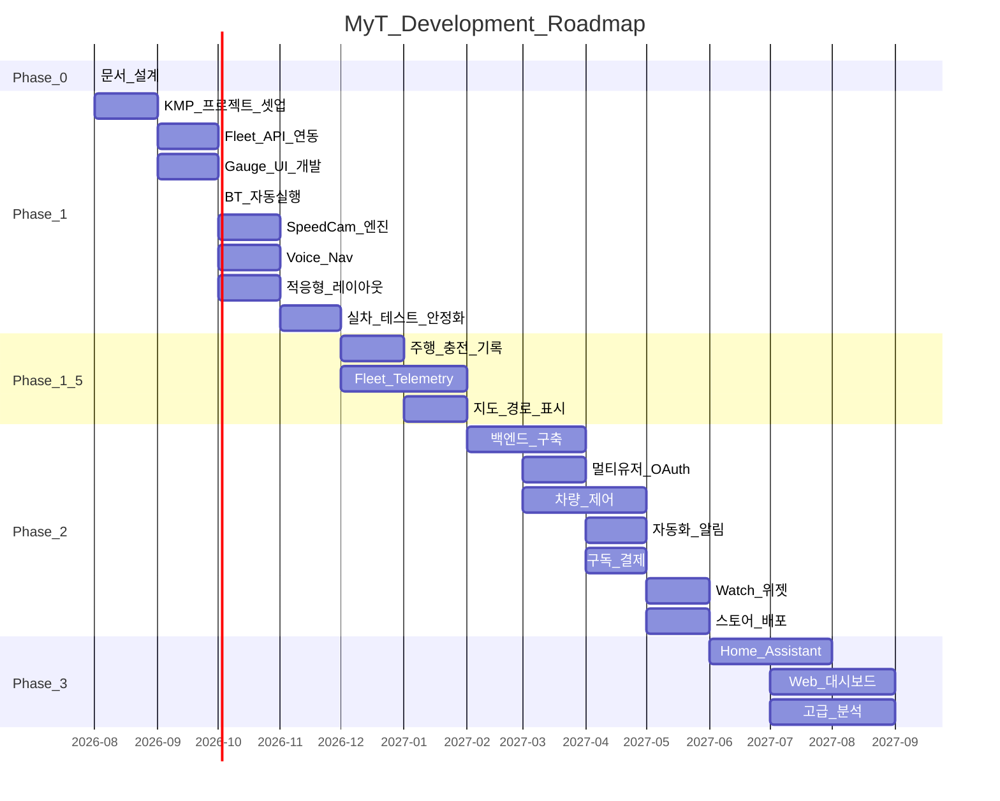
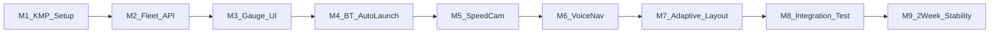
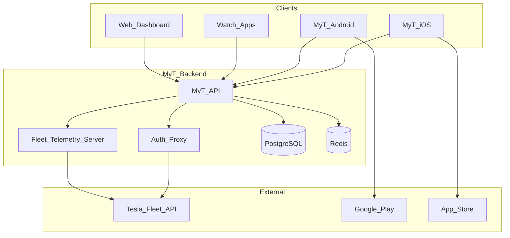
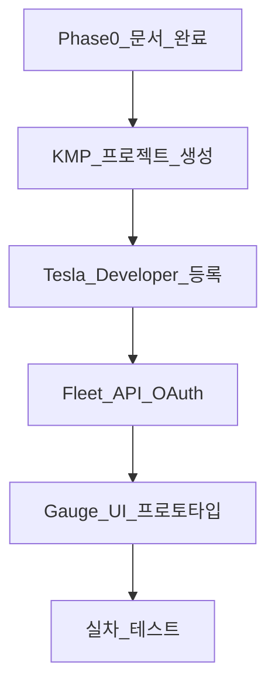

# Phase 로드맵

## 1. Phase 개요

## 2. Phase 0: 문서 · 설계 (완료)

| 항목 | 상태 | 산출물 |
|---|---|---|
| Tesla API/BLE 조사 | ✅ | tesla-api-bluetooth-findings.md |
| 과속카메라 데이터 조사 | ✅ | korea-speed-camera-data.md |
| 경쟁앱 분석 | ✅ | competitor-apps-analysis.md |
| 크로스플랫폼 기술 조사 | ✅ | cross-platform-tech-stack.md |
| 제품 개념 | ✅ | product-concept.md |
| 기능/비기능 요구사항 | ✅ | functional/non-functional-requirements.md |
| 기능 카탈로그 (85+) | ✅ | feature-catalog.md |
| 표시 정보 명세 | ✅ | display-specifications.md |
| 수락 기준 | ✅ | acceptance-criteria-phase1.md |
| 시스템 아키텍처 | ✅ | system-architecture.md |
| 상세 설계 + 콘티 | ✅ | detailed-design.md, app-conti.md |

## 3. Phase 1: 개인 차량 MVP

**목표:** 본인 Model 3에서 Gauge + SpeedCam + Voice Nav 2주 무중단

### 3.1 마일스톤

| Milestone | 내용 | 완료 기준 |
|---|---|---|
| M1 | KMP + Compose Multiplatform 프로젝트 셋업 | Android + iOS 빌드 성공 |
| M2 | Fleet API OAuth + vehicle_data 폴링 | 본인 VIN 데이터 수신 |
| M3 | Gauge UI (속도, SOC, 기어, 온도) | Scene 12 구현 |
| M4 | BT 자동 실행 (Android + iOS) | AC-C01~C03 통과 |
| M5 | SpeedCam 엔진 + POI DB | AC-S01~S06 통과 |
| M6 | Voice Nav (STT + navigation_request) | AC-N01~N05 통과 |
| M7 | 적응형 레이아웃 (폰/태블릿) | AC-L01~L07 통과 |
| M8 | 통합 테스트 | AC 42/43 통과 |
| M9 | 2주 실차 안정화 | AC-ST01~06 통과 |

### 3.2 Phase 1 기능 (20개)

A01~A20 (feature-catalog.md 참조)

### 3.3 Phase 1 제외

- 멀티 차량 / 멀티 사용자
- 차량 원격 제어
- 주행/충전 기록
- 자동화 / Push 알림
- Watch / 위젯
- 구독 / 결제
- 백엔드 서버

## 4. Phase 1.5: 확장

| 기능 | 설명 |
|---|---|
| 주행 자동 기록 | Trip start/end, map, efficiency |
| 충전 세션 기록 | Session log, cost |
| Fleet Telemetry | 폴링 → WebSocket stream |
| 지도 경로 표시 | RouteLine polyline decode + map |
| POI DB OTA | 월간 자동 갱신 |
| Crashlytics | Firebase crash reporting |

## 5. Phase 2: 유상 배포

### 5.1 인프라

### 5.2 Phase 2 기능 (+45)

- Control (D01~D15): 잠금, 클라이-mate, 트렁크 등
- Auto (E01~E15): 스케줄, 트리거, 알림
- Platform (F03~F18): Watch, 위젯, Siri, 구독
- Analytics (B04~B17): FSD, CO₂, 비교, 배지

### 5.3 상용 준비

| 항목 | 내용 |
|---|---|
| Tesla Partner 등록 | 법인, 도메인, 공개키 |
| App Store / Play 등록 | 심사, 스크린샷, 설명 |
| 개인정보처리방침 | 위치·운행·차량 데이터 |
| 구독 모델 | Play Billing + StoreKit 2 |
| Fleet Telemetry 서버 | AWS/GCP 호스팅 |
| CI/CD | GitHub Actions → Store |

## 6. Phase 3: 고도화

| 기능 | 설명 |
|---|---|
| Home Assistant | MQTT/Webhook 연동 |
| HomeKit / Alexa | 스마트홈 |
| Web Dashboard | 브라우저 제어 |
| 고급 분석 | Grafana-style dashboards |
| 데이터 가져오기 | Tessie, TezLab import |
| Carbon Offset | CO₂ 상쇄 |
| Live Camera | Tesla Live Camera view |

## 7. 리스크 · 대응

| 리스크 | Phase | 대응 |
|---|---|---|
| Fleet API 비용 증가 | 1.5 | Telemetry 전환 |
| iOS BT 자동 실행 불가 | 1 | Notification + Shortcuts |
| Tesla API 변경 | All | SDK 업데이트, changelog 모니터 |
| App Store 심사 거절 | 2 | 운전 중 UI 가이드라인 준수 |
| BLE 3연결 제한 | 1 | 연결 감지만, 직접 BLE 최소 |
| Compose MP iOS 버그 | 1 | JetBrains 이슈 트래킹, fallback |

## 8. 다음 단계 (Phase 1 시작)

1. KMP + Compose Multiplatform 프로젝트 생성
2. Tesla Developer 계정 + Fleet API 등록
3. Fleet API OAuth + vehicle_data 연동
4. Gauge UI 프로토타입 (Scene 12)
5. 실차 테스트 시작

