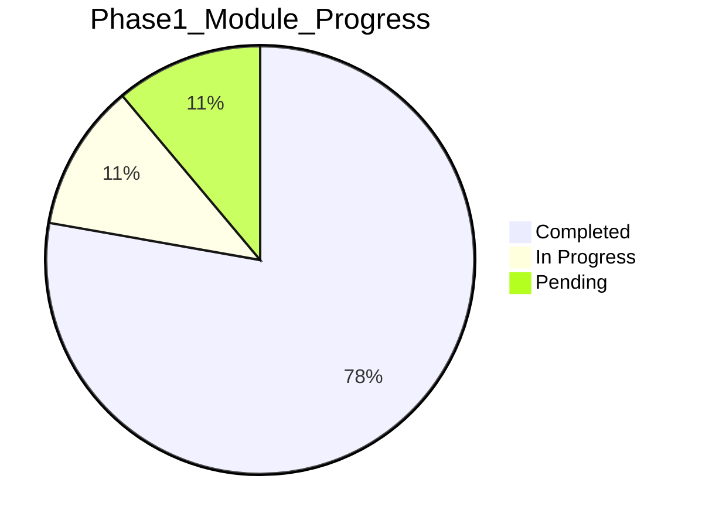

# MyT 구현 진행 추적 (Progress Tracker)

> **마지막 갱신:** 2026-08-20 11:45 KST  
> **현재 Phase:** 1 (S1 Scaffold — 진행 중)  
> **규칙:** Task 시작/완료 시 Started/Finished/Duration 즉시 갱신

## 요약 대시보드

| Phase | 모듈 | Tasks | Completed | In Progress | Pending |
|---|---|---|---|---|---|
| 0 | 문서 | 20 | 20 | 0 | 0 |
| 1 | M0~M17 | 90 | 52 | 2 | 36 |
| 1.5 | M18~M24 | 39 | 7 | 0 | 32 |
| 2 | M25~M38 | 84 | 14 | 0 | 70 |
| 3 | M39~M45 | 35 | 7 | 0 | 28 |
| **합계** | **46** | **~275** | **100** | **2** | **166** |

---

## Phase 0 — 문서·설계 ✅

| ID | Module | Task | Status | Started | Finished | Duration |
|---|---|---|---|---|---|---|
| P0-T01 | Docs | Research (5 docs) | completed | 2026-08-20 10:00 | 2026-08-20 11:00 | 1h |
| P0-T02 | Docs | Requirements (5 docs) | completed | 2026-08-20 11:00 | 2026-08-20 11:15 | 15m |
| P0-T03 | Docs | Architecture (3 docs) | completed | 2026-08-20 11:15 | 2026-08-20 11:25 | 10m |
| P0-T04 | Docs | Design + Storyboard (4 docs) | completed | 2026-08-20 11:25 | 2026-08-20 11:40 | 15m |
| P0-T05 | Docs | README index | completed | 2026-08-20 11:40 | 2026-08-20 11:45 | 5m |

---

## Phase 1 — M0~M17

### M0: Project Scaffold

| ID | Task | Status | Started | Finished | Duration | Notes |
|---|---|---|---|---|---|---|
| P1-M0-T01 | KMP root Gradle setup | completed | 2026-08-20 11:35 | 2026-08-20 11:38 | 3m | settings, build, libs.versions.toml |
| P1-M0-T02 | composeApp module | completed | 2026-08-20 11:38 | 2026-08-20 11:40 | 2m | android+ios targets |
| P1-M0-T03 | androidApp module | completed | 2026-08-20 11:40 | 2026-08-20 11:41 | 1m | |
| P1-M0-T04 | Gradle wrapper | completed | 2026-08-20 11:41 | 2026-08-20 11:42 | 1m | gradlew |
| P1-M0-T05 | .gitignore | completed | 2026-08-20 11:42 | 2026-08-20 11:42 | 0m | |
| P1-M0-T06 | Android debug build verify | blocked | 2026-08-20 11:43 | - | - | JDK 미설치 — install-guide 참조 |

### M1: Core Domain

| ID | Task | Status | Started | Finished | Duration |
|---|---|---|---|---|---|
| P1-M1-T01 | GaugeState, Gear, models | completed | 2026-08-20 11:38 | 2026-08-20 11:39 | 1m |
| P1-M1-T02 | Repository interfaces | completed | 2026-08-20 11:39 | 2026-08-20 11:39 | 0m |
| P1-M1-T03 | UseCase interfaces + impl | completed | 2026-08-20 11:39 | 2026-08-20 11:40 | 1m |
| P1-M1-T04 | UnitConverter | completed | 2026-08-20 11:40 | 2026-08-20 11:40 | 0m |
| P1-M1-T05 | VehicleConfig VIN whitelist | completed | 2026-08-20 11:40 | 2026-08-20 11:40 | 0m |
| P1-M1-T06 | SpeedCamEngine | completed | 2026-08-20 11:40 | 2026-08-20 11:41 | 1m |
| P1-M1-T07 | Unit tests | completed | 2026-08-20 11:41 | 2026-08-20 11:42 | 1m |

### M2: Platform Abstractions

| ID | Task | Status | Started | Finished | Duration |
|---|---|---|---|---|---|
| P1-M2-T01 | expect Platform.kt | completed | 2026-08-20 11:40 | 2026-08-20 11:41 | 1m |
| P1-M2-T02 | Android actual (6) | completed | 2026-08-20 11:41 | 2026-08-20 11:43 | 2m |
| P1-M2-T03 | iOS actual stubs | completed | 2026-08-20 11:43 | 2026-08-20 11:44 | 1m |
| P1-M2-T04 | Platform DI modules | completed | 2026-08-20 11:44 | 2026-08-20 11:44 | 0m |

### M3: Auth·Token

| ID | Task | Status | Started | Finished | Duration |
|---|---|---|---|---|---|
| P1-M3-T01 | TokenRepository impl | completed | 2026-08-20 11:42 | 2026-08-20 11:42 | 0m | stub |
| P1-M3-T02 | AuthUseCase | completed | 2026-08-20 11:42 | 2026-08-20 11:42 | 0m | stub |
| P1-M3-T03 | OAuth PKCE flow | pending | - | - | - | Tesla Dev 계정 필요 |
| P1-M3-T04 | AuthScreen UI | completed | 2026-08-20 11:43 | 2026-08-20 11:43 | 0m | OnboardingScreens |
| P1-M3-T05 | Token refresh | pending | - | - | - |

### M4: Fleet Telemetry

| ID | Task | Status | Started | Finished | Duration |
|---|---|---|---|---|---|
| P1-M4-T01 | KtorFleetRepository stub | completed | 2026-08-20 11:42 | 2026-08-20 11:43 | 1m |
| P1-M4-T02 | GaugeState mapping | completed | 2026-08-20 11:43 | 2026-08-20 11:43 | 0m | demo data |
| P1-M4-T03 | Polling scheduler | pending | - | - | - |
| P1-M4-T04 | navigation_request | pending | - | - | - |
| P1-M4-T05 | Sleep/error handling | pending | - | - | - |
| P1-M4-T06 | tesla-fleet-sdk integration | pending | - | - | - |

### M5: POI SpeedCam DB

| ID | Task | Status | Started | Finished | Duration |
|---|---|---|---|---|---|
| P1-M5-T01 | SQLDelight schema | completed | 2026-08-20 11:42 | 2026-08-20 11:42 | 0m |
| P1-M5-T02 | MockPoiRepository | completed | 2026-08-20 11:42 | 2026-08-20 11:43 | 1m |
| P1-M5-T03 | POI JSON bundle | pending | - | - | - | data.go.kr import |
| P1-M5-T04 | R-Tree spatial index | pending | - | - | - |
| P1-M5-T05 | Import script | pending | - | - | - |

### M6: Settings Storage

| ID | Task | Status | Started | Finished | Duration |
|---|---|---|---|---|---|
| P1-M6-T01 | SettingsRepository impl | completed | 2026-08-20 11:42 | 2026-08-20 11:42 | 0m |
| P1-M6-T02 | SettingsScreen UI | completed | 2026-08-20 11:43 | 2026-08-20 11:43 | 0m |
| P1-M6-T03 | Theme persistence | pending | - | - | - |

### M7: Presence BT

| ID | Task | Status | Started | Finished | Duration |
|---|---|---|---|---|---|
| P1-M7-T01 | BluetoothRepository impl | completed | 2026-08-20 11:43 | 2026-08-20 11:43 | 0m |
| P1-M7-T02 | PresenceUseCase | completed | 2026-08-20 11:43 | 2026-08-20 11:43 | 0m |
| P1-M7-T03 | Android PresenceService | completed | 2026-08-20 11:43 | 2026-08-20 11:44 | 1m | stub |
| P1-M7-T04 | BtBroadcastReceiver | completed | 2026-08-20 11:44 | 2026-08-20 11:44 | 0m | stub |
| P1-M7-T05 | Auto-launch Gauge | pending | - | - | - |
| P1-M7-T06 | iOS notification flow | pending | - | - | - |

### M8: Gauge UI

| ID | Task | Status | Started | Finished | Duration |
|---|---|---|---|---|---|
| P1-M8-T01 | GaugeTheme | completed | 2026-08-20 11:42 | 2026-08-20 11:42 | 0m |
| P1-M8-T02 | SpeedDisplay, GearPill | completed | 2026-08-20 11:42 | 2026-08-20 11:43 | 1m |
| P1-M8-T03 | SocRing, InfoRow, NavRow | completed | 2026-08-20 11:43 | 2026-08-20 11:43 | 0m |
| P1-M8-T04 | GaugeScreen | completed | 2026-08-20 11:43 | 2026-08-20 11:43 | 0m |
| P1-M8-T05 | ChargePanel | pending | - | - | - |
| P1-M8-T06 | TireGrid, GMeter | pending | - | - | - |

### M9: Adaptive Layout

| ID | Task | Status | Started | Finished | Duration |
|---|---|---|---|---|---|
| P1-M9-T01 | LayoutConfig model | completed | 2026-08-20 11:42 | 2026-08-20 11:42 | 0m |
| P1-M9-T02 | AdaptiveLayoutUseCase | completed | 2026-08-20 11:42 | 2026-08-20 11:42 | 0m |
| P1-M9-T03 | Single/Two Pane layouts | completed | 2026-08-20 11:43 | 2026-08-20 11:43 | 0m |
| P1-M9-T04 | Three Pane layout | pending | - | - | - |
| P1-M9-T05 | Material3 Adaptive integration | pending | - | - | - |

### M10: SpeedCam Engine UI

| ID | Task | Status | Started | Finished | Duration |
|---|---|---|---|---|---|
| P1-M10-T01 | SpeedCamUseCase | completed | 2026-08-20 11:43 | 2026-08-20 11:43 | 0m |
| P1-M10-T02 | SpeedCamOverlay L1~L3 | completed | 2026-08-20 11:43 | 2026-08-20 11:43 | 0m |
| P1-M10-T03 | Section tracking | completed | 2026-08-20 11:43 | 2026-08-20 11:43 | 0m | SpeedCamEngine |
| P1-M10-T04 | Audio/Haptic wiring | pending | - | - | - |

### M11: Voice Nav

| ID | Task | Status | Started | Finished | Duration |
|---|---|---|---|---|---|
| P1-M11-T01 | VoiceNavUseCase | completed | 2026-08-20 11:43 | 2026-08-20 11:43 | 0m |
| P1-M11-T02 | VoiceNavDialog UI | completed | 2026-08-20 11:43 | 2026-08-20 11:44 | 1m |
| P1-M11-T03 | STT platform wiring | pending | - | - | - |
| P1-M11-T04 | navigation_request send | pending | - | - | - |

### M12: Onboarding Home

| ID | Task | Status | Started | Finished | Duration |
|---|---|---|---|---|---|
| P1-M12-T01 | OnboardingScreen | completed | 2026-08-20 11:43 | 2026-08-20 11:43 | 0m |
| P1-M12-T02 | HomeScreen | completed | 2026-08-20 11:43 | 2026-08-20 11:43 | 0m |
| P1-M12-T03 | VIN setup flow | pending | - | - | - |
| P1-M12-T04 | Error states (50~52) | pending | - | - | - |

### M13: Navigation Shell

| ID | Task | Status | Started | Finished | Duration |
|---|---|---|---|---|---|
| P1-M13-T01 | Route sealed interface | completed | 2026-08-20 11:43 | 2026-08-20 11:43 | 0m |
| P1-M13-T02 | App.kt NavHost | completed | 2026-08-20 11:43 | 2026-08-20 11:44 | 1m |
| P1-M13-T03 | GaugeViewModel | completed | 2026-08-20 11:44 | 2026-08-20 11:44 | 0m |
| P1-M13-T04 | AppStateMachine | pending | - | - | - |

### M14: Android Entry

| ID | Task | Status | Started | Finished | Duration |
|---|---|---|---|---|---|
| P1-M14-T01 | MainActivity | completed | 2026-08-20 11:44 | 2026-08-20 11:44 | 0m |
| P1-M14-T02 | MyTApplication + Koin | completed | 2026-08-20 11:44 | 2026-08-20 11:44 | 0m |
| P1-M14-T03 | AndroidManifest permissions | completed | 2026-08-20 11:44 | 2026-08-20 11:44 | 0m |
| P1-M14-T04 | ProGuard rules | pending | - | - | - |

### M15: iOS Entry

| ID | Task | Status | Started | Finished | Duration |
|---|---|---|---|---|---|
| P1-M15-T01 | MainViewController | completed | 2026-08-20 11:44 | 2026-08-20 11:44 | 0m |
| P1-M15-T02 | iosApp Xcode project | in_progress | 2026-08-20 11:45 | - | - |
| P1-M15-T03 | Info.plist capabilities | pending | - | - | - |
| P1-M15-T04 | BT monitor + notification | pending | - | - | - |

### M16: Integration Test

| ID | Task | Status | Started | Finished | Duration |
|---|---|---|---|---|---|
| P1-M16-T01 | Unit tests | completed | 2026-08-20 11:42 | 2026-08-20 11:42 | 0m |
| P1-M16-T02 | AC checklist doc | completed | 2026-08-20 11:45 | 2026-08-20 11:45 | 0m | acceptance-criteria |
| P1-M16-T03 | Fleet repo mock test | pending | - | - | - |
| P1-M16-T04 | UI compose test | pending | - | - | - |
| P1-M16-T05 | Vehicle E2E 2wk | pending | - | - | - |

### M17: Deploy Package

| ID | Task | Status | Started | Finished | Duration |
|---|---|---|---|---|---|
| P1-M17-T01 | build-all.sh | completed | 2026-08-20 11:44 | 2026-08-20 11:44 | 0m |
| P1-M17-T02 | install-guide.md | completed | 2026-08-20 11:44 | 2026-08-20 11:44 | 0m |
| P1-M17-T03 | CHANGELOG v0.1.0 | completed | 2026-08-20 11:45 | 2026-08-20 11:45 | 0m |
| P1-M17-T04 | Release signing config | pending | - | - | - |
| P1-M17-T05 | APK/IPA build | pending | - | - | - | JDK/Xcode 필요 |

---

## Phase 1.5 — M18~M24 (스캐폴드)

| ID | Module | Task | Status | Notes |
|---|---|---|---|---|
| P15-M18-T01 | Trip Recorder | Interface + stub | completed | phase15/TripRecorder.kt |
| P15-M19-T01 | Charge Session | Interface + stub | completed | phase15/ChargeSessionRecorder.kt |
| P15-M20-T01 | Fleet Telemetry Client | Interface + stub | completed | phase15/TelemetryStreamClient.kt |
| P15-M21-T01 | Map Route UI | Placeholder | completed | phase15/MapRoutePlaceholder.kt |
| P15-M22-T01 | History UI routes | Route stub | completed | Route.TripHistory |
| P15-M23-T01 | POI OTA | Spec doc | completed | phase-specs/phase-1.5.md |
| P15-M24-T01 | Crashlytics | Spec doc | completed | phase-specs/phase-1.5.md |
| P15-* | (remaining) | Full impl | pending | Phase 1 G6 후 |

---

## Phase 2 — M25~M38 (스캐폴드)

| ID | Module | Task | Status | Notes |
|---|---|---|---|---|
| P2-M25-T01 | Backend Scaffold | Ktor server skeleton | completed | backend/ |
| P2-M26-T01 | Auth Proxy | Route stub | completed | backend/.../AuthRoutes.kt |
| P2-M27-T01 | Telemetry Server | README stub | completed | backend/README.md |
| P2-M28-T01 | MyT API | Route stub | completed | backend/.../ApiRoutes.kt |
| P2-M29~M38 | Control/Auto/Platform | Spec doc | completed | phase-specs/phase-2.md |
| P2-* | (remaining) | Full impl | pending | Phase 1.5 G10 후 |

---

## Phase 3 — M39~M45 (스캐폴드)

| ID | Module | Task | Status | Notes |
|---|---|---|---|---|
| P3-M39-T01 | Home Assistant | Integration spec | completed | phase-specs/phase-3.md |
| P3-M40-T01 | HomeKit/Alexa | Spec | completed | phase-specs/phase-3.md |
| P3-M41-T01 | Web Dashboard | Spec | completed | phase-specs/phase-3.md |
| P3-M42-T01 | Advanced Analytics | Spec | completed | phase-specs/phase-3.md |
| P3-M43-T01 | Import/Export | Spec | completed | phase-specs/phase-3.md |
| P3-M44-T01 | Live Camera | Spec | completed | phase-specs/phase-3.md |
| P3-M45-T01 | Carbon Badge | Spec | completed | phase-specs/phase-3.md |
| P3-* | (remaining) | Full impl | pending | Phase 2 G16 후 |

---

## Module Summary (Phase 1)

| Module | Tasks Done | Total | Status |
|---|---|---|---|
| M0 | 5/6 | 6 | blocked (JDK) |
| M1 | 7/7 | 7 | ✅ |
| M2 | 4/4 | 4 | ✅ |
| M3 | 2/5 | 5 | stub |
| M4 | 2/6 | 6 | stub |
| M5 | 2/5 | 5 | stub |
| M6 | 2/3 | 3 | stub |
| M7 | 4/6 | 6 | stub |
| M8 | 4/6 | 6 | partial |
| M9 | 3/5 | 5 | partial |
| M10 | 3/4 | 4 | partial |
| M11 | 2/4 | 4 | stub |
| M12 | 2/4 | 4 | stub |
| M13 | 3/4 | 4 | partial |
| M14 | 3/4 | 4 | partial |
| M15 | 1/4 | 4 | in_progress |
| M16 | 2/5 | 5 | partial |
| M17 | 3/5 | 5 | partial |
