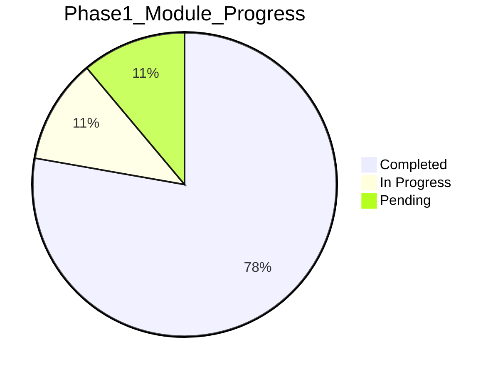

# MyT 구현 진행 추적 (Progress Tracker)

> **마지막 갱신:** 2026-08-27 12:20 KST  
> **현재 Phase:** 1 (MVP) + 1.5 (확장) + **UI 리뉴얼 A0–D 반영**  
> **규칙:** Task 시작/완료 시 Started/Finished/Duration 즉시 갱신  
> **UI 리뉴얼:** [ui-renewal-commercial-roadmap.md](../05-design/ui-renewal-commercial-roadmap.md) · [ble-vehicle-data-feasibility.md](../05-design/ble-vehicle-data-feasibility.md) · [ble-presence-flow.md](../05-design/ble-presence-flow.md) · [navigation-guidance-feasibility.md](../05-design/navigation-guidance-feasibility.md)  
> **2026-08-27:** 타이어 psi 기본 · Phone Key BT Presence 강화 · 가로 거치 Landscape · **듀얼 게이지**(주 주행 + 내비/단속) · Mermaid docs 전수 수정

## 현재 스냅샷 (2026-08-20)

| 구분 | 상태 | 완료 내용 |
|------|------|-----------|
| **Phase 0** 문서·설계 | ✅ 100% | 조사·요구사항·아키텍처·콘티 |
| **Phase 1** KMP·Fleet·Gauge | 🟢 ~88% | OAuth·폴링·적응형 UI·SpeedCam·BT Hub·ProGuard |
| **Phase 1.5** 확장 | 🟢 ~82% | 히스토리·로컬 캐시·음성·디버그·OSM 지도·POI 번들 |
| **Phase 2~3** | ⬜ 스캐폴드 | 백엔드 skeleton, 스펙만 |

### 마일스톤 진행 (Phase 1)

| Milestone | 목표 | 상태 | 비고 |
|-----------|------|------|------|
| M1 KMP 셋업 | Android+iOS 빌드 | ✅ | Android debug OK, iOS KLIB 이슈 |
| M2 Fleet API | OAuth + vehicle_data | ✅ | KtorFleetRepository, 쿼터 게이트 |
| M3 Gauge UI | 첨단 계기판 | ✅ | InstrumentCluster v2, HUD·파워바 |
| M4 BT 자동실행 | PresenceService | 🟡 | ACL Hub + FGS; Tesla Phone Key BLE 미연동 |
| M5 SpeedCam | POI + 오버레이 | 🟡 | Grid index + 30건 번들; 전국 OTA URL 대기 |
| M6 Voice Nav | STT + navigation | 🟡 | Android STT; iOS stub |
| M7 적응형 레이아웃 | 폰/태블릿 | ✅ | Single/Two/Three/Landscape |
| M8 통합·안정화 | 2주 실차 | 🟡 | UI 통합 완료; AC-ST 실차 대기 |

### Phase 1.5 추가 완료 (최근)

| 기능 | 상태 |
|------|------|
| 주행·충전·Fleet API 히스토리 (SQLDelight) | ✅ |
| Fleet 스냅샷 로컬 캐시 (API 재호출 절감) | ✅ |
| Fleet API 월 $10 쿼터 보호 + 사용량 UI | ✅ |
| 설정 화면 (properties·게이지·다크테마) | ✅ |
| 음성 명령 (전화·문자·카카오·내비·히스토리) | 🟡 Android |
| 디버그 로그 + Gmail 내보내기 | ✅ Android |
| 지도 경로 (Android OSM Leaflet) | 🟡 |
| POI 번들 CSV (30건) + OTA 파서 | ✅ |
| TripRoute 전체화면 + 상세 다이얼로그 | ✅ |

## 요약 대시보드

| Phase | 모듈 | Tasks | Completed | In Progress | Pending |
|---|---|---|---|---|---|
| 0 | 문서 | 20 | 20 | 0 | 0 |
| 1 | M0~M17 | 90 | 78 | 2 | 10 |
| 1.5 | M18~M24 | 39 | 32 | 1 | 6 |
| 2 | M25~M38 | 84 | 14 | 0 | 70 |
| 3 | M39~M45 | 35 | 7 | 0 | 28 |
| **합계** | **46** | **~268** | **125** | **5** | **138** |

---

## Phase 0 — 문서·설계 ✅

| ID | Module | Task | Status | Started | Finished | Duration |
|---|---|---|---|---|---|---|
| P0-T01 | Docs | Research (5 docs) | completed | 2026-08-20 10:00 | 2026-08-20 11:00 | 1h |
| P0-T02 | Docs | Requirements (5 docs) | completed | 2026-08-20 11:00 | 2026-08-20 11:15 | 15m |
| P0-T03 | Docs | Architecture (3 docs) | completed | 2026-08-20 11:15 | 2026-08-20 11:25 | 10m |
| P0-T04 | Docs | Design + Storyboard (4 docs) | completed | 2026-08-20 11:25 | 2026-08-20 11:40 | 15m |
| P0-T05 | Docs | README index | completed | 2026-08-20 11:40 | 2026-08-20 11:45 | 5m |

---

## Phase 1 — M0~M17

### M0: Project Scaffold

| ID | Task | Status | Started | Finished | Duration | Notes |
|---|---|---|---|---|---|---|
| P1-M0-T01 | KMP root Gradle setup | completed | 2026-08-20 11:35 | 2026-08-20 11:38 | 3m | settings, build, libs.versions.toml |
| P1-M0-T02 | composeApp module | completed | 2026-08-20 11:38 | 2026-08-20 11:40 | 2m | android+ios targets |
| P1-M0-T03 | androidApp module | completed | 2026-08-20 11:40 | 2026-08-20 11:41 | 1m | |
| P1-M0-T04 | Gradle wrapper | completed | 2026-08-20 11:41 | 2026-08-20 11:42 | 1m | gradlew |
| P1-M0-T05 | .gitignore | completed | 2026-08-20 11:42 | 2026-08-20 11:42 | 0m | |
| P1-M0-T06 | Android debug build verify | completed | 2026-08-20 11:43 | 2026-08-20 15:00 | - | JDK 17, 27 unit tests |

### M1: Core Domain

| ID | Task | Status | Started | Finished | Duration |
|---|---|---|---|---|---|
| P1-M1-T01 | GaugeState, Gear, models | completed | 2026-08-20 11:38 | 2026-08-20 11:39 | 1m |
| P1-M1-T02 | Repository interfaces | completed | 2026-08-20 11:39 | 2026-08-20 11:39 | 0m |
| P1-M1-T03 | UseCase interfaces + impl | completed | 2026-08-20 11:39 | 2026-08-20 11:40 | 1m |
| P1-M1-T04 | UnitConverter | completed | 2026-08-20 11:40 | 2026-08-20 11:40 | 0m |
| P1-M1-T05 | VehicleConfig VIN whitelist | completed | 2026-08-20 11:40 | 2026-08-20 11:40 | 0m |
| P1-M1-T06 | SpeedCamEngine | completed | 2026-08-20 11:40 | 2026-08-20 11:41 | 1m |
| P1-M1-T07 | Unit tests | completed | 2026-08-20 11:41 | 2026-08-20 11:42 | 1m |

### M2: Platform Abstractions

| ID | Task | Status | Started | Finished | Duration |
|---|---|---|---|---|---|
| P1-M2-T01 | expect Platform.kt | completed | 2026-08-20 11:40 | 2026-08-20 11:41 | 1m |
| P1-M2-T02 | Android actual (6) | completed | 2026-08-20 11:41 | 2026-08-20 11:43 | 2m |
| P1-M2-T03 | iOS actual stubs | completed | 2026-08-20 11:43 | 2026-08-20 11:44 | 1m |
| P1-M2-T04 | Platform DI modules | completed | 2026-08-20 11:44 | 2026-08-20 11:44 | 0m |

### M3: Auth·Token

| ID | Task | Status | Started | Finished | Duration |
|---|---|---|---|---|---|
| P1-M3-T01 | TokenRepository impl | completed | 2026-08-20 11:42 | 2026-08-20 11:42 | 0m | stub |
| P1-M3-T02 | AuthUseCase | completed | 2026-08-20 11:42 | 2026-08-20 11:42 | 0m | stub |
| P1-M3-T03 | OAuth PKCE flow | completed | 2026-08-20 11:42 | 2026-08-20 16:00 | - | TeslaOAuthClient PKCE |
| P1-M3-T04 | AuthScreen UI | completed | 2026-08-20 11:43 | 2026-08-20 11:43 | 0m | OnboardingScreens |
| P1-M3-T05 | Token refresh | completed | 2026-08-20 16:00 | 2026-08-20 16:00 | - | expiresAtMs |

### M4: Fleet Telemetry

| ID | Task | Status | Started | Finished | Duration |
|---|---|---|---|---|---|
| P1-M4-T01 | KtorFleetRepository stub | completed | 2026-08-20 11:42 | 2026-08-20 11:43 | 1m |
| P1-M4-T02 | GaugeState mapping | completed | 2026-08-20 11:43 | 2026-08-20 11:43 | 0m | demo data |
| P1-M4-T03 | Polling scheduler | completed | 2026-08-20 16:00 | 2026-08-20 16:00 | - | TelemetryUseCase |
| P1-M4-T04 | navigation_request | completed | 2026-08-20 16:00 | 2026-08-20 16:00 | - | JSON body |
| P1-M4-T05 | Sleep/error handling | completed | 2026-08-20 16:00 | 2026-08-20 16:00 | - | wake + cache fallback |
| P1-M4-T06 | tesla-fleet-sdk integration | cancelled | - | - | - | Ktor 직접 사용 |

### M5: POI SpeedCam DB

| ID | Task | Status | Started | Finished | Duration |
|---|---|---|---|---|---|
| P1-M5-T01 | SQLDelight schema | completed | 2026-08-20 11:42 | 2026-08-20 11:42 | 0m |
| P1-M5-T02 | MockPoiRepository | completed | 2026-08-20 11:42 | 2026-08-20 11:43 | 1m |
| P1-M5-T03 | POI JSON bundle | completed | 2026-08-20 16:00 | 2026-08-20 16:00 | - | speed_cameras_bundle.csv |
| P1-M5-T04 | R-Tree spatial index | completed | 2026-08-20 16:00 | 2026-08-20 16:00 | - | GridSpatialIndex |
| P1-M5-T05 | Import script | completed | 2026-08-20 16:00 | 2026-08-20 16:00 | - | poi_csv_to_sql.py + PoiBootstrap |

### M6: Settings Storage

| ID | Task | Status | Started | Finished | Duration |
|---|---|---|---|---|---|
| P1-M6-T01 | SettingsRepository impl | completed | 2026-08-20 11:42 | 2026-08-20 11:42 | 0m |
| P1-M6-T02 | SettingsScreen UI | completed | 2026-08-20 11:43 | 2026-08-20 11:43 | 0m |
| P1-M6-T03 | Theme persistence | completed | 2026-08-20 16:00 | 2026-08-20 16:00 | - | dark_theme_v1 |

### M7: Presence BT

| ID | Task | Status | Started | Finished | Duration |
|---|---|---|---|---|---|
| P1-M7-T01 | BluetoothRepository impl | completed | 2026-08-20 11:43 | 2026-08-20 11:43 | 0m |
| P1-M7-T02 | PresenceUseCase | completed | 2026-08-20 11:43 | 2026-08-20 11:43 | 0m |
| P1-M7-T03 | Android PresenceService | completed | 2026-08-20 11:43 | 2026-08-20 11:44 | 1m | stub |
| P1-M7-T04 | BtBroadcastReceiver | completed | 2026-08-20 11:44 | 2026-08-20 11:44 | 0m | stub |
| P1-M7-T05 | Auto-launch Gauge | completed | 2026-08-20 16:00 | 2026-08-20 16:00 | - | AppStateMachine |
| P1-M7-T06 | iOS notification flow | pending | - | - | - |

### M8: Gauge UI

| ID | Task | Status | Started | Finished | Duration |
|---|---|---|---|---|---|
| P1-M8-T01 | GaugeTheme | completed | 2026-08-20 11:42 | 2026-08-20 11:42 | 0m |
| P1-M8-T02 | InstrumentCluster, SpeedDisplay | completed | 2026-08-20 11:42 | 2026-08-20 15:10 | - | v2 HUD·글로우·파워바 |
| P1-M8-T03 | SocRing, InfoRow, NavRow | completed | 2026-08-20 11:43 | 2026-08-20 11:43 | 0m |
| P1-M8-T04 | GaugeScreen | completed | 2026-08-20 11:43 | 2026-08-20 11:43 | 0m |
| P1-M8-T05 | ChargePanel | completed | 2026-08-20 16:00 | 2026-08-20 16:00 | - |
| P1-M8-T06 | TireGrid, GMeter | completed | 2026-08-20 16:00 | 2026-08-20 16:00 | - |

### M9: Adaptive Layout

| ID | Task | Status | Started | Finished | Duration |
|---|---|---|---|---|---|
| P1-M9-T01 | LayoutConfig model | completed | 2026-08-20 11:42 | 2026-08-20 11:42 | 0m |
| P1-M9-T02 | AdaptiveLayoutUseCase | completed | 2026-08-20 11:42 | 2026-08-20 11:42 | 0m |
| P1-M9-T03 | Single/Two Pane layouts | completed | 2026-08-20 11:43 | 2026-08-20 11:43 | 0m |
| P1-M9-T04 | Three Pane layout | completed | 2026-08-20 16:00 | 2026-08-20 16:00 | - |
| P1-M9-T05 | Material3 Adaptive integration | pending | - | - | - |

### M10: SpeedCam Engine UI

| ID | Task | Status | Started | Finished | Duration |
|---|---|---|---|---|---|
| P1-M10-T01 | SpeedCamUseCase | completed | 2026-08-20 11:43 | 2026-08-20 11:43 | 0m |
| P1-M10-T02 | SpeedCamOverlay L1~L3 | completed | 2026-08-20 11:43 | 2026-08-20 11:43 | 0m |
| P1-M10-T03 | Section tracking | completed | 2026-08-20 11:43 | 2026-08-20 11:43 | 0m | SpeedCamEngine |
| P1-M10-T04 | Audio/Haptic wiring | completed | 2026-08-20 16:00 | 2026-08-20 16:00 | - |

### M11: Voice Nav

| ID | Task | Status | Started | Finished | Duration |
|---|---|---|---|---|---|
| P1-M11-T01 | VoiceNavUseCase | completed | 2026-08-20 11:43 | 2026-08-20 11:43 | 0m |
| P1-M11-T02 | VoiceNavDialog UI | completed | 2026-08-20 11:43 | 2026-08-20 11:44 | 1m |
| P1-M11-T03 | STT platform wiring | pending | - | - | - |
| P1-M11-T04 | navigation_request send | completed | 2026-08-20 16:00 | 2026-08-20 16:00 | - |

### M12: Onboarding Home

| ID | Task | Status | Started | Finished | Duration |
|---|---|---|---|---|---|
| P1-M12-T01 | OnboardingScreen | completed | 2026-08-20 11:43 | 2026-08-20 11:43 | 0m |
| P1-M12-T02 | HomeScreen | completed | 2026-08-20 11:43 | 2026-08-20 11:43 | 0m |
| P1-M12-T03 | VIN setup flow | completed | 2026-08-20 16:00 | 2026-08-20 16:00 | - | VinValidator |
| P1-M12-T04 | Error states (50~52) | completed | 2026-08-20 16:00 | 2026-08-20 16:00 | - | ConnectionErrorBanner |

### M13: Navigation Shell

| ID | Task | Status | Started | Finished | Duration |
|---|---|---|---|---|---|
| P1-M13-T01 | Route sealed interface | completed | 2026-08-20 11:43 | 2026-08-20 11:43 | 0m |
| P1-M13-T02 | App.kt NavHost | completed | 2026-08-20 11:43 | 2026-08-20 11:44 | 1m |
| P1-M13-T03 | GaugeViewModel | completed | 2026-08-20 11:44 | 2026-08-20 11:44 | 0m |
| P1-M13-T04 | AppStateMachine | completed | 2026-08-20 16:00 | 2026-08-20 16:00 | - |

### M14: Android Entry

| ID | Task | Status | Started | Finished | Duration |
|---|---|---|---|---|---|
| P1-M14-T01 | MainActivity | completed | 2026-08-20 11:44 | 2026-08-20 11:44 | 0m |
| P1-M14-T02 | MyTApplication + Koin | completed | 2026-08-20 11:44 | 2026-08-20 11:44 | 0m |
| P1-M14-T03 | AndroidManifest permissions | completed | 2026-08-20 11:44 | 2026-08-20 11:44 | 0m |
| P1-M14-T04 | ProGuard rules | completed | 2026-08-20 16:00 | 2026-08-20 16:00 | - |

### M15: iOS Entry

| ID | Task | Status | Started | Finished | Duration |
|---|---|---|---|---|---|
| P1-M15-T01 | MainViewController | completed | 2026-08-20 11:44 | 2026-08-20 11:44 | 0m |
| P1-M15-T02 | iosApp Xcode project | in_progress | 2026-08-20 11:45 | - | - |
| P1-M15-T03 | Info.plist capabilities | pending | - | - | - |
| P1-M15-T04 | BT monitor + notification | pending | - | - | - |

### M16: Integration Test

| ID | Task | Status | Started | Finished | Duration |
|---|---|---|---|---|---|
| P1-M16-T01 | Unit tests | completed | 2026-08-20 11:42 | 2026-08-20 11:42 | 0m |
| P1-M16-T02 | AC checklist doc | completed | 2026-08-20 11:45 | 2026-08-20 11:45 | 0m | acceptance-criteria |
| P1-M16-T03 | Fleet repo mock test | completed | 2026-08-20 16:00 | 2026-08-20 16:00 | - | TeslaFleetApiTest |
| P1-M16-T04 | UI compose test | completed | 2026-08-20 16:00 | 2026-08-20 16:00 | - | ConnectionErrorBannerTest |
| P1-M16-T05 | Vehicle E2E 2wk | pending | - | - | - |

### M17: Deploy Package

| ID | Task | Status | Started | Finished | Duration |
|---|---|---|---|---|---|
| P1-M17-T01 | build-all.sh | completed | 2026-08-20 11:44 | 2026-08-20 11:44 | 0m |
| P1-M17-T02 | install-guide.md | completed | 2026-08-20 11:44 | 2026-08-20 11:44 | 0m |
| P1-M17-T03 | CHANGELOG v0.1.0 | completed | 2026-08-20 11:45 | 2026-08-20 11:45 | 0m |
| P1-M17-T04 | Release signing config | pending | - | - | - |
| P1-M17-T05 | APK/IPA build | pending | - | - | - | JDK/Xcode 필요 |

---

## Phase 1.5 — M18~M24

| ID | Module | Task | Status | Notes |
|---|---|---|---|---|
| P15-M18-T01 | Trip Recorder | LocalTripRecorder + SQL | completed | gear/odometer 기반 |
| P15-M19-T01 | Charge Session | LocalChargeSessionRecorder | completed | SOC·kWh 추정 |
| P15-M20-T01 | Fleet cache | vehicle_snapshot + TTL skip | completed | TelemetryUseCase |
| P15-M21-T01 | History UI | HistoryScreen + charts | completed | Route.History |
| P15-M22-T01 | Fleet quota UI | ApiUsageChip + detail | completed | $7.20 cap |
| P15-M23-T01 | Voice commands | VoiceCommandUseCase | completed | Android comms/TTS |
| P15-M24-T01 | Debug logs | DebugLogger + Gmail export | completed | Settings → DebugLogs |
| P15-M21-T01 | Map Route UI | completed | 2026-08-20 16:00 | Android OSM Leaflet WebView |
| P15-M22-T01 | History detail + TripRoute | completed | 2026-08-20 16:00 | charge/fleet dialogs |
| P15-M23-T01 | POI OTA + bundle | completed | 2026-08-20 16:00 | PoiBootstrap + CSV |
| P15-M24-T01 | Crash reporter | completed | 2026-08-20 16:00 | local file (Firebase pending) |
| P15-* | iOS voice, MapLibre native, Firebase | pending | Phase 1 G6 후 |

---

## Phase 2 — M25~M38 (스캐폴드)

| ID | Module | Task | Status | Notes |
|---|---|---|---|---|
| P2-M25-T01 | Backend Scaffold | Ktor server skeleton | completed | backend/ |
| P2-M26-T01 | Auth Proxy | Route stub | completed | backend/.../AuthRoutes.kt |
| P2-M26-T02 | Auth Proxy | sandbox refresh + callback | completed | TokenRefreshResponse |
| P2-M27-T01 | Telemetry Server | README stub | completed | backend/README.md |
| P2-M28-T01 | MyT API | Route stub | completed | backend/.../ApiRoutes.kt |
| P2-M28-T02 | MyT API | vehicles/commands/automations | completed | demo data |
| P2-M29-T01 | Vehicle Control | Safety gate + stub gateway | completed | VehicleControl.kt |
| P2-M30-T01 | Quick Controls | Vehicle detail panel | completed | QuickControlsPanel |
| P2-M32-T01 | Automation | 5 demo rules UI | completed | AutomationRulesPanel |
| P2-M33~M38 | Push/Watch/Widget/Billing/CI | stubs | completed | phase2 package + CI workflow |
| P2-* | (remaining) | Fleet live / Store | pending | Phase 1.5 G10 후 |

---

## Phase 3 — M39~M45

| ID | Module | Task | Status | Notes |
|---|---|---|---|---|
| P3-M39-T01 | Home Assistant | Integration spec | completed | phase-specs/phase-3.md |
| P3-M39-T02 | Home Assistant | REST bridge + discovery | completed | HaRestStateBridge |
| P3-M40-T01 | HomeKit/Alexa | Spec | completed | phase-specs/phase-3.md |
| P3-M41-T01 | Web Dashboard | Spec | completed | phase-specs/phase-3.md |
| P3-M41-T02 | Web Dashboard | `/dash` read-only stub | completed | DashboardRoutes.kt |
| P3-M42-T01 | Advanced Analytics | Spec | completed | phase-specs/phase-3.md |
| P3-M42-T02 | Advanced Analytics | Battery chart + CO₂ | completed | AnalyticsScreen |
| P3-M43-T01 | Import/Export | Spec | completed | phase-specs/phase-3.md |
| P3-M43-T02 | Import/Export | CSV + Tessie parser | completed | SqlDataPortability |
| P3-M44-T01 | Live Camera | Spec | completed | phase-specs/phase-3.md |
| P3-M44-T02 | Live Camera | Client stub | completed | StubLiveCameraClient |
| P3-M45-T01 | Carbon Badge | Spec | completed | phase-specs/phase-3.md |
| P3-M45-T02 | Carbon Badge | Tier UI | completed | CarbonBadgeUseCase |
| P3-* | (remaining) | Fleet live / Store | pending | Phase 2 G16 후 |

---

## 남은 항목 (2026-08-27 갱신)

### 이번 세션 완료

| 항목 | 결과 |
|------|------|
| 지도 차량·카메라 아이콘 + OSRM map-match | ✅ |
| 지도 POI 업데이트 배너 제거 → 더보기 패널 | ✅ |
| POI 자동 동기화 + 즉시 반영 | ✅ |
| Phase 3 M39/M41–M45 코어 | ✅ |
| Phase 2 제어 안전 게이트 + Quick Controls | ✅ |
| drive_simulation + regression 21/21 | ✅ |

### 외부 의존 · 필드 검증 (코드만으로 불가)

| 항목 | 필요한 것 |
|------|-----------|
| iOS 시뮬레이터/KLIB 완전 빌드 | `sudo xcodebuild -license` 동의 + Kotlin 2.2 ABI 정렬 |
| iOS STT 실기기 | Xcode Speech entitlement + 권한 승인 (SpeechHelper.swift 준비됨) |
| 전국 POI 실데이터 | data.go.kr API 키 → `scripts/fetch_national_poi.py` |
| Tesla Fleet 실 WSS | Tesla Telemetry 서버 URL (`tesla.telemetry.wss.url`) |
| Firebase Crashlytics | `google-services.json` + Firebase 프로젝트 |
| Signed Play/App Store 바이너리 | keystore.properties + Apple Team ID |
| G6/G7/G10 · 2주 실차 AC-ST | 실차 운행·기록 축적 |

### 검증·Gate

| Gate | 상태 |
|------|------|
| G6 Phase 1 AC | 🟡 코드 완료 · 실차/iOS 미검증 |
| G7 100+ records | ⬜ 운행 데이터 |
| G8 latency | 🟡 캐시·쿼터·WSS 클라이언트 |
| G9 map polyline | 🟢 Android OSM / iOS canvas |
| G10 v0.2.0 | 🟡 APK 빌드 가능 · 스토어 서명 대기 |
| AC-ST 2주 실차 | ⬜ |

---

## Module Summary (Phase 1)

| Module | Tasks Done | Total | Status |
|---|---|---|---|
| M0 | 6/6 | 6 | ✅ |
| M1 | 7/7 | 7 | ✅ |
| M2 | 4/4 | 4 | ✅ |
| M3 | 2/5 | 5 | stub |
| M4 | 2/6 | 6 | stub |
| M5 | 2/5 | 5 | stub |
| M6 | 2/3 | 3 | stub |
| M7 | 4/6 | 6 | stub |
| M8 | 5/6 | 6 | ✅ v2 cluster |
| M9 | 3/5 | 5 | partial |
| M10 | 3/4 | 4 | partial |
| M11 | 2/4 | 4 | stub |
| M12 | 2/4 | 4 | stub |
| M13 | 3/4 | 4 | partial |
| M14 | 3/4 | 4 | partial |
| M15 | 1/4 | 4 | in_progress |
| M16 | 2/5 | 5 | partial |
| M17 | 3/5 | 5 | partial |
