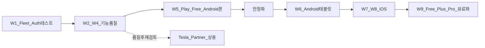

# 상용화 의사결정 · 기능/품질 백로그

기준일: **2026-08-27**  
관련: [feature-catalog.md](../03-requirements/feature-catalog.md), [competitive-gap-analysis.md](./competitive-gap-analysis.md), [commercialization-checklist.md](./commercialization-checklist.md), [phase-2.md](../08-implementation/phase-specs/phase-2.md), [phase-3.md](../08-implementation/phase-specs/phase-3.md)

---

## 1. 확정 의사결정

| # | 결정 | 함의 |
|---|---|---|
| D1 | **상용급 기능·품질 확보 → 그다음 Play Store 준비·출시** | Billing·리스팅보다 제품 완성도 우선 |
| D2 | **Tesla Partner 상용 등록은 품질 확보 후 재검토**. 단 **테스트·인증(OAuth, VK 페어링 테스트, 명령 서명 등)은 지금 구현·검증** | Partner 대기 없이 실차 검증 가능 경로 유지 |
| D3 | **Free 출시 = 전 기능 포함** → 일정 기간 안정화 → 이후 Free/Plus/Pro 분화·유료화 | 출시 직전 Play Billing·엔타이틀먼트 게이트 **보류** |
| D4 | **Watch / Wear 미지원 · 향후 계획 없음**. 플랫폼 순서: **Android 폰 → Android 태블릿 → iOS 폰 → iOS 태블릿** → 그다음 유료화·(해당 OS) 스토어 | M34/M35·Commercial Watch UI는 범위 밖 |
| D5 | **실 Fleet Command 즉시 진행** | `DemoVehicleControlGateway` → Fleet API 실호출로 교체 |

### 출시·수익 순서 (요약)

---

## 2. 기호 · Wave 정의

| 기호 | 의미 |
|---|---|
| ● | 상용급 구현됨 |
| ◐ | 부분 / 데모 / UI만 |
| ○ | 미착수 |
| ✕ | 범위 밖 (하지 않음) |
| ◇ | 품질·안정화 과제 (기능은 있으나 상용 기준 미달) |

| Wave | 이름 | 목표 |
|---|---|---|
| **W1** | Fleet · Auth 테스트 | 실 명령 + 테스트용 OAuth/VK/서명 경로 |
| **W2** | 운전 중 경험 품질 | Gauge·SpeedCam·BT·음성·적응형 상용 품질 |
| **W3** | 제어·자동화·알림 패리티 | Free 기본 제어·자동화·FCM + **공조 세밀 예약(FR-V06a) 기반** |
| **W3b** | 음성 고도화 | **음성 호출(FR-N10)** · 핸들 버튼 조사(FR-N11) |
| **W4** | 분석·카메라·위젯·확장 | 배터리/FSD·Live Camera·Glance·**충전 차계부(FR-CH10)** |
| **W4b** | 스마트 내비 | **스마트 목적지(FR-N08/N09)** 자연어·이력 검색 |
| **W5** | Play Free (Android 폰) | 정책·리스팅·비공개→프로덕션 (전 기능 Free) |
| **W6** | Android 태블릿 | 적응형·스토어 태블릿 자산 |
| **W7** | iOS 폰 | KMP iOS 안정·App Store 준비 착수 |
| **W8** | iOS 태블릿 | iPad 적응형 |
| **W9** | 유료화 | Free/Plus/Pro 게이트 + Play Billing |
| **WP** | Partner 재검토 | D2 — W5 안정화 이후 |
| — | 범위 밖 | Watch/Wear 등 |

---

## 3. 기능·품질 마스터 표

컬럼: **현상태** = 코드/단말 기준(2026-08-27) · **계획** = 의사결정 반영 구현안 · **Wave** = 착수 묶음.

### 3.1 운전 중 경험 (MyT USP · 카탈로그 A · 경쟁 ★)

| ID | 항목 | 구체화 | 현상태 | 구현 계획 | Wave |
|---|---|---|---|---|---|
| A01–A12 | Gauge 핵심 표시 | 속도·기어·SOC·온도·전력·G·타이어·벨트·ETA·GPS·충전 | ● | 실차 폴링 정확도·누락 필드 보완, 야간 대비·가독성 QA | W2 |
| A13 | BT Phone Key 자동 실행 | 연결 시 Gauge 포그라운드 | ● 안내 | Settings 배터리 예외 CTA, 실패 복구 UX·회귀 자동화 | W2 |
| A14–A15 | 과속·구간단속 | L1–L3 경고, 평균속도 | ● sync UX | 오탐/미탐 로그, 지도 매칭, 6,000+ 진행률 | W2 |
| A16 | 음성 → 차량 내비 | STT → `navigation_request` | ◐ | STT 오류(7) 재시도·권한 가이드, 실 명령 경로와 통합 검증 | W1–W2 |
| A17 | 주야간 테마 | Auto/Manual | ● | 자동 전환 임계·눈부심 테스트 | W2 |
| A19 | 적응형 레이아웃 | 폰 가로/세로 | ● / ◇태블릿 | 폰 품질 고정(W2) → 태블릿 전용 브레이크포인트(W6) | W2, W6 |
| A20 | 경로·지도 | polyline, OSM, 차량/카메라 마커 | ● | 스냅·오프라인 타일 실패 UX, 히스토리 지도 안정성 | W2 |
| Q-DRV-01 | 운전 중 조작 최소화 | 큰 글씨·최소 탭·고지 | ● 배너·STT | Play 스토어 문구(W5), 실차 고지 회귀 | W2, W5 |
| Q-DRV-02 | 2주 실차 무중단 | Phase1 AC-ST | ◇ | 실차 체크리스트 재실행, 크래시/ANR 0 Critical | W2 |
| A18 | OBD Profiler | ECU급 | ○ | **후순위** (차별과 무관, 공수 큼) — W9 이후 검토 | — |

### 3.2 원격 제어 (카탈로그 V · Phase M29–M31 · D5)

| ID | 항목 | 구체화 | 현상태 | 구현 계획 | Wave |
|---|---|---|---|---|---|
| V01 | 잠금/해제 | Fleet command | ● REST 경로 | `FleetVehicleControlGateway` + Selecting(시뮬→데모); VK 서명 403 시 안내 | **W1** |
| V06 | 공조 ON/OFF | 동일 | ● REST | 실 API | **W1** |
| V03/V13 | 트렁크·프렁크·경적·플래시 | 동일 | ● REST | 실 API; Safety gate 유지 | **W1** |
| M31 | 안전 게이트 | 주행 중 위험 명령 차단 | ● | 유지 | W1 |
| M30 | Quick Controls UI | 차량 상세 | ● | Fleet/데모 안내 문구 갱신 | W1 |
| V02 | Remote Start | | ○ | W3 패리티 | W3 |
| V04 | 창문 | | ○ | W3 | W3 |
| V07 | 공조 온도 설정 | | ○ | W3 | W3 |
| V08–V10 | Dog / Camp / Sentry | | ○ | W3 모드 토글 | W3 |
| V11 | 충전 포트 | | ○ | W3 | W3 |
| Q-CTL-01 | 명령 신뢰성 | 타임아웃·웨이크·감사 로그 | ○ | 백엔드/클라이언트 감사, 실패 사유 UI | W1, W3 |
| Q-CTL-02 | 실차 10종 QA | 게이트 E3 | ○ | 체크리스트·자동화 일부 | W1, W3 |

### 3.3 인증 · 테스트용 Tesla 연동 (D2 — Partner 이전)

| ID | 항목 | 구체화 | 현상태 | 구현 계획 | Wave |
|---|---|---|---|---|---|
| AUTH-01 | OAuth PKCE · refresh · revoke | 개인/테스트 클라이언트 | ◐ | 설정 Auth 테스트 + ensureFreshAccessToken | **W1** |
| AUTH-02 | Virtual Key 페어링 테스트 UX | 공개키·도메인(개인/스테이징) | ◐ | 공개키 URL 안내 완료 · 페어링 UX 후속 | **W1** |
| AUTH-03 | Command 서명 / 프록시 | 실차 명령에 필요 시 | ○ | 403 시 안내 · vehicle-command 프록시 후속 | **W1** |
| AUTH-04 | 위치 scope 고지 | 차량 UI 아이콘 안내 | ○ | 온보딩 카피·설정 링크 | W1, W5 |
| AUTH-05 | API 비용 가드 | 월 크레딧·한도 | ◐ 설계 | 런타임 차단·UI | W1–W2 |
| WP-01 | Tesla Partner 상용 등록 | 법인·멀티유저 상용 | ○ | **W5 안정화 후 재검토** | **WP** |
| WP-02 | 상용 공개키 도메인 | 프로덕션 도메인 | ○ | Partner와 함께 | WP |

### 3.4 자동화 · 알림 (M32–M33 · 경쟁 갭)

| ID | 항목 | 구체화 | 현상태 | 구현 계획 | Wave |
|---|---|---|---|---|---|
| M32 | 조건 트리거 | charge_complete, gear_park, 저온 등 | ◐ 로컬 | 규칙 CRUD·영속·실 텔레메트리 연동 | W3 |
| AUTO-01 | 스케줄 프리컨디션 | 출발 전 공조 | ◐ UI 규칙 | 스케줄러 + 실 climate 명령 | W3 |
| PLUS-CLIM | **공조 세밀 예약** FR-V06a | 시각·온도·열선/통풍·defrost·반복 | ◐ 기반 | set_temps/좌석·스티어링 Fleet 명령·편집 UI 고도화; **W9 Plus** | **W3** |
| AUTO-02 | 지오펜스 | 진입/이탈 | ○ | 위치 기반 규칙 | W3 |
| AUTO-03 | Sentry 이벤트 알림 | | ○ | Fleet/텔레메트리 이벤트 구독 | W3–W4 |
| M33 | FCM 푸시 | 백그라운드 | ◐ 인앱 Snackbar | FCM 연동, 채널, Doze 가이드 (APNs는 W7) | **W3** |
| Q-NOT-01 | 알림 적시성 | 주차 후 도달 | ○ | 실기기 절전 테스트 | W3 |

### 3.5 주행·충전 기록 · 분석 (B/C · M42–M45)

| ID | 항목 | 구체화 | 현상태 | 구현 계획 | Wave |
|---|---|---|---|---|---|
| B01–B03, B07 | 주행 기록·지도·효율 | | ● | 빈 상태 UX, 마이그레이션 회귀 유지 | W2 |
| C01–C05 | 충전 실시간·기록 | | ● / ◐ | 세션 경계·비용(후속) | W2–W4 |
| M42 | 배터리 health 차트 | degradation | ◐ | 장기 시계열·실용량 필드 | W4 |
| M45 | CO₂ 배지 | | ● | 유지 | — |
| B05–B06 | FSD/AP 통계 | Telemetry 필드 | ◐ 시뮬 | 실 Autopilot 필드 수집 | W4 |
| M43 | CSV import/export | Tessie 등 | ● | 대용량·오류 메시지 | W4 |
| SOC-01 | 커뮤니티 비교 | TezLab형 | ○ | **보류** (동의·서버 필요) — W9 이후 | — |
| C06–C09 | 충전 비용·TOU·SC 영수증 | | ○ | W4 일부 | W4 |
| PLUS-LEDGER | **충전 차계부** FR-CH10/11 | SC vs 홈/공용 일반 구분·합산·월 UI·CSV | ○ | 유형 분류 + 단가표 + 차계부 탭; **W9 Plus** | **W4** |
| PRO-SMARTNAV | **스마트 목적지** FR-N08/N09 | 자연어 + 이력·공영주차 검색 | ○ | NLU→후보→navigation_request; **W9 Pro** | **W4b** |
| PLUS-WAKE | **음성 호출** FR-N10 | 웨이크워드·인카 진입 | ○ | hotword/BT 청취; **W9 Plus** | **W3b** |
| PRO-WHEEL | **핸들 음성 버튼** FR-N11 | 스티어링 음성키→MyT | ○ | 가로채기 가능성 조사 후 연동/대체 UX; **W9 Pro** | **W3b** |

### 3.6 Live Camera · 위젯 · 확장 (M36, M39–M44)

| ID | 항목 | 구체화 | 현상태 | 구현 계획 | Wave |
|---|---|---|---|---|---|
| M44 | Live Camera | Fleet stream | ◐ 색프레임 | 실 스트림 + 배터리/정책 고지; **Free 출시에 포함**(D3) | W4 |
| M36 | 홈 위젯 | Glance SOC/충전 | ◐ 미리보기 | Android Glance 실위젯 (Watch 아님) | W4 |
| M34/M35 | Apple Watch / Wear OS | | ◐ 미리보기 | **✕ 제거·문서/UI에서 제외** | — |
| M39 | Home Assistant | REST/discovery | ◐ | 안정화·설치 가이드 | W4 |
| M40 | HomeKit / Alexa | | ○ | iOS 이후 검토; Android 우선순위 낮음 | W7+ |
| M41 | Web 대시보드 | `/dash` | ◐ | 읽기 품질 → 제어는 Fleet 이후 | W4 |
| P15 | 다중 차량 | | ◐ | VIN 전환 UX (W3–W5) | W3 |

### 3.7 플랫폼 · 스토어 · 수익 (D1, D3, D4)

| ID | 항목 | 구체화 | 현상태 | 구현 계획 | Wave |
|---|---|---|---|---|---|
| PL-AND-PHONE | Android 폰 | 주력 | ● | W1–W5 완성 무대 | W1–W5 |
| PL-AND-TAB | Android 태블릿 | | ◇ | 레이아웃·스토어 태블릿 샷 | **W6** |
| PL-IOS-PHONE | iOS 폰 | | ○ 빌드 이슈 | KLIB/CI 안정화 후 패리티 | **W7** |
| PL-IOS-TAB | iOS 태블릿 | | ○ | iPad 적응형 | **W8** |
| M37 | Play Billing | Plus/Pro | ◐ 로컬 샌드박스 | **W9까지 출시 게이트에 넣지 않음**; Free 전기능 후 분화 | **W9** |
| MON-01 | Free/Plus/Pro 기능표 | 게이트 | ◐ | **Plus:** 공조세밀예약·차계부·음성호출 · **Pro:** 스마트목적지·핸들음성(가능시)·Live Camera 등 | W9 |
| M38 | CI / 스토어 파이프 | | ◐ | AAB·서명·트랙 | W5 |
| PLAY-01 | Privacy / Data safety / ToS | | ○ | W5 직전 집중 | W5 |
| PLAY-02 | 리스팅·스크린샷 | | ○ | Free 전기능 스토리 | W5 |
| PLAY-03 | 내부→비공개→프로덕션 | | ○ | 심사 데모/시뮬 경로 문서 | W5 |
| Q-OPS-01 | 크래시·ANR·Fleet 비용 관측 | | ◐ | 대시보드·알람 | W5 |

### 3.8 품질 축 (경쟁 비교 §3 — 목표 수준)

| ID | 품질 축 | 목표 | 현수준 | 보완 계획 | Wave |
|---|---|---|---|---|---|
| Q1 | 주행 중 UI 가독성 | 9/10 유지 | 높음 | 야간·햇빛·태블릿 | W2, W6 |
| Q2 | 원격 제어 신뢰성 | ≥8 | 낮음(데모) | 실 Fleet + 재시도 | W1, W3 |
| Q3 | 알림 적시성 | ≥8 | 낮음 | FCM | W3 |
| Q4 | 분석 깊이 | ≥7 | 중간 | 배터리·FSD 실데이터 | W4 |
| Q5 | 온보딩 단순함 | ≥8 | 중간 | AUTH 테스트 UX | W1, W5 |
| Q6 | 한국 로컬(SpeedCam) | 9 유지 | 높음 | 데이터 SLA | W2 |
| Q7 | 크로스플랫폼 | 단계적 | Android만 | D4 순서 | W6–W8 |

---

## 4. Free 출시 시 포함 범위 (D3)

**포함한다 (안정화 전 Free 한 패키지):**

- 운전 중 Gauge · BT · SpeedCam · 음성 내비  
- 실 Fleet 제어 (구현 완료분 전부)  
- 자동화 · FCM  
- 히스토리 · 분석 · CO₂ · CSV  
- Live Camera (실스트림 준비되는 대로)  
- Glance 위젯 · HA/Web (동작 가능 수준)  

**출시 패키지에서 빼거나 숨긴다:**

- Watch/Wear 진입점·카피 (✕)  
- Plus/Pro 결제 게이트 (W9까지 로컬 실험 UI는 디버그/숨김 가능)  
- Tesla Partner 전용 멀티테넌트 상용 인프라 (WP)

**유료화(W9) 티어 예고 (Free 선출시에는 아래도 구현·포함 가능, 게이트만 W9):**

| Plus | Pro |
|---|---|
| 공조 세밀 예약 (FR-V06a) | 스마트 목적지 자연어 (FR-N08/N09) |
| 충전 차계부 (FR-CH10/11) | 핸들 음성 버튼 (FR-N11, 가능 시) |
| 음성 호출 웨이크 (FR-N10) | Live Camera, 고급 FSD/배터리 |
| FCM 고급 자동화 | 다중 차량 슬롯·Web 제어 등 |

---

## 5. 즉시 착수 순서 (다음 구현 스프린트)

1. **W1** `FleetVehicleControlGateway` + 실차 명령 QA + AUTH-01~03 테스트 경로  
2. **W2** 운전 중 경험·SpeedCam·실차 2주 게이트  
3. **W3** FCM · 자동화 · **공조 세밀 예약** · 제어 패리티  
4. **W3b** 음성 호출 · 핸들 버튼 조사  
5. **W4** Camera · Glance · **충전 차계부** · 분석 깊이  
6. **W4b** 스마트 목적지  
7. **W5** Play Free (Android 폰)  
8. 이후 W6→W7→W8→W9, Partner는 WP

---

## 6. 문서 동기화

| 문서 | 반영 |
|---|---|
| 본 문서 | 의사결정 원본 · 마스터 백로그 |
| [functional-requirements.md](../03-requirements/functional-requirements.md) | FR-V06a, FR-CH10/11, FR-N08–N11 |
| [feature-catalog.md](../03-requirements/feature-catalog.md) | A16a/b, C02a, D07a |
| [README.md](./README.md) | 결정 확정 · 본 문서 링크 |
| [schedule.md](./schedule.md) | Wave 기준 일정 |
| [competitive-gap-analysis.md](./competitive-gap-analysis.md) | Free 전기능·Watch ✕ |
| [stub-demo-status.md](./stub-demo-status.md) | Watch 범위 밖 · Fleet 즉시 |
| Phase 2 spec | M34/M35 ✕, M37 → W9, M29 → W1 |

---

## 7. 변경 이력

| 날짜 | 내용 |
|---|---|
| 2026-08-27 | D1–D5 확정, 마스터 백로그 초판 |
| 2026-08-27 | 공조세밀예약·차계부·스마트목적지·음성호출 추가, W3b/W4b·Plus/Pro 분류 |
