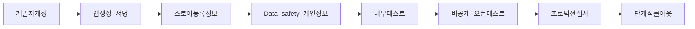

# Google Play 스토어 출시 · 승인 작업 정리

대상: MyT Android (`com.myt` 가정 — 실제 applicationId는 Gradle 확인)  
관련: [commercial-constraints.md](../01-research/commercial-constraints.md) §2.1

---

## 1. 출시 프로세스 한눈에

| 단계 | 목적 | 예상 소요 |
|---|---|---|
| Play Console 계정 | 개발자 등록·수수료 | 1–3일 (결제·신원) |
| 앱 생성·AAB 업로드 | 패키지·버전 코드 | 1일 |
| 스토어 등록정보 | 리스팅·그래픽 | 3–7일 |
| 정책 양식 | Data safety, 권한 선언 | 2–5일 |
| 내부 테스트 | 본인·소수 | 즉시~수일 |
| 비공개/오픈 | 피드백·안정성 | 2–4주 |
| 프로덕션 심사 | Google 리뷰 | 수시간~7일+ |
| 롤아웃 | 20%→100% | 1–2주 |

---

## 2. 계정·패키징 체크리스트

- [ ] Google Play Console 개발자 계정 (개인/조직)
- [ ] 판매자(결제) 프로필 — **유료/구독 시 필수**
- [ ] 앱 이름·기본 언어(한국어)·카테고리(예: 자동차/교통 또는 라이프스타일)
- [ ] `applicationId` 최종 확정 (이후 변경 불가에 가깝음)
- [ ] Upload key / Play App Signing 등록
- [ ] `targetSdk` / `minSdk` Play 요구 충족
- [ ] Release AAB (`bundleRelease`) + ProGuard/R8 매핑 보관
- [ ] 버전 코드 단조 증가 정책

---

## 3. 스토어 리스팅 (승인·전환에 직결)

| 자산 | 요구 | MyT 메모 |
|---|---|---|
| 짧은 설명 (80자) | 필수 | Gauge + 과속단속 한 줄 |
| 긴 설명 | 필수 | Tesla 비공식·Fleet 연동·운전 주의 명시 |
| 앱 아이콘 512 | 필수 | |
| 피처 그래픽 1024×500 | 권장/일부 노출 | |
| 폰 스크린샷 ≥2 | 필수 | Gauge 가로·세로, SpeedCam, 설정 |
| 7인치/10인치 태블릿 | 태블릿 타깃 시 | 적응 레이아웃 샷 |
| 개인정보처리방침 URL | **데이터 수집 시 필수** | 공개 HTTPS |
| 지원 이메일 | 필수 | |

문구 주의:

- “공식 Tesla” 오인 금지 (상표·사칭 정책).
- 자율주행·FSD를 **과장하지 않음** (데모 추정과 실기능 구분).
- 유료 기능은 구독 고지와 일치.

---

## 4. 권한 · 선언 (거절 빈발 지점)

MyT 예상 민감 영역:

| 권한/기능 | Play 대응 |
|---|---|
| Bluetooth / nearby devices | 사용 목적: Phone Key 자동 실행 — 선언서에 명시 |
| 알림(FCM) | 정상, 옵트인 UX |
| Foreground Service | `connectedDevice` 등 타입 정확 선언 |
| 위치 | Fleet GPS 위주라면 **백그라운드 위치 최소화**; 필요 시 고지·비디오 |
| 마이크 (음성 내비) | STT 목적 명시, 운전 중 주의 |
| 결제 | Play Billing만 (우회 결제 금지) |

제출 전:

- [ ] Photos/Videos, Location 등 **민감 권한 선언 양식** 작성
- [ ] Foreground service 유형 문서와 코드 일치
- [ ] 권한 런타임 요청이 기능 직전에만 뜨는지 확인

---

## 5. Data safety · 개인정보

수집 가능 항목 예시와 양식 기입:

| 데이터 | 수집? | 공유? | 비고 |
|---|---|---|---|
| 위치 (차량) | 예 | Tesla/자사 서버 | 사용자 동의·아이콘 고지 |
| 개인식별 (계정·이메일) | 예(OAuth) | Tesla | |
| 앱 활동·크래시 | 예 | 분석/GitHub 이슈 등 | PII 마스킹 |
| 결제 정보 | Play 처리 | Google | 앱이 카드번호 직접 수집 금지 |
| 마이크 녹음 | STT 시 일시 | 처리 후 미저장 권장 | |

- [ ] Privacy Policy에 수집·보관·삭제·연락처
- [ ] 계정 삭제 경로 (인앱 또는 웹) — **정책 강화 추세**
- [ ] 아동 대상 아님 (Families 해당 시 별도)

---

## 6. 자동차·운전 관련 정책

Play는 **운전 중 산만**을 문제 삼을 수 있음.

권장 대응:

- [ ] 첫 실행/Gauge 진입 시 “주행 중 조작 최소화·음성 권장” 고지
- [ ] 큰 글씨·최소 탭 (이미 Gauge 방향과 일치)
- [ ] 영상 데모에 안전 운전 장면만 (위험 조작 연출 금지)
- [ ] 설명에 “운전자 책임, 보조 정보” 문구

---

## 7. 구독·결제 (Plus/Pro)

- [ ] Play Console에 구독 상품 생성 (기간·가격 KRW)
- [ ] 무료 체험/유예 정책 명확히
- [ ] 서버 측 purchase token 검증
- [ ] 구독 관리 딥링크 (Play 구독 페이지)
- [ ] 환불·다운그레이드 시 엔타이틀먼트 회수 QA

Billing 없이 Free만 내면 이 절은 연기 가능 → 심사 단순화.

---

## 8. 테스트 트랙 전략

| 트랙 | 인원 | 목적 |
|---|---|---|
| 내부 | 1–10 | 서명·크래시·OAuth |
| 비공개 | 12–100 | 실차·정책 사전 검증 |
| 오픈 (선택) | 무제한 | 마케팅 전 피드백 |
| 프로덕션 | 단계적 | 20% → 50% → 100% |

비공개에서 꼭 볼 것:

1. 신규 설치 → Tesla 로그인 → VK → Gauge
2. BT 자동 실행
3. SpeedCam 경고
4. (해당 시) 구매·알림
5. 앱 종료·재시작 토큰 유지

---

## 9. 심사 제출 패키지

- [ ] 최신 AAB
- [ ] 출시 노트 (KR)
- [ ] 로그인 테스트 계정 (심사관용) **또는** Tesla 연동 불가 시 데모 모드 경로 명시
- [ ] 심사 메모: Virtual Key 절차, 데모 VIN 시뮬 방법
- [ ] 정책 고지 URL
- [ ] 콘텐츠 등급 설문

**중요:** 심사관이 실차량·Tesla 계정에 접근 못하면 **거절/보류**될 수 있음.  
대응 옵션:

1. 심사 전용 Tesla 계정 + 테스트 차량 권한  
2. 또는 **시뮬/데모 모드**를 심사 경로의 1급 시민으로 문서화 (`DRIVE_SIM` 등)

---

## 10. 거절 시 자주 나오는 사유 → 예방

| 사유 | 예방 |
|---|---|
| 개인정보처리방침 없음/불일치 | URL·Data safety 동기화 |
| 권한 과다·목적 불명 | 최소 권한, 선언서 |
| 오해의 소지 브랜딩 (Tesla) | “비공식”·상표 가이드 |
| 로그인 불가 | 테스트 계정·데모 경로 |
| 구독 고지 미흡 | Play Billing·가격 표시 |
| 불안정 크래시 | Pre-launch, 내부 트랙 |
| 백그라운드 위치 | 정말 필요시에만 + 비디오 |

항소 시: Console 정책 소명 + 스크린샷/영상 + 변경 빌드.

---

## 11. 출시 직후 운영

- [ ] Vitals (크래시·ANR) 알림
- [ ] 리뷰 응답 템플릿 (한국어)
- [ ] Fleet API 비용 알람
- [ ] POI(과속) 데이터 갱신 SLA
- [ ] 핫픽스 버전 코드 여유

---

## 12. MyT 전용 “승인 준비도” 요약

| 영역 | 준비도 (현재) | 프로덕션 전 필수 |
|---|---|---|
| 핵심 Gauge UX | 높음 | 실차 재검증 |
| 데모/시뮬 | 높음 | 심사 경로 문서화 |
| Tesla 상용 OAuth/VK | 낮음 | Partner+도메인 |
| 실 제어·FCM·Billing | 데모/미연동 | 범위 결정 후 구현 |
| 법무·리스팅 자산 | 없음 | W1–2 |
| iOS | 비대상(Android 우선) | 선택 |

오빠가 **Free 전용 빠른 출시**를 고르시면 §7 Billing과 실 Camera를 빼고 §9 데모 경로를 강화하는 편이 승인이 빠릅니다.
