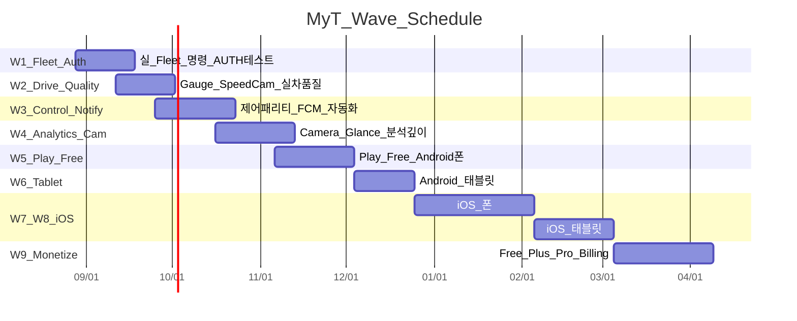

# 상용화 작업 일정 (Wave 기준)

기준일: **2026-08-27**  
원본 의사결정: [decisions-and-backlog.md](./decisions-and-backlog.md)  
가정: 1인 개발 · Android 폰 우선 · Partner 상용 등록은 W5 이후 재검토 · Billing은 W9

## Wave 체크리스트

### W1 — Fleet · Auth 테스트 (즉시)

- [x] `FleetVehicleControlGateway` (Demo 교체 + Selecting)
- [x] 실차 Lock/Climate/Trunk/Flash/Honk REST 경로 + Safety gate
- [x] OAuth refresh 테스트 UI (설정 Auth 테스트)
- [x] VK 공개키 URL 안내 (페어링 UX·서명 프록시는 후속)
- [ ] 음성 `navigation_request` 실경로 스모크 (기존 경로 유지 · 실차 확인)

### W2 — 운전 중 경험 품질

- [ ] Gauge/SpeedCam/BT/테마 실차 QA
- [ ] POI OTA·오탐 로그, 지도 품질
- [x] 운전 중 고지 UX (Q-DRV-01 배너 + STT 오류 문구 인간화)
- [ ] 2주 실차 무중단 게이트 착수
- [x] A13 BT Doze/배터리 예외 안내
- [x] A14–A15 POI sync 실패·신선도 UX

### W3 — 제어 패리티 · 자동화 · FCM · 공조 세밀 예약

- [x] Dog/Camp/Sentry/창문/충전포트 등 (퀵 컨트롤 Fleet 매핑 · 서명/VK는 후속)
- [x] 자동화 CRUD + 스케줄·지오펜스(1차) (Settings 영속 · 스케줄 30s · 지오펜스 진입/이탈 · More 허브 UI)
- [x] **FR-V06a 공조 세밀 예약** 기반 (모델·저장·30s 스케줄러·More 허브 UI · set_temps/열선 Fleet 세부는 후속)
- [ ] FCM + 채널 + 절전 가이드
- [ ] 다중 VIN 전환 UX
- [x] 충전 상태 정규화 (Complete/한도도달 · 충전 중 캐시 skip 방지 · near-limit 45s 폴링)
- [x] 음성 TTS 예시 주입 테스트 · YouTube Music 검색 명령

### W3b — 음성 호출

- [ ] FR-N10 웨이크워드 / 인카 청취 진입
- [ ] FR-N11 핸들 음성 버튼 **가능성 조사** + 대체 UX

### W4 — 분석 · Camera · 위젯 · 차계부

- [ ] Live Camera 실스트림 (Free 포함)
- [ ] Glance 홈 위젯
- [ ] 배터리·FSD 실데이터
- [ ] **FR-CH10/11 충전 차계부** (SC/일반 구분·합산)
- [ ] HA/Web 품질, Watch UI **제거**

### W4b — 스마트 목적지

- [ ] FR-N08/N09 자연어·이력 기반 목적지 검색·설정

### W5 — Play Free (Android 폰)

- [ ] Privacy / Data safety / ToS
- [ ] 리스팅·내부/비공개/프로덕션
- [ ] **전 기능 Free** 패키지 (Billing 없음)
- [ ] 안정화 기간 운영 (크래시·비용 관측)

### W6 — Android 태블릿

- [ ] 적응형 레이아웃·스토어 태블릿 자산

### W7–W8 — iOS

- [ ] iOS 폰 빌드·패리티 → App Store 준비
- [ ] iOS 태블릿

### W9 — 유료화

- [ ] Free/Plus/Pro 기능 재정의
- [ ] Play Billing + 서버 검증
- [ ] (선택) App Store 유료

### WP — Partner 재검토 (W5 안정화 후)

- [ ] 상용 앱 등록·프로덕션 도메인 키·멀티유저

## 이전 일정안과의 차이

| 이전 가정 | 현재 결정 |
|---|---|
| Partner·Billing을 출시 전 필수 | Partner·Billing **후순위** (W9 / WP) |
| Free+유료 게이트 동시 | **Free 전기능** 먼저 |
| Watch/Wear Optional | **영구 제외** |
| 데모 제어 유지 가능 | **실 Fleet 즉시 (W1)** |

상세 ID별 표: [decisions-and-backlog.md](./decisions-and-backlog.md) §3
